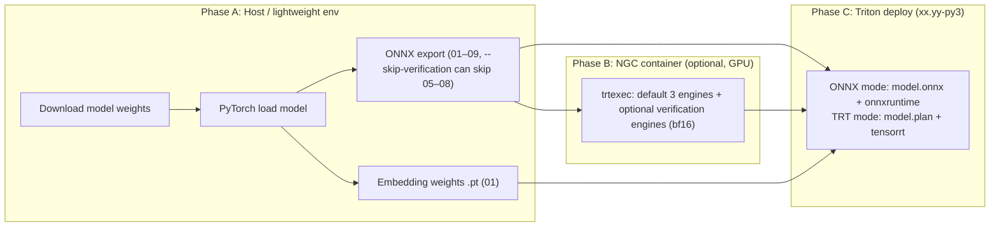

**English** | [中文](architecture.zh-CN.md)

# Qwen3TTS-Streaming Streaming Inference Service Architecture Design

> **Technical stack**: Triton Inference Server + TensorRT + ONNX Runtime
>
> **Inference precision**: Currently the primary target is **BF16**, but we have not yet declared that the fused TRT graph has closed the numerical loop. The current validation conclusion is: `FP16` is not usable on the current fused graph, `BF16` is clearly better than `FP16`, and `FP32` can serve as a diagnostic/reference precision.
>
> **Core strategy**: Unified dual-backend deployment (pure ONNX Runtime / pure TensorRT). The BLS inference flow is completely identical; only the backend and model file format differ. Both Talker Context and Talker Decode fuse Code Predictor + Codec Embedding Sum into a single model, registered as a standalone Triton submodel. The BLS calls it via `pb_utils.InferenceRequest` and passes the KV Cache zero-copy via `dlpack`.

---

## 0. Current Implementation Status (2026-03-30)

| Item | Current status |
|------|---------|
| `talker_code2wav_fused` export | **Available**. The exported graph includes `attention_bias` / `past_seq_lens` / `cache_position`, supporting padding+mask batching |
| TensorRT build | **Compilable again**. The fused graph can compile `FP16/BF16/FP32` engines |
| Pure streaming inference | **Available**. The fused graph handles prefill + decode; the decode ceiling is controlled by `engine_max_decode_len` |
| Long-text rollover | **Available**. Pre-segmentation + runtime dynamic segmentation (see below); forced inter-segment rollover when KV hits the ceiling, emergency correction on `RatioTracker` overflow |
| Prefix KV cache | **Implemented** (`enable_prefix_kv_cache` on by default; `PREFIX_KV_CACHE_MAX_ENTRIES` defaults to 16). When a prefix is hit across segments, the entire segment prefill is skipped and only the request segment goes through fused |
| Continuous Batching | **Implemented**. The Orchestrator adopts the vLLM backend three-thread model: execute submit / engine decode loop / response sender; multi-way padding+mask concatenated into a batch decode |
| Session management + flow control | **Phase 2**. `FlowState`: IDLE / ACTIVE / DONE; **PAUSED removed**. On streaming init with no first-packet text, `slot_id=-1` (no batch slot occupied); a slot is allocated only when the first text segment arrives; the pad stage no longer PAUSEs, up until EOS or `request_timeout` |
| Streaming text input | **Implemented**. Gateway init/append_text/text_complete; on the engine side, IDLE can `append` multiple times, `text_segments` dynamically extend; new text during ACTIVE is appended as future segments |
| RatioTracker | **Implemented**. `audio_steps/text_tokens` EMA (via `RATIO_INITIAL` and other environment variables / config); `capabilities` returns `ratio_ema`; updated on segment-end EOS, `update_overflow` on KV overflow |
| Greedy BPE buffering | **Module provided** in `greedy_tokenizer.py` (stable-prefix segmentation); the current main path still primarily plans via `split_text_for_token_budget` after concatenating the buffered text, to stay aligned with PrefillBuilder |
| Inter-segment timbre | **Reserved** `last_segment_codec_tail` (logits tail); Qwen3-TTS already anchors on a speaker embedding, so acoustic context injection can be added later based on listening tests |
| Legacy path | **Removed**. Only the fused pipeline (talker_code2wav_fused) is retained |
| TRT numerical validation | **Still a blocker**. `BF16` is significantly better than `FP16`; the main remaining deviation is on the `code predictor unroll / argmax / codec_sum` path |

### 0.1 Text Segmentation and Three-Layer Defense (memo)

- **Stage 1 / Stage 2**: at each step `next_embed = codec_sum + text_embed`; once text is exhausted, `tts_pad_embed` is used until the model emits codec EOS (Stage 2 is still valid audio synthesis and must not be arbitrarily truncated).
- **Audio/text ratio**: `ratio ≈ decode steps / trailing text tokens of this segment`, tracked online as an EMA by `RatioTracker`; the pre-segmentation budget ≈ `(engine_max_decode_len - rollover_margin) / ratio_ema`.
- **Layer 1 — pre-segmentation**: `_plan_text_segments` + `text_segmenter.split_text_for_token_budget`, punctuation-first.
- **Layer 2 — dynamic segmentation**: during decode, if the remaining KV cannot cover the estimated remaining decode steps, split `current_segment_text` at a punctuation mark, insert the next segment, then `reset_decode_state` + `_activate_next_segment` (re-prefill the shortened text of the current segment).
- **Layer 3 — KV fallback**: when `past_len > engine_max_decode_len`, force an inter-segment rollover and call `RatioTracker.update_overflow`.
- **Academic references**: for streaming long-text and bounded context, see arXiv:2603.06444 (prosodic boundary + sliding window); for online scheduling and KV constraints, see arXiv:2504.11320 (Nested WAIT).

**Current conclusions**:
- The Orchestrator BLS has completed continuous batching and Phase 2 flow control (no PAUSE, ratio budget, dynamic segmentation, prefix KV enabled by default).
- The core of the next phase is still fused TRT numerical convergence (the code_predictor_unrolled subgraph).

> **Note**: sections 9–11 below may still contain historical flow-control descriptions such as `WAITING` / `PAUSED`; the implementation is authoritative per **§0 / §0.1** in this section.

---

## 1. Design Goals

| Goal | Description |
|------|------|
| Adaptive streaming text input | Token-level consumption by default, automatically adapting to upstream LLM speed, degrading as needed |
| Frame-level streaming audio output | Once a certain number of codec frames accumulate, synthesize and push an audio segment |
| Multi-user batch inference | Share GPU resources; the ultimate goal is to support continuous insert/complete; for now keep the TRT-compilable baseline first |
| High GPU utilization | The inference engine eliminates framework overhead, GPU utilization > 80% |
| LLM-agnostic | Whether the upstream is a large or small model, the TTS service requires no changes |

---

## 2. Model Component Overview

Six independent components are split out of the original `Qwen3TTSForConditionalGeneration`:

| Component | Model structure | Effective params | Inference engine | Invocation pattern |
|------|---------|---------|---------|---------|
| **Text Embedder** | `Embedding(151936, 2048)` + `ResizeMLP(2048→1024)` | ~312M | PyTorch weights | Once per request + when text arrives |
| **Speaker Encoder** | ECAPA-TDNN, mel=128, enc_dim=1024 | ~6M | ONNX | Once per request (voice clone only) |
| **Speech Tokenizer Encoder** | MimiModel, 16 codebooks | ~26M | ONNX | Once per request (ICL mode only) |
| **Talker Backbone** | Qwen3-style, 28L, h=1024/2048 (0.6B/1.7B), GQA(16h/8kv), head_dim=128 | ~180M–500M | **Pure TRT (single Unified engine)** | Prefill + Decode in the same engine; 1 prefill + N decodes per request |
| **Code Predictor** | Qwen3-style, 5L, h=1024, GQA(16h/8kv), head_dim=128 + 15×embed + 15×lm_head | ~200M | **Fused into the Fused Decode TRT** | Invoked by the fused engine at every decode step |
| **Code2Wav Decoder** | RVQ Dequant + Transformer(8L) + BigVGAN ConvNet | ~60M | ONNX | Once per chunk |

### 2.1 Embedding Weights (embedded in the Orchestrator)

The following weights are loaded directly into the Orchestrator process and are not scheduled through Triton models:
- Talker's codec embedding (`Embedding(vocab, 1024)`)
- Talker's 16 codec sum embeddings (used to construct decode-step inputs)
- Special embeddings: `tts_pad_embed`, `tts_bos_embed`, `tts_eos_embed`
- Text Embedder: `Embedding(151936, 2048)` + `ResizeMLP(2048→1024)`, ~312M params, ~624MB BF16

> **Memory planning**: The Text Embedder weights (~624MB) are managed by PyTorch and are not in the Triton memory pool. They must be explicitly counted in the total memory budget:
> - Text Embedder: ~624MB
> - Codec Embeddings (16 × Embedding): ~64MB
> - Special Embeddings: <1MB
> - Total Orchestrator footprint: **~690MB**

> **Codec Embedding Sum optimization (implemented)**: Each decode step needs to compute `Σ embed_i(codec_ids[i]), i=0..15`. The naive implementation is 16 × Embedding.forward() + element-wise addition (~0.15ms). A pre-merged 3D lookup-table scheme has been implemented:
> - The Talker codec embedding has vocab=3072, and the 15 CP embeddings have vocab=2048; the CP embeddings are zero-padded to 3072 and stacked with the Talker embedding into `[16, 3072, H]` (H=talker_hidden_size), completing the operation in a single advanced-indexing + sum.
> - See `codec_embeddings_3d.pt` for export (export_01_embeddings); inference uses the `CodecEmbeddingSum` module in `scripts/python/codec_embedding_sum.py`.
> - Measured (design-1.7b, GPU): 3D gather ~0.02ms, naive loop ~0.17ms, **~7.7x speedup**; bitwise identical to the naive implementation at the same dtype, with max_abs_diff < 0.001 when exported as BF16.

### 2.2 Model Variants and Task Types

Qwen3-TTS provides three model variants with an **identical architecture** (all `Qwen3TTSForConditionalGeneration`); only the weights differ:

| Variant | tts_model_type | Core capability | Needs Speaker Encoder | Needs Speech Tokenizer | Needs instruct |
|------|---------------|---------|---------------------|----------------------|--------------|
| **Base** | `base` | 3-second voice clone | **Yes** (ref_audio → spk_embed) | ICL mode: **Yes** | No |
| **CustomVoice** | `custom_voice` | 9 preset timbres + instruction control | **No** (spk_id lookup) | No | Optional (style control) |
| **VoiceDesign** | `voice_design` | Design a timbre from a natural-language description | **No** (no speaker) | No | **Required** (timbre description) |

#### 2.2.1 Task Types and Sub-modes

```
TaskType
├── VOICE_CLONE         ← Base model
│   ├── ICL mode        ← ref_audio + ref_text → Speaker Encoder + Speech Tokenizer
│   │                     prefill contains the reference audio's codec tokens, highest clone quality
│   └── X_VECTOR_ONLY   ← ref_audio → Speaker Encoder (speaker embedding only)
│                         does not need ref_text, slightly lower clone quality but simpler
├── CUSTOM_VOICE        ← CustomVoice model
│   └── speaker (1 of 9) + optional instruct (style/emotion control)
└── VOICE_DESIGN        ← VoiceDesign model
    └── instruct (required, describes the target timbre)
```

#### 2.2.2 Speaker Source Differences

The speaker embedding source differs completely across the three task types, so the Orchestrator must branch by task_type:

| Task type | speaker_embed source | Value |
|----------|-------------------|-----|
| Base (ICL / X_VECTOR) | Speaker Encoder ONNX inference | `extract_speaker_embedding(ref_audio)` → `[1, 1024]` |
| CustomVoice | Talker codec embedding lookup | `codec_embed(spk_id[speaker_name])` → `[1, 1, 1024]` |
| VoiceDesign | None | no speaker position inserted in prefill |

#### 2.2.3 Deployment Strategy: single-variant vs multi-variant

**Recommended: single-variant deployment** (Phase 1-3)

Each Triton instance loads **one set of model weights**, selecting the variant via deployment configuration:

```
Advantages:
  - Zero memory waste (Talker ~360MB + CP ~400MB + others ~200MB ≈ 960MB)
  - Simple deployment configuration
  - Different variants can scale independently

Disadvantages:
  - Multiple instances must be deployed when several timbre features are needed

Configuration:
  model_repository/tts_orchestrator/config.pbtxt:
    parameters: {
      key: "model_variant"
      value: { string_value: "Qwen3-TTS-12Hz-1.7B-CustomVoice" }
    }
```

**Alternative: multi-variant deployment** (Phase 4+)

```
Option A: multiple Orchestrator instances (recommended)
  - Register multiple Orchestrators within one Triton process (tts_base / tts_custom / tts_design)
  - Share Talker/CP/Code2Wav engines (identical architecture)
  - Only the spk_id lookup weights inside each Orchestrator differ (~a few KB)
  - ⚠️ Prerequisite: confirm that the Talker/CP weight differences across variants are negligible (to be verified)

Option B: Gateway routing
  - The Gateway routes to different Triton instances by task_type
  - Each instance independently loads different weights
  - Suitable for heterogeneous deployment (different GPUs run different variants)
```

> **Key finding (verified)**: The Talker/CP Transformer-layer weights of the three variants are highly similar (cosine >0.994), but the **codec embeddings differ significantly** (cosine ~0.60). Since the codec embedding participates in constructing the input at every decode step, the engine **cannot be shared across variants**, and single-variant deployment is mandatory. See `workspace/exported/multi_variant_report.json` for details.

---

## 3. Overall Architecture

```
                      ┌─── Upstream Reply LLM ───┐
                      │  text stream (sentence)   │
                      └──────────┬────────────────┘
                                 │ gRPC BiDi Stream / WebSocket
                                 ▼
┌──────────────────────────────────────────────────────────────────┐
│                     TTS Gateway (gRPC ↔ Triton)                  │
│  - Custom gRPC TTSService (see 12.3)                             │
│  - Protocol conversion: TTSRequest/Response ↔ Triton InferenceRequest │
│  - Session routing: session_id → Triton decoupled model request  │
│  - Client-disconnect detection + cancellation propagation        │
└──────────────────────┬───────────────────────────────────────────┘
                       │ Triton gRPC (tritonclient)
                       ▼
┌─────────────────────────────────────────────────────────────┐
│                   Triton Inference Server                    │
│                                                             │
│  ┌───────────────────────────────────────────────────────┐  │
│  │         TTS Orchestrator (BLS Python Backend)         │  │
│  │                                                       │  │
│  │  ┌─────────────┐  ┌──────────────────────────────┐   │  │
│  │  │ Session Mgr  │  │     Batch Scheduler          │   │  │
│  │  │ (per-user    │  │  - Slot allocation           │   │  │
│  │  │  state)      │  │  - Continuous insert/remove  │   │  │
│  │  └─────────────┘  │  - Prefill/Decode scheduling  │   │  │
│  │                    │  - Talker KV cache mgmt      │   │  │
│  │  ┌─────────────┐  └──────────────────────────────┘   │  │
│  │  │ Flow Control │  Adaptive flow control (TCP-like): │  │
│  │  │ State Machine│  TOKEN → ADAPTIVE → SENTENCE(degrade) │  │
│  │  └─────────────┘                                     │  │
│  │                                                       │  │
│  │  ┌───────────────────────────────────────────────┐   │  │
│  │  │           Streaming Generation Loop            │   │  │
│  │  │                                                │   │  │
│  │  │  Prefill: fused engine produces logits + KV    │   │  │
│  │  │  Prefix cache: Orchestrator reuses stable prefix KV │  │
│  │  │  Decode loop (fused engine):                   │   │  │
│  │  │    Talker decode + CP + codec_sum → single call│   │  │
│  │  │    → wav, codec_sum, full_codec, logits        │   │  │
│  │  │  Accumulate → Code2Wav (async) → audio         │   │  │
│  │  │  Long-text rollover: segment by punctuation, restart session │  │
│  │  └───────────────────────────────────────────────┘   │  │
│  └──┬────────┬────────┬────────────────────────────────┘   │
│     │        │        │                                     │
│     ▼        ▼        ▼                                     │
│  ┌──────┐┌──────┐┌──────┐                                  │
│  │ Text ││ Spk  ││Speech│                                  │
│  │Embed ││ Enc  ││Token │                                  │
│  │(Torch││(ONNX)││ Enc  │                                  │
│  │ Wts) ││      ││(ONNX)│                                  │
│  └──────┘└──────┘└──────┘                                  │
│                                                            │
│  ┌──────────────────────────────────────────────────────┐  │
│  │          Pure TRT Engines (self-managed KV Cache)    │  │
│  │                                                      │  │
│  │  ┌─────────────────────────────────────────────────┐  │  │
│  │  │ talker_code2wav_fused (prod: Talker + Code2Wav T=1) │  │  │
│  │  │ → wav, codec_sum, logits, present_kv_*, c2w_*      │  │  │
│  │  └─────────────────────────────────────────────────┘  │  │
│  └──────────────────────────────────────────────────────┘  │
│     (legacy: talker_unified + code2wav split models + frame buffer) │
│     (next phase: minimal incremental validation `attention_bias/past_seq_lens`) │
└─────────────────────────────────────────────────────────────┘
                                 │
                                 │ audio chunk stream
                                 ▼
                           ┌──────────┐
                           │  Client  │
                           └──────────┘
```

### 3.1 TTS Gateway

Triton has its own gRPC protocol (`tritonclient`), which is incompatible with the custom `TTSService` proto. A **Gateway process** is needed to bridge the protocols:

| Responsibility | Description |
|------|------|
| Protocol conversion | External `TTSRequest` ↔ Triton `InferenceRequest` (decoupled model) |
| Streaming bridge | Client gRPC BiDi stream ↔ Triton multiple partial responses |
| Disconnect propagation | Notify the Orchestrator to release the slot when the client disconnects |
| Load balancing | Request routing across multiple Triton instances (Phase 4) |

> **Alternative**: If a custom proto is not needed, Triton's decoupled model + `tritonclient` library can be used directly. The client communicates using the Triton protocol directly, eliminating the Gateway layer. Suitable for internal service-to-service calls.

---

## 4. Core Data Flow

### 4.1 Complete Generation Flow (single-request view)

```
Phase 0: Initialization (branch by task_type)
════════════════════════════════════

[Common] Tokenize: text → input_ids, instruct → instruct_ids (if any)
       Text Embedding: text_embed(ids) → text_proj(·) → [1, S, 1024]

[VOICE_CLONE — Base model]
     │
     ├── Speaker Encoder (ONNX):
     │   mel_spectrogram(ref_audio, sr=24000) → [1, T, 128]
     │   → spk_embedding [1, 1024]
     │
     └── Speech Tokenizer Encoder (ONNX, ICL mode only):
         ref_audio → ref_codes [T_ref, 16]
         (x_vector_only mode skips this step)

[CUSTOM_VOICE — CustomVoice model]
     │
     └── Speaker ID lookup (inside Orchestrator):
         config.spk_id[speaker_name] → spk_id (int)
         codec_embed(spk_id) → speaker_embed [1, 1, 1024]
         (no Speaker Encoder / Speech Tokenizer call)

[VOICE_DESIGN — VoiceDesign model]
     │
     └── No speaker processing
         (speaker_embed = None, timbre is implicitly specified by instruct)


Phase 1: Prefill construction (branch by task_type)
══════════════════════════════════════════

Base structure shared by all task types:
  role_embed = text_proj(text_embed(input_ids[:3]))    # <|im_start|>assistant\n
  tag_embed  = codec_embed([think_id, think_bos, lang_id?, think_eos])  # 3~4 tokens
  bos_embed  = codec_embed(codec_bos)
  text layer:  tts_pad × (tag_len-1) + tts_bos  aligns with the codec layer
  each position = text_proj + codec_embed (dual-track overlay)

[CUSTOM_VOICE] instruct + speaker_id:
   ┌─────────────────────────────────────────────────────────────────────┐
   │ role (3) │ instruct_embed (S_ins) │ tag (3~4) │ spk (1) │ bos+t₀  │
   └─────────────────────────────────────────────────────────────────────┘
   instruct_embed = text_proj(text_embed(instruct_ids))
   spk = codec_embed(spk_id[speaker_name])  ← lookup from config, not Speaker Encoder

[VOICE_DESIGN] instruct, no speaker:
   ┌────────────────────────────────────────────────────────────────┐
   │ role (3) │ instruct_embed (S_ins) │ tag (3~4) │ bos+t₀       │
   └────────────────────────────────────────────────────────────────┘
   instruct_embed = text_proj(text_embed(instruct_ids))
   no speaker position (speaker_embed = None)

[VOICE_CLONE, x_vector_only] speaker_embed, no ICL:
   ┌──────────────────────────────────────────────────────┐
   │ role (3) │ tag (3~4) │ spk_embed (1) │ bos+t₀       │
   └──────────────────────────────────────────────────────┘
   spk_embed = Speaker Encoder(ref_audio) → [1, 1024]

[VOICE_CLONE, ICL] speaker_embed + ref_code:
   ┌───────────────────────────────────────────────────────────────────────────────┐
   │ role (3) │ tag (3~4) │ spk_embed (1) │ bos │ ref_text+ref_codec (T_ref) │ t… │
   └───────────────────────────────────────────────────────────────────────────────┘
   spk_embed = Speaker Encoder(ref_audio)
   ref_text_embed = text_proj(text_embed(ref_ids))  ← reference-text embedding
   ref_codec_embed = Σ codec_embed_i(ref_code[:, i])  ← reference-audio codec embedding
   ICL segment: ref_text_embed + ref_codec_embed (dual-track overlay, like a decode step)
   trailing_text_hidden starts at the tail of the ICL segment (generated text after the ref text)


1. Initialize the trailing_text_hidden queue:
   - non-ICL: text_proj(text_embed(input_ids[4:-5])) + tts_eos_embed
   - ICL: split internally by generate_icl_prompt (see above)
   - already-arrived subsequent text → embed then enqueue
   - not-yet-arrived → appended dynamically later (token-level or sentence-level, depending on current flow-control mode)

2. Talker Context Engine Forward (Prefill, Pure TRT):
   inputs_embeds [1, S_prefill, H]   ← S_prefill varies by task_type; H=1024/2048
   position_ids  [3, 1, S_prefill]   ← 3D multimodal RoPE
   → last_hidden  [1, 1, H]          ← hidden state at the last position
   → last_logits  [1, 1, 3072]       ← logits at the last position
   → present_kv_*                     ← K/V cache of all layers filled into pre-allocated buffers

3. First Step (the Context engine does not include CP, so a separate call is needed):
   codec_token_0 = argmax(last_logits)
   Code Predictor (BLS) → codec_ids [1, 15]
   full_codec = [codec_0, codec_ids]  → [1, 16]
   codec_sum = CodecEmbeddingSum(full_codec) → [1, 1, H]
   next_embed = codec_sum + text_add


Phase 2: Decode Loop (streaming, Fused Decode Engine)
════════════════════════════════════════════════
┌──────────────────────────────────────────────────────┐
│ while not EOS and step < max_tokens:                 │
│                                                      │
│   ① single call to the Fused Decode Engine (Pure TRT):│
│      input: input_embeds [B,1,H] + position_id [3,B,1]│
│           + past_kv_* (self-managed KV cache buffer) │
│      internal: Talker decode → CP 15 steps → codec embed sum │
│      output:                                         │
│        codec_sum  [B,1,H]   ← codec part of the next-step input │
│        full_codec [B,16]    ← 16 codebook tokens     │
│        logits     [B,1,3072]← Talker output logits    │
│        present_kv_* → update KV cache buffer         │
│                                                      │
│   ② EOS check: logits argmax == codec_eos_id?         │
│                                                      │
│   ③ Accumulate → Code2Wav (every 25 frames):         │
│      Code2Wav chunked_decode → audio chunk           │
│      → stream to the client                          │
│                                                      │
│   ④ construct the next-step input (adaptive flow ctrl):│
│      text_add = chosen by the flow-control strategy:  │
│        text available → trailing_text_hidden[step]    │
│        briefly missing → tts_pad_embed (tolerate a little pad) │
│        persistently missing → PAUSE decode (freeze KV cache) │
│      next_embed = codec_sum + text_add               │
│                                                      │
│   ⑤ step += 1, position_id += 1                      │
└──────────────────────────────────────────────────────┘

### 4.3 Current TRT Safety Boundary

The current fused graph has already exposed the explicit inputs required for heterogeneous batching:

- `input_embeds`
- `position_ids`
- `attention_bias`
- `past_seq_lens`
- `cache_position`
- `past_kv_*`
- `c2w_*`

This means the graph signature already reserves interfaces for the following capabilities:

- padding+mask for heterogeneous past lengths
- alignment of the effective past length across requests after a prefix-cache hit
- batched decode scheduling for future continuous batching

But the current "safety boundary" has now shifted from "can the graph compile" to "is the fused TRT numerically trustworthy enough":

- `FP16` fused TRT cannot serve as a production precision on the current graph
- `BF16` is a more reasonable candidate, but has not yet completed the step-by-step consistency loop
- `FP32` can serve as a diagnostic baseline; it has been shown that `step0` aligns almost perfectly with ORT
- the most significant remaining semantic deviation has now narrowed to the `code predictor unroll / argmax / codec_sum` path

Therefore, the capabilities that can truly be advanced conservatively in this phase are:

- long-text segmentation within a single request + inter-segment session restart
- stable-prefix KV reuse
- the orchestrator-side batching/scheduler infrastructure

while **true heterogeneous continuous batching** still needs to wait until the fused TRT numerical issues converge before it can be declared available.


Phase 3: Wrap-up
═════════════
- Flush remaining codec tokens → Code2Wav → final audio segment
- Reset TalkerRunner (zero the KV cache, _seq_len = 0)
- Close the stream
```

### 4.2 Adaptive Streaming Text-Input Mechanism

Reuses the original model's streaming mode (`non_streaming_mode=False`), with **token-level consumption by default, automatically degrading as needed**:

```
Upstream LLM (fast, 40 tok/s):
  token-level consumption, no waiting:
  "你" arrives → prefill, begin decode
  "好" arrives → immediately consumed as trailing_text_hidden
  "世" arrives → immediately consumed
  ...uninterrupted...

Upstream LLM (medium, 10 tok/s):
  text occasionally can't keep up with the decode step:
  step 5: text hasn't arrived → insert tts_pad_embed (1, pad_tolerance=1)
  step 6: text still not here → 2nd consecutive pad → PAUSE, freeze KV cache
  step 6+: "界" arrives → buffer ≥ resume_threshold → resume decode
  → frequent PAUSE → automatically upgrade to ADAPTIVE mode (larger startup buffer)

Upstream LLM (slow, 3 tok/s):
  frequent starvation → automatically raise the flow-control level:
  TOKEN_LEVEL → ADAPTIVE (larger startup buffer)
  → still frequent starvation → SENTENCE_LEVEL (degrade, emit warning)
```

**Tolerance of `tts_pad_embed`** (based on experimental verification):

> **Pad tolerance experiment** (`scripts/python/pad_tolerance_experiment.py`):
> Original PyTorch model (CustomVoice 1.7B); insert 0/1/2/3/5 `tts_pad_token_id` mid-sentence,
> two repetitions each in Chinese/English, comparing audio quality:
>
> | Pad count | Chinese audio duration change | English audio duration change | Perceived quality |
> |--------|-----------------|-----------------|---------|
> | 0 (baseline) | — | — | Normal |
> | 1 | +1.6% | +8% | Acceptable, slight rhythm change |
> | **2** | **+9.5%** | **-1% ~ +0%** | **Perceptible pauses/drawn-out sounds appear** |
> | 3 | +21% | +32% | Clearly abnormal: duration inflation, extra pauses |
> | 5 | +20% | +47% | Severe degradation: long drawn-out sounds, broken rhythm |
>
> **Conclusion**: pad=2 already carries quality risk; `pad_tolerance` should be set to **1** (tolerate at most 1 consecutive pad).

- During training the model uses pad in several scenarios (codec tag padding, ICL alignment, non_streaming full-pad throughout)
- But in those training scenarios pad appears in **structured positions** (sequence head/tail, alignment regions), not arbitrary positions mid-sentence
- Inserting 1 pad mid-sentence is only equivalent to "text is temporarily missing for one step", from which the model can recover once real text follows
- Inserting ≥2 consecutive pads mid-sentence starts to deviate from the training distribution, producing perceptible pauses/drawn-out sounds
- When the tolerance threshold is exceeded, PAUSE decode to protect audio quality (the KV cache does not depend on wall-clock time)

---

## 5. Code Predictor: No-KV-Cache Loop-Unrolling Scheme

This is the most sensitive part of the current fused TRT main path, and the part that most needs continued convergence. The Code Predictor's 15-step autoregression is designed to **drop the KV Cache**, doing a full prefill from scratch at each step, unrolled into a single TRT call within the fused graph.

> **Current status**: "exportable, compilable" already holds, but "step-by-step semantic equivalence with ORT" has not yet closed. Current direct-backend validation shows that the main remaining deviation of the fused TRT has narrowed to the `code predictor unroll / argmax / codec_sum` path.

### 5.1 Scheme Comparison

| Dimension | Traditional KV Cache scheme | No-KV-Cache unrolling scheme (preferred) | No-KV-Cache single-stage scheme (fallback) |
|------|-------------------|--------------------|--------------------------------------|
| **TRT export difficulty** | High (explicit KV Cache management + loop + switching among 15 lm_heads) | **Medium (pure static graph, but the argmax→Gather path needs validation)** | **Low (single stage, definitely feasible)** |
| **Weight read volume** | 15 × 153MB = 2.30GB | 15 × 153MB = 2.30GB (**same**) | 15 × 153MB = 2.30GB (**same**) |
| **Extra compute** | None | Prefix recompute ~0.12ms (**negligible**) | Prefix recompute ~0.12ms (**negligible**) |
| **Batch efficiency** | GEMV [B,1,1024]×W (low GPU utilization) | **GEMM [B,S,1024]×W (high GPU utilization)** | **GEMM [B,S,1024]×W (high GPU utilization)** |
| **Performance (B=1)** | ~2ms | ~2ms | ~3ms (+15 launch overheads) |
| **Performance (B=8)** | ~2ms | **~2ms (better)** | ~3.5ms |
| **Implementation complexity** | Must manage the CP KV Cache | **Stateless, single forward** | **Stateless, but needs a 15-iteration Python loop** |

### 5.2 Why the Extra Compute Is Negligible

Code Predictor: 5-layer Transformer, hidden=1024.

- The bottleneck is **weight reading** (memory bandwidth bound), not compute
- Every step must read all 153MB of weights from HBM, regardless of whether a KV Cache is used
- Activation compute for prefix recompute: 5L × Σ(seq=2..16) × 30M FLOPs ≈ 20G FLOPs
- RTX 4090 BF16: 330 TFLOPS → 20G / 330T = **0.06ms** (vs total ~2ms, ~3% share)

### 5.3 TRT Engine Structure

```
┌───────────────────────────────────────────────────────────┐
│            Code Predictor TRT Engine (single engine)      │
│                                                           │
│  Input: past_hidden [B, 1, 1024]                          │
│         codec_token_0 [B]                                 │
│                                                           │
│  Internal (all static graph, no loop, no external state): │
│                                                           │
│  ┌─ Stage 0 ──────────────────────────────────────────┐   │
│  │ seq = [past_hidden, embed_0(codec_0)]  → [B,2,D]  │   │
│  │ → projection → Transformer_5L → lm_head_0 → argmax│   │
│  │ → token_1                                          │   │
│  └────────────────────────────────────────────────────┘   │
│                         ↓ token_1                         │
│  ┌─ Stage 1 ──────────────────────────────────────────┐   │
│  │ seq = [..., embed_1(token_1)]  → [B,3,D]           │   │
│  │ → projection → Transformer_5L → lm_head_1 → argmax│   │
│  │ → token_2                                          │   │
│  └────────────────────────────────────────────────────┘   │
│                         ↓ token_2                         │
│  ...  (15 stages, sharing the Transformer weights)        │
│                                                           │
│  ┌─ Stage 14 ─────────────────────────────────────────┐   │
│  │ seq = [all 16 tokens]  → [B,16,D]                  │   │
│  │ → projection → Transformer_5L → lm_head_14 → argmax│  │
│  │ → token_15                                          │  │
│  └─────────────────────────────────────────────────────┘  │
│                                                           │
│  Output: codec_tokens [B, 15]                             │
└───────────────────────────────────────────────────────────┘

Weight sharing: the 15 stages reference the same set of Transformer weights (IConstantLayer)
         TRT auto-detects the sharing, stores only one copy, optimizes L2 cache reuse
```

### 5.4 Export Code

```python
class CodePredictorUnrolled(nn.Module):
    """All 15 steps unrolled into a single forward, no KV Cache"""

    def __init__(self, transformer_layers, norm, rotary_emb,
                 projection, embeddings, lm_heads):
        super().__init__()
        self.layers = transformer_layers       # 5 layers, shared across all stages
        self.norm = norm
        self.rotary_emb = rotary_emb
        self.projection = projection           # Linear(1024, 1024) or Identity
        self.embeddings = nn.ModuleList(embeddings)  # 15 × Embedding(2048, 1024)
        self.lm_heads = nn.ModuleList(lm_heads)      # 15 × Linear(1024, 2048)

    def _transformer_forward(self, x):
        seq_len = x.shape[1]
        causal_mask = torch.triu(
            torch.full((seq_len, seq_len), float('-inf'), device=x.device),
            diagonal=1
        )
        pos_ids = torch.arange(seq_len, device=x.device).unsqueeze(0)
        cos, sin = self.rotary_emb(x, pos_ids)

        hidden = x
        for layer in self.layers:
            hidden = layer(hidden, attention_mask=causal_mask,
                          position_embeddings=(cos, sin))
        return self.norm(hidden)

    def forward(self, past_hidden, codec_token_0):
        """
        past_hidden:   [B, 1, 1024]
        codec_token_0: [B]
        returns:       [B, 15]
        """
        embed_0 = self.embeddings[0](codec_token_0).unsqueeze(1)
        sequence = self.projection(
            torch.cat([past_hidden, embed_0], dim=1)
        )

        output_tokens = []
        for stage in range(15):
            hidden = self._transformer_forward(sequence)
            logits = self.lm_heads[stage](hidden[:, -1:])
            token = logits.argmax(dim=-1).squeeze(-1)
            output_tokens.append(token)

            if stage < 14:
                next_embed = self.projection(
                    self.embeddings[stage + 1](token).unsqueeze(1)
                )
                sequence = torch.cat([sequence, next_embed], dim=1)

        return torch.stack(output_tokens, dim=1)
```

Verify weight sharing after ONNX export:
```python
import onnx
model_onnx = onnx.load("code_predictor_unrolled.onnx")
n_inits = len(model_onnx.graph.initializer)
n_nodes = len(model_onnx.graph.node)
# n_inits should be ≈ 5-layer weights + 15 embeddings + 15 lm_heads ≈ 60
# and not 15 × 5-layer weights ≈ 550 (which would indicate weights are correctly shared)
```

### 5.5 TRT Compilation and Numerical Risk Analysis

Although unrolling the 15 steps into a single engine is theoretically equivalent to a pure static graph, there are the following risks at the TRT compilation level:

1. **argmax → Embedding Gather path**: each stage's `argmax` produces integer indices that are then used to index an `Embedding` table. This is a **data-dependent dynamic index** (`ArgMax → Gather`); the ONNX export and the TRT parser's support for this path need to be verified empirically.
2. **Graph scale**: 15 stages × 5 layers = 75 Transformer-layer forwards. Even with weight sharing, the execution plan still has 75 node copies; TRT compilation time may be long and the serialized engine may be large.
3. **Serial dependency across stages**: each stage depends on the previous stage's argmax result, so TRT cannot parallelize optimizations across stages and the kernel-fusion opportunity is limited.
4. **Compiler limits**: an extremely large static graph may trigger TRT's internal limits (such as max node count or max tensor count), causing compilation failure.

**Current validation status**:
- [x] ONNX export succeeded + initializer count verified — weight sharing itself is not the current blocker
- [x] TRT engine compilable — it is now confirmed that the fused graph can compile `FP16` / `BF16` / `FP32`
- [x] Direct-backend numerical comparison completed (ORT vs Triton backend)
- [ ] The "fused TRT vs ORT step-by-step semantic loop" is not yet closed

**Current conclusions**:
- `FP16`: not usable on the current fused graph; may diverge severely at `step0`
- `BF16`: significantly better than `FP16`, but subsequent decode still exhibits CP-group forking
- `FP32`: `step0` aligns almost perfectly, subsequent main tokens hold longer, but the CP group still drifts first
- Therefore, "standalone CP TRT is compilable" should not be misread as "the current fused TRT has passed validation"

### 5.6 Fallback: Single-Stage TRT Engine + Python Loop

If the validation in 5.5 fails, fall back to the single-stage engine scheme:

```python
class CodePredictorSingleStage(nn.Module):
    """Forward for a single stage, driven by an external loop"""

    def __init__(self, transformer_layers, norm, rotary_emb, projection):
        super().__init__()
        self.layers = transformer_layers
        self.norm = norm
        self.rotary_emb = rotary_emb
        self.projection = projection

    def forward(self, sequence, lm_head_weight, lm_head_bias):
        """
        sequence:       [B, S, 1024]  (S grows from 2 to 16)
        lm_head_weight: [2048, 1024]  (passed in externally, differs per stage)
        lm_head_bias:   [2048]
        returns:        logits [B, 1, 2048]
        """
        seq_len = sequence.shape[1]
        causal_mask = torch.triu(
            torch.full((seq_len, seq_len), float('-inf'),
                       device=sequence.device), diagonal=1)
        pos_ids = torch.arange(seq_len, device=sequence.device).unsqueeze(0)
        cos, sin = self.rotary_emb(sequence, pos_ids)

        hidden = sequence
        for layer in self.layers:
            hidden = layer(hidden, attention_mask=causal_mask,
                          position_embeddings=(cos, sin))
        hidden = self.norm(hidden)
        logits = F.linear(hidden[:, -1:], lm_head_weight, lm_head_bias)
        return logits
```

External loop (inside the Orchestrator):
```python
async def code_predictor_fallback(engine, past_hidden, codec_token_0,
                                  embeddings, lm_heads, projection):
    embed_0 = embeddings[0](codec_token_0).unsqueeze(1)
    sequence = projection(torch.cat([past_hidden, embed_0], dim=1))
    output_tokens = []

    for stage in range(15):
        logits = engine.forward(sequence,
                                lm_heads[stage].weight,
                                lm_heads[stage].bias)
        token = logits.argmax(dim=-1).squeeze(-1)
        output_tokens.append(token)
        if stage < 14:
            next_embed = projection(
                embeddings[stage + 1](token).unsqueeze(1))
            sequence = torch.cat([sequence, next_embed], dim=1)

    return torch.stack(output_tokens, dim=1)
```

**Fallback performance estimate**: 15 TRT launches × ~0.05ms + compute ~2ms ≈ **~2.8ms/step**. Total step ~3.5ms, still far better than vllm-omni's 20ms+.

---

## 6. Talker Backbone: Pure TRT Deployment (self-managed KV Cache + Fused Decode)

The Talker Backbone retains the KV Cache (unlike the Code Predictor), because:
- The sequence length can reach thousands of steps, so the cost of prefix recompute is non-negligible
- The KV Cache memory is tiny: 28L × 8 KV heads × 128 dim

### 6.0 Deployment

**Production default**: the submodels are `speaker_encoder` (Base voice clone), `speech_tokenizer_codec_fused` (Base ICL), **`talker_code2wav_fused`** (mandatory per variant) + `tts_orchestrator` (BLS). The entire generation is done by **talker_code2wav_fused**: Talker (prefill+decode+CP+codec_sum) and Code2Wav (chunk_T=1) live in the same engine; the BLS maintains the Talker `present_kv_*` and Code2Wav's `c2w_*` state. The `position_ids` layout is **(B,3,S)**; empty KV is **S_past=0** (consistent with the export/TRT profile).

**Legacy path**: if only `talker_unified` + `code2wav` are assembled (verification mode or older repo), the BLS automatically takes the step-by-step decode with chunk_T=4 buffering; the environment variable `USE_LEGACY_TALKER_CODE2WAV=1` can also force this path.

**Verification-only ONNX** (`export_all.py` steps 01–09; `--skip-verification` skips 05–08): `speech_tokenizer_encoder`, `code_predictor`, `code2wav_decoder`, `talker_backbone`, `talker_unified` are used for step-by-step consistency tests; by default they are **not** compiled into Phase B TRT and do not enter the default Triton assembly (enabled when `BUILD_VERIFICATION_ENGINES=1` / `ASSEMBLE_VERIFICATION_MODELS=1`).

| Deployment mode | Model file | Triton backend | config.pbtxt |
|---------|---------|---------------|-------------|
| ONNX Runtime | `model.onnx` | `onnxruntime` | `generate_triton_configs.py` |
| TensorRT | `model.plan` | `tensorrt` | `generate_triton_configs.py` (explicit I/O and minimal) |

**`triton_manifest.json`** (required by `export_09`): merges the Talker dimensions from `weights/config.json` with the fused-graph Code2Wav state (`code2wav_fused`). Phase C `assemble` **requires** this file to exist, copies it into `tts_orchestrator/<version>/` and `tts_orchestrator/<version>/runtime/`, and generates all `config.pbtxt` via [`scripts/python/generate_triton_configs.py`](../../scripts/python/generate_triton_configs.py). See the schema at [`scripts/python/schemas/triton_manifest.schema.json`](../../scripts/python/schemas/triton_manifest.schema.json).

**Precision and manifest (single source of truth)**:

- **ONNX (export_09)**: floats are still exported with `utils.ONNX_EXPORT_DTYPE` (**FP32**), to guarantee toolchain/API compatibility; the "deployment BF16/FP16" is **not** written into the ONNX file itself.
- **`engine_dtype`**: a `triton_manifest.json` field that drives Phase B `trtexec`'s **`--bf16` / `--fp16` / `--fp8`** (for `fp32` there is no precision flag), i.e. the precision preferred on the **TensorRT operator side**.
- **`triton_io_float_dtype`**: in the same manifest, declares the binding for the **`talker_code2wav_fused` float tensors** (`fp32` / `bf16` / `fp16`). In Phase B, [`scripts/python/trt_fused_io_formats.py`](../../scripts/python/trt_fused_io_formats.py) generates `--inputIOFormats` / `--outputIOFormats` in the **same I/O order as `export_09`** (integer inputs/outputs fixed to `int64:chw`). In Phase C, [`generate_triton_configs.py`](../../scripts/python/generate_triton_configs.py) generates `TYPE_*` accordingly; the BLS **reads the manifest's `triton_io_float_dtype` first** to set the `torch` dtype, keeping it aligned with `config.pbtxt`.
- **User-switching fp16/bf16/fp32**: after modifying the manifest (or `export_09 --engine-dtype` / `--triton-io-float-dtype`), **re-run Phase B engine build + Phase C assemble**; the environment variable `ENGINE_DTYPE` is only used as a fused-build fallback **when the manifest is missing**.

Switching: `deploy.sh assemble --engine-mode onnx|trt`. The BLS picks the fused or legacy pipeline based on whether `talker_code2wav_fused/config.pbtxt` exists; on the fused path it reads the Code2Wav state-tensor layout from `triton_manifest.json`'s `code2wav_fused` (consistent with the exported fused ONNX).

### 6.1 Production Fused Engine (talker_code2wav_fused)

```
┌──────────────────────────────────────────────────────────────────────────┐
│  talker_code2wav_fused (Prefill + Decode + Code2Wav chunk_T=1)            │
│                                                                            │
│  Inputs:                                                                   │
│    input_embeds [B, S, H]     (S>1 prefill, S=1 decode)                    │
│    position_ids [B, 3, S]                                                  │
│    cache_position [B, 1]      (vocoder absolute frame index)              │
│    past_kv_{i}_k/v [B, kv, S_past, hd]   (S_past=0 cold start)             │
│    c2w_*                      (37 Code2Wav state paths, matching code2wav export) │
│                                                                            │
│  Internals: TalkerUnifiedFused → full_codec → Code2WavStreaming (1 frame)│
│                                                                            │
│  Outputs: wav, codec_sum, full_codec, logits, present_kv_*, updated c2w_*    │
└──────────────────────────────────────────────────────────────────────────┘
```

### 6.2 ONNX Export (steps 07–09 and the verification subgraphs)

#### 6.2.0 Talker Backbone (`export_07_talker_backbone.py`, verification)

Exports `TalkerUnifiedONNX` → `talker_backbone.onnx` (hidden / logits / KV, no CP / codec_sum). Used for alignment against PyTorch and as the semantic baseline for unified.

#### 6.2.1 Talker Unified (`export_08_talker_unified.py`, verification)

Exports `TalkerUnifiedFusedONNX` → `talker_unified.onnx` (consistent with the historical single-engine talker graph: argmax + CP + codec_sum). Does **not** depend on the ONNX files from 05/06; it only shares the checkpoint and `talker_unified_modules`.

#### 6.2.2 Production Fusion (`export_09_talker_code2wav_fused.py`, recommended)

Wraps another `Code2WavStreamingWrapper` (T=1) around the Talker fused module (reusing the same weights as 08), producing `talker_code2wav_fused.onnx`; the I/O names carry the `c2w_` prefix and must exactly match the Triton `config.pbtxt`.

#### 6.2.1 Context Engine Export (`export_04_talker_context.py`, deprecated)

```python
class PrefillKVCache:
    """Captures per-layer K/V during prefill (not a real cache, just a collector)."""
    def __init__(self, num_layers: int): ...
    def get_seq_length(self) -> int: return 0
    def update(self, key_states, value_states, layer_idx, ...) -> Tuple:
        self._cache[layer_idx] = (key_states, value_states)
        return key_states, value_states

class TalkerContextONNX(nn.Module):
    """Wraps Talker layers + norm + codec_head for prefill ONNX export."""
    def forward(self, input_embeds, position_ids):
        # input_embeds: [B, S, H], position_ids: [3, B, S] (multimodal RoPE)
        position_embeddings = self.rotary_emb(input_embeds, position_ids)
        causal_mask = torch.triu(full((S,S), -inf), diagonal=1)
        cache = PrefillKVCache(num_layers)
        for layer in self.layers:
            hidden = layer(hidden, mask, position_ids, cache, position_embeddings)
        logits = self.codec_head(self.norm(hidden))
        return (last_hidden, last_logits, *[cache.get_layer(i) for i in ...])
```

#### 6.2.2 Fused Decode Engine Export (`export_05_talker_decode_fused.py`, deprecated)

```python
class DecodeKVCache:
    """Manages past + present KV for single-step decode."""
    def update(self, key_states, value_states, layer_idx, ...):
        full_k = torch.cat([past_k, key_states], dim=2)  # append along seq dim
        full_v = torch.cat([past_v, value_states], dim=2)
        return full_k, full_v

class TalkerDecodeFusedONNX(nn.Module):
    """Fuses: Talker decode step + Code Predictor (15 steps) + Codec Embedding Sum."""
    def forward(self, input_embeds, position_ids, *past_key_values):
        # 1. Talker decode (single token)
        hidden, logits, present_kv = self.talker_decode(input_embeds, position_ids, *past_kv)
        # 2. Code Predictor (15 steps unrolled, no KV cache)
        codec_token_0 = logits[:, -1, :].argmax(dim=-1)
        cp_tokens = self.cp(hidden, codec_token_0)         # [B, 15]
        full_codec = cat([codec_token_0.unsqueeze(1), cp_tokens], dim=1)  # [B, 16]
        # 3. Codec Embedding Sum (3D gather + sum)
        codec_sum = self.codec_sum(full_codec).unsqueeze(1)  # [B, 1, H]
        return (codec_sum, full_codec, hidden, logits, *present_kv)
```

### 6.3 TRT Engine Compilation (`build_engines.sh`)

**Default Phase B** compiles only three engines (when the corresponding ONNX exists): `speaker_encoder`, `speech_tokenizer_codec_fused` (Base), **`talker_code2wav_fused`** (per variant). `trt_fused_talk_c2w_profiles.py` generates the fused model's min/opt/max shapes; on the Talker side **S_past min=0** (empty KV, consistent with the BLS numpy empty tensor).

```bash
# Example: fused engine (concrete shapes are generated by the profile script)
trtexec --onnx=talker_code2wav_fused.onnx --bf16 \
  --minShapes=... --optShapes=... --maxShapes=... \
  --saveEngine=talker_code2wav_fused.engine
```

When `BUILD_VERIFICATION_ENGINES=1`, the verification engines `talker_unified`, `speech_tokenizer_encoder`, `code2wav_decoder`, etc. are also compiled.

### 6.4 KV Cache and Code2Wav State (BLS)

The Talker KV and Code2Wav state are managed at the BLS layer with `torch.Tensor`, passed zero-copy via `pb_utils.Tensor.from_dlpack`:

```python
# Fused path: talker_code2wav_fused at each step (prefill: past_kv=None, cache_position=0)
wav, codec_sum, logits, kv_tensors, c2w_states = self._bls_talker_code2wav_fused(
    embeds, position_ids, cache_position, past_kv, c2w_states
)

# Legacy path: talker_unified + standalone code2wav (chunk_T=4 buffering)
codec_sum, full_codec, logits, kv_tensors = self._bls_talker(embeds, position_ids, past_kv)
```

KV memory: 28L × 2 × 8(kv_heads) × max_seq × 128(head_dim) × 2B(bf16).

### 6.5 BF16 Precision Notes

**BF16 (BFloat16)** is used instead of FP16 to fundamentally avoid the risk of precision overflow:

| Dimension | FP16 | BF16 |
|------|------|------|
| Exponent bits | 5 bits (range ±65504) | **8 bits (range ±3.4e38, same as FP32)** |
| Mantissa bits | 10 bits | 7 bits |
| RoPE trig functions | Prone to overflow on long sequences | **Safe, same range as FP32** |
| LayerNorm variance | Possible underflow | **Safe** |
| Softmax exponent | Limited dynamic range | **Safe** |
| Memory footprint | 2 Bytes | 2 Bytes (**same**) |
| GPU throughput | 330 TFLOPS (4090) | 330 TFLOPS (**same**) |

> BF16's mantissa precision is slightly lower than FP16's (7 bits vs 10 bits), but for the current fused graph the safety of the exponent range matters far more than mantissa precision. Current direct-backend measurements have already shown that `FP16` diverges severely at step0, so BF16 remains the more reasonable production-candidate precision.

**Current validation status (to be distinguished from older verification scripts)**:

- The old `verify_e2e_trt.sh` mainly covers the legacy `talker_unified`/step-by-step path and does not represent the current production fused main path.
- The current fused main path should be judged by [`tools/validation/compare_audio.py`](../../tools/validation/compare_audio.py) (`compare-ort` / `compare-triton` modes), which directly compares:
  - local ORT `talker_code2wav_fused.onnx`
  - Triton `talker_code2wav_fused` backend
- The current conclusions are:
  - `FP16`: diverges severely already at step0, unusable
  - `BF16`: aligns at step0, but subsequent decode still forks
  - `FP32`: aligns almost perfectly at step0, subsequent main tokens hold longer, but the CP group still drifts first

Therefore, `BF16` should currently be understood as "a production-candidate precision better than FP16", not "the final answer that has already closed the fused TRT numerical loop".

---

## 7. Other Model Exports

### 7.1 Speaker Encoder → ONNX

```python
# ECAPA-TDNN
# Input:  mel_spectrogram [B, T, 128]
# Output: speaker_embedding [B, 1024]
torch.onnx.export(speaker_encoder, dummy_mel, "speaker_encoder.onnx",
    dynamic_axes={"mel": {0: "batch", 1: "time"}})
```

### 7.2 Speech Tokenizer Encoder → ONNX

```python
# MimiModel encoder
# Input:  waveform [B, 1, samples]
# Output: audio_codes [B, 16, T_codes]
torch.onnx.export(tokenizer_encoder, dummy_wav, "speech_tok_enc.onnx",
    dynamic_axes={"wav": {0: "batch", 2: "samples"}})
```

### 7.3 Code2Wav Decoder → ONNX

```python
# RVQ Dequant + Transformer(8L) + BigVGAN ConvNet
# supports chunked decode (left_context overlap)
# Input:  codes [B, 16, T_chunk], left_context [B, 16, T_ctx] (optional)
# Output: wav [B, T_chunk * 1920]
torch.onnx.export(tokenizer_decoder, (dummy_codes, dummy_ctx), "code2wav.onnx",
    dynamic_axes={"codes": {0: "batch", 2: "time"}})
```

---

## 8. Triton Model Repository

```
model_repository/
│
├── tts_orchestrator/                    # BLS Python backend (Decoupled)
│   ├── config.pbtxt                     # model_transaction_policy: decoupled
│   └── 1/
│       ├── model.py                     # main logic: prefill + decode loop + Code2Wav
│       # production: BLS calls talker_code2wav_fused; legacy: talker_unified + code2wav
│       ├── prefill_builder.py           # prefill construction for the 4 task_types
│       ├── codec_embedding_sum.py       # 3D-gather-optimized codec embedding sum
│       ├── session_manager.py           # session state management (Phase 3)
│       ├── batch_scheduler.py           # batch scheduler (Phase 3)
│       ├── flow_controller.py           # adaptive flow control (Phase 3)
│       └── weights/                     # embedding weights (.pt)
│           ├── text_embedding.pt
│           ├── text_projection.pt
│           ├── codec_embeddings_3d.pt   # 3D merged lookup table [16, 3072, H]
│           ├── special_embeddings.pt    # tts_pad/bos/eos_embed
│           └── config.json             # model config (vocab, dims, special ids)
│
├── speaker_encoder/                     # ONNX Runtime
│   ├── config.pbtxt
│   └── 1/model.onnx
│
├── speech_tokenizer_codec_fused/        # Base ICL: waveform → ref_codec_sum_vec
│   └── 1/model.onnx or model.plan
│
├── talker_code2wav_fused/               # production: Talker fusion + Code2Wav (T=1)
│   └── 1/model.onnx or model.plan
│
├── speech_tokenizer_encoder/            # optional (verification / ASSEMBLE_VERIFICATION_MODELS)
│   └── 1/model.onnx
│
├── talker_unified/                      # optional (verification or legacy pipeline)
│   └── 1/model.onnx or model.plan
│
└── code2wav/                            # optional (legacy pipeline, chunk_T=4)
    └── 1/model.onnx
```

> **Note**: The default assembly includes **talker_code2wav_fused**; the BLS `_bls_talker_code2wav_fused` passes in `cache_position` and 37 `c2w_*` state paths. If only talker_unified + code2wav exist, it takes `_bls_talker` + `_bls_code2wav_streaming` with frame buffering.

---

## 9. Batch Scheduling Design

### 9.1 Slot-Based Continuous Batching

```
┌─────────────────────────────────────────────┐
│              Batch Scheduler                 │
│                                              │
│  Slots: [0] [1] [2] [3] [4] [5] [6] [7]    │
│         ╔══╗ ╔══╗                            │
│         ║A ║ ║B ║  ▒▒  ▒▒  ▒▒  ▒▒  ▒▒      │
│         ╚══╝ ╚══╝                            │
│         active   idle                        │
│                                              │
│  Step 1: A(decode) + B(decode)               │
│          → Talker batch [2, 1, 1024]         │
│          → Code Predictor batch [2, ...]     │
│                                              │
│  Step 2: C arrives → slot[2], prefill        │
│          A + B → batch decode                │
│          C → single prefill                  │
│                                              │
│  Step 3: A EOS → release slot[0]             │
│          B + C → batch decode [2, 1, 1024]   │
└─────────────────────────────────────────────┘

Different sessions may be in different flow-control modes + states:
  Slot 0: GENERATING / TOKEN_LEVEL  (ample text, lowest latency)
  Slot 1: GENERATING / ADAPTIVE     (occasional pad, buffer management)
  Slot 2: PAUSED / ADAPTIVE         (starvation, waiting for text)
  Slot 3: WAITING / SENTENCE_LEVEL  (very slow LLM, waiting for a full sentence)

The batch decode only includes slots in the GENERATING state
PAUSED/WAITING slots only occupy KV cache memory, not compute
```

### 9.2 Prefill/Decode Scheduling Strategy

New requests need prefill while existing requests keep decoding. The two cannot execute in the same TRT call (different shapes).

```
Strategy A: interleaved scheduling (Phase 3 implementation)
═══════════════════════════════
Each loop:
  1. Execute batch decode (all GENERATING sessions)
  2. If a new request is waiting for prefill:
     - Take 1 and run prefill after decode
     - Prefill takes ~20ms (S≈10), roughly the latency of ~5 decode steps
     - For sessions currently decoding: each accumulated new request adds a ~20ms hiccup

Strategy B: async prefill (Phase 4 optimization)
════════════════════════════════════
Use the Context Engine's chunked prefill:
  - Split prefill into multiple small chunks (e.g. 64 tokens/chunk)
  - Each chunk runs in the gaps between decode steps, filling the KV cache in segments
  - Decode latency increases minimally (~2ms/chunk)
  - The new request's first-packet latency rises slightly, but does not block existing generation

Strategy C: dual engines (alternative)
═════════════════════
  - Prefill and Decode use different TRT engines (different profiles)
  - Executed in parallel on different CUDA streams
  - Memory footprint doubles; consider only in high-concurrency scenarios
```

### 9.3 Slot Exhaustion and Request Queuing

```
When all slots are full (including PAUSED/WAITING sessions):

  1. New requests enter a waiting queue (FIFO)
  2. The waiting queue has a length limit (default: 32)
  3. Exceeding the queue limit → return 503 Service Unavailable

Slot reclamation for PAUSED/WAITING sessions:
  - PAUSED longer than max_pause_ms (3s) → terminate + release slot
  - WAITING longer than max_idle_ms (10s) → terminate + release slot
  - Extreme case: all slots occupied by PAUSED sessions
    → forcibly terminate the oldest PAUSED session, release its slot for the new request
    → the terminated session receives an "evicted" error and may be retried by the client
```

### 9.4 Batch Processing of the Code Predictor

The Code Predictor has no KV Cache, so all active slots' requests are packed into a single call:

```
(past_hidden, codec_token_0) of active slots
→ concatenated into a batch: past_hidden [B_active, 1, 1024], codec_token_0 [B_active]
→ single call to the Code Predictor TRT Engine
→ output [B_active, 15] codec_tokens

No per-session state, no KV Cache management, extremely simple batch assembly
```

---

## 10. Orchestrator Core Logic

### 10.1 Session State

```python
class TaskType(Enum):
    """Task type — determines prefill construction and the initialization flow"""
    VOICE_CLONE_ICL = "voice_clone_icl"        # Base model, ref_audio + ref_text
    VOICE_CLONE_XVEC = "voice_clone_xvec"      # Base model, ref_audio only
    CUSTOM_VOICE = "custom_voice"               # CustomVoice model, speaker + instruct
    VOICE_DESIGN = "voice_design"               # VoiceDesign model, instruct only


class FlowMode(Enum):
    """Flow-control mode — like TCP congestion control, auto up/down-grades as needed"""
    TOKEN_LEVEL = "token"          # default: token-level consumption, lowest latency
    ADAPTIVE = "adaptive"          # adaptive: Jitter Buffer, upgrades after starvation
    SENTENCE_LEVEL = "sentence"    # degraded: wait for a full sentence, emit warning


class FlowState(Enum):
    """Flow-control state — orthogonal to FlowMode"""
    WAITING = "waiting"            # waiting for the first text token
    GENERATING = "generating"      # normal decode
    PAUSED = "paused"              # buffer exhausted, decode frozen
    DONE = "done"


@dataclass
class TTSSession:
    session_id: str
    slot_id: int

    # ── request parameters (partially optional by task_type) ──
    task_type: TaskType
    language: str

    # Voice Clone (Base): Speaker Encoder output
    spk_embedding: Optional[torch.Tensor] = None       # [1, 1024], from Speaker Encoder

    # Voice Clone ICL: Speech Tokenizer output
    ref_codes: Optional[torch.Tensor] = None            # [T_ref, 16], from Speech Tokenizer
    ref_text_ids: Optional[torch.Tensor] = None         # [1, S_ref], ref_text token ids

    # CustomVoice: preset speaker
    speaker_name: Optional[str] = None                  # e.g. "Chelsie"
    speaker_codec_embed: Optional[torch.Tensor] = None  # [1, 1, 1024], codec_embed(spk_id)

    # CustomVoice / VoiceDesign: instruction control
    instruct_hidden: Optional[torch.Tensor] = None      # [1, S_ins, 1024], text_proj(instruct)

    # generation state
    flow_state: FlowState = FlowState.WAITING
    flow_mode: FlowMode = FlowMode.TOKEN_LEVEL
    generation_step: int = 0
    past_hidden: Optional[torch.Tensor] = None
    logits: Optional[torch.Tensor] = None
    prefilled: bool = False

    # streaming text queue
    trailing_text_hidden: List[torch.Tensor] = field(default_factory=list)
    text_complete: bool = False
    text_consumed_count: int = 0

    # adaptive flow control
    start_threshold: int = 1       # 1 under TOKEN_LEVEL (start immediately)
    resume_threshold: int = 2      # PAUSED resume needs ≥2 token buffer (avoid re-PAUSE right after resume)
    pad_tolerance: int = 1         # max consecutive pads (experiment: pad≥2 already degrades quality)
    consecutive_pad_count: int = 0 # current consecutive pad count
    starvation_count: int = 0      # cumulative starvation count (PAUSE triggers)
    good_segment_count: int = 0    # count of consecutive starvation-free segments
    pause_start_time: Optional[float] = None
    max_pause_ms: int = 3000

    # codec accumulation
    codec_buffer: List[torch.Tensor] = field(default_factory=list)
    audio_chunk_threshold: int = 25

    # Code2Wav context
    code2wav_left_context: Optional[torch.Tensor] = None

    @property
    def buffer_available(self) -> int:
        return len(self.trailing_text_hidden) - self.text_consumed_count

    def escalate_mode(self):
        """raise the flow-control level after starvation (multiplicative increase)"""
        if self.flow_mode == FlowMode.TOKEN_LEVEL:
            self.flow_mode = FlowMode.ADAPTIVE
            self.start_threshold = 4      # first jump: buffer 4 steps before starting
            self.resume_threshold = 4     # PAUSE resume also needs a 4-step buffer
        elif self.flow_mode == FlowMode.ADAPTIVE:
            self.start_threshold = min(self.start_threshold + 3, 20)
            self.resume_threshold = self.start_threshold
            if self.start_threshold >= 12:
                self.flow_mode = FlowMode.SENTENCE_LEVEL
                log.warning(f"[{self.session_id}] LLM too slow, "
                            "degrading to sentence-level")
        self.good_segment_count = 0

    def try_deescalate_mode(self):
        """lower the flow-control level after sustained good behavior (additive decrease)"""
        self.good_segment_count += 1
        if self.good_segment_count < 5:
            return
        if self.flow_mode == FlowMode.SENTENCE_LEVEL:
            self.flow_mode = FlowMode.ADAPTIVE
            self.start_threshold = 8
            self.resume_threshold = 8
        elif self.flow_mode == FlowMode.ADAPTIVE:
            self.start_threshold = max(self.start_threshold - 1, 2)
            self.resume_threshold = self.start_threshold
            if self.start_threshold <= 2:
                self.flow_mode = FlowMode.TOKEN_LEVEL
                self.start_threshold = 1
                self.resume_threshold = 2   # TOKEN_LEVEL resume still needs a 2-step buffer
        self.good_segment_count = 0
```

### 10.2 Session Initialization (branch by task_type)

```python
async def init_session(req: InitRequest, scheduler: BatchScheduler) -> TTSSession:
    """Create a session after receiving the gRPC InitRequest, branching by task_type."""
    slot = scheduler.allocate_slot()  # may queue and wait

    session = TTSSession(
        session_id=gen_uuid(),
        slot_id=slot,
        task_type=parse_task_type(req),
        language=req.language or "auto",
    )

    # ── branch by task_type ──
    if session.task_type in (TaskType.VOICE_CLONE_ICL, TaskType.VOICE_CLONE_XVEC):
        # Speaker Encoder (ONNX) — extract the speaker embedding
        audio_np = decode_audio(req.ref_audio)
        mel = mel_spectrogram(audio_np, sr=24000)           # [1, T, 128]
        session.spk_embedding = speaker_encoder.infer(mel)  # [1, 1024]

        if session.task_type == TaskType.VOICE_CLONE_ICL:
            # Speech Tokenizer (ONNX) — extract the reference codec
            session.ref_codes = speech_tok_encoder.infer(audio_np)  # [T_ref, 16]
            session.ref_text_ids = tokenize(req.ref_text)

    elif session.task_type == TaskType.CUSTOM_VOICE:
        spk_id = config.talker_config.spk_id[req.speaker.lower()]
        session.speaker_codec_embed = codec_embed(spk_id)   # [1, 1, 1024]
        session.speaker_name = req.speaker
        if req.instruct:
            session.instruct_hidden = text_proj(
                text_embed(tokenize(build_instruct_text(req.instruct))))

    elif session.task_type == TaskType.VOICE_DESIGN:
        session.instruct_hidden = text_proj(
            text_embed(tokenize(build_instruct_text(req.instruct))))

    # ── common: tokenize the generated text ──
    session.input_ids = tokenize(build_assistant_text(first_text_chunk))

    scheduler.register(session)
    return session


def parse_task_type(req: InitRequest) -> TaskType:
    if req.task_type == "voice_clone":
        return TaskType.VOICE_CLONE_XVEC if req.x_vector_only else TaskType.VOICE_CLONE_ICL
    elif req.task_type == "custom_voice":
        return TaskType.CUSTOM_VOICE
    elif req.task_type == "voice_design":
        return TaskType.VOICE_DESIGN
    else:
        raise ValueError(f"Unknown task_type: {req.task_type}")
```

### 10.3 Generation Loop (pseudocode)

> **Architecture change**: In the original scheme, the Talker Backbone and Code Predictor were invoked step by step as independent models. In the new scheme, the decode loop uses the **Fused Decode Engine**—a single TRT call completes Talker decode + CP 15 steps + Codec Embedding Sum, directly returning `codec_sum`, `full_codec`, and `logits`. The first step (after the context engine) still requires a separate CP call.

```python
async def generation_loop(scheduler: BatchScheduler):
    while scheduler.has_active_sessions():

        # ── 0. receive upstream text ──
        for session in scheduler.all_sessions():
            new_tokens = session.grpc_stream.try_recv()
            if new_tokens:
                embeds = text_embed_and_project(new_tokens)
                session.trailing_text_hidden.extend(embeds)
            if session.grpc_stream.is_complete():
                session.trailing_text_hidden.append(tts_eos_embed)
                session.text_complete = True

        # ── 1. WAITING → GENERATING (start condition decided by mode) ──
        for s in scheduler.all_sessions():
            if s.flow_state != FlowState.WAITING:
                continue
            ready = False
            if s.flow_mode == FlowMode.TOKEN_LEVEL:
                ready = s.buffer_available >= 1
            elif s.flow_mode == FlowMode.ADAPTIVE:
                ready = s.buffer_available >= s.start_threshold
            elif s.flow_mode == FlowMode.SENTENCE_LEVEL:
                ready = (contains_sentence_boundary(s.trailing_text_hidden)
                         or s.text_complete)
            if ready and not s.prefilled:
                # ── Prefill: Pure TRT context engine ──
                prefill_embeds = build_prefill_embeds(s)
                position_ids = build_3d_position_ids(prefill_embeds)
                hidden, logits = talker.context(prefill_embeds, position_ids)
                # KV cache already filled into the TalkerRunner internal buffer

                # ── First step: standalone CP (context engine does not include CP) ──
                codec_token_0 = logits[:, -1, :].argmax(dim=-1)
                cp_tokens = bls_code_predictor(hidden, codec_token_0)
                full_codec = cat([codec_token_0.unsqueeze(1), cp_tokens], dim=1)
                s.codec_buffer.append(full_codec)
                codec_sum = codec_embedding_sum(full_codec)

                # next_embed for first decode step
                text_add = consume_text(s)
                s.next_embed = codec_sum + text_add
                s.flow_state = FlowState.GENERATING
                s.prefilled = True

        # ── 2. PAUSED → GENERATING (resume check) ──
        for s in scheduler.all_sessions():
            if s.flow_state != FlowState.PAUSED:
                continue
            if s.buffer_available >= s.resume_threshold:
                s.flow_state = FlowState.GENERATING
                s.consecutive_pad_count = 0
            elif s.pause_duration_ms > s.max_pause_ms:
                s.flow_state = FlowState.DONE
                stream_error(s, "text_timeout")

        # ── 3. Batch decode ──
        active = [s for s in scheduler.all_sessions()
                  if s.flow_state == FlowState.GENERATING]
        if not active:
            await asyncio.sleep(0.001)
            continue

        # ── 4. Fused decode step (single TRT call) ──
        # inside the fused engine: Talker decode → CP 15 steps → codec embed sum
        for session in active:
            position_id = build_position_id(session.generation_step)
            codec_sum, full_codec, logits = talker.decode_step(
                session.next_embed, position_id)

            session.codec_buffer.append(full_codec)
            session.generation_step += 1

            # ── 5. EOS check ──
            if logits[:, -1, :].argmax(dim=-1) == CODEC_EOS:
                flush_remaining_audio(session)
                session.flow_state = FlowState.DONE
                talker.reset()
                scheduler.release_slot(session.slot_id)
                continue

            # ── 6. streaming audio output ──
            if len(session.codec_buffer) >= session.audio_chunk_threshold:
                audio = code2wav_chunked(session)
                stream_audio_to_client(session, audio)
                session.try_deescalate_mode()

            # ── 7. construct the next-step input (adaptive flow control) ──
            text_add = consume_text_adaptive(session)
            if text_add is None:  # PAUSE
                continue
            session.next_embed = codec_sum + text_add
```

### 10.4 Prefill Construction Branches (build_prefill_embeds)

`build_prefill_embeds(session)` is the core function called by the generation loop in 10.2; it builds the prefill input branching by `task_type`. The following pseudocode corresponds to the logic at L2068-L2234 in the source `Qwen3TTSForConditionalGeneration.generate()`:

```python
def build_prefill_embeds(s: TTSSession) -> torch.Tensor:
    """
    Build the prefill inputs_embeds by task_type.
    Returns: [1, S_prefill, H] — passed directly to the Talker Context Engine (Pure TRT).
    """
    # ── common: role segment (<|im_start|>assistant\n) ──
    role_embed = text_proj(text_embed(s.input_ids[:, :3]))  # [1, 3, 1024]

    # ── common: tag segment (think/language tokens) ──
    if s.language == "auto":
        tag_ids = [codec_nothink_id, codec_think_bos_id, codec_think_eos_id]
    else:
        lang_id = codec_language_id[s.language]
        tag_ids = [codec_think_id, codec_think_bos_id, lang_id, codec_think_eos_id]
    tag_codec_embed = codec_embed(tag_ids)                  # [1, 3~4, 1024]

    bos_codec_embed = codec_embed([codec_bos_id])           # [1, 1, 1024]

    # ── common: special text embeddings ──
    tts_bos, tts_eos, tts_pad = text_proj(text_embed(
        [tts_bos_token_id, tts_eos_token_id, tts_pad_token_id]
    )).chunk(3)                                             # each [1, 1, 1024]

    # ── branch by task_type: instruct segment ──
    instruct_embed = None
    if s.task_type in (TaskType.CUSTOM_VOICE, TaskType.VOICE_DESIGN):
        if s.instruct_hidden is not None:
            instruct_embed = s.instruct_hidden              # [1, S_ins, 1024]

    # ── branch by task_type: speaker segment ──
    if s.task_type == TaskType.CUSTOM_VOICE:
        speaker_embed = s.speaker_codec_embed               # [1, 1, 1024] — lookup from config
    elif s.task_type in (TaskType.VOICE_CLONE_ICL, TaskType.VOICE_CLONE_XVEC):
        speaker_embed = s.spk_embedding.view(1, 1, -1)     # [1, 1, 1024] — Speaker Encoder output
    else:  # VOICE_DESIGN
        speaker_embed = None

    # ── assemble the codec layer (lower track) ──
    if speaker_embed is not None:
        codec_layer = cat([tag_codec_embed, speaker_embed, bos_codec_embed], dim=1)
    else:
        codec_layer = cat([tag_codec_embed, bos_codec_embed], dim=1)

    # ── assemble the text layer (upper track) — pad to align with the codec layer ──
    text_layer = cat([tts_pad.expand(-1, codec_layer.shape[1] - 2, -1),
                      tts_bos], dim=1)  # pad for tag+spk positions, tts_bos before bos

    # ── dual-track overlay: base prefill ──
    base_prefill = cat([role_embed,
                        text_layer + codec_layer[:, :-1]], dim=1)

    # ── branch by task_type: instruct + ICL / first_text ──
    if instruct_embed is not None:
        base_prefill = cat([role_embed, instruct_embed,
                            text_layer + codec_layer[:, :-1]], dim=1)

    if s.task_type == TaskType.VOICE_CLONE_ICL:
        # ICL: reference-text + reference-codec dual-track concatenation
        icl_embed, trailing = generate_icl_prompt(
            text_id=s.input_ids[:, 3:-5],
            ref_id=s.ref_text_ids[:, 3:-2],
            ref_code=s.ref_codes,
            tts_pad_embed=tts_pad, tts_eos_embed=tts_eos,
            non_streaming_mode=False)
        first_text = text_proj(text_embed(s.input_ids[:, 3:4])) + codec_layer[:, -1:]
        prefill = cat([base_prefill, first_text, icl_embed], dim=1)
        s.trailing_text_hidden = trailing  # ICL mode is split internally
    else:
        # non-ICL: add the first_text token
        first_text = text_proj(text_embed(s.input_ids[:, 3:4])) + codec_layer[:, -1:]
        prefill = cat([base_prefill, first_text], dim=1)
        # trailing_text_hidden was already set during session initialization

    return prefill  # [1, S_prefill, 1024]
```

> **S_prefill length differences**:
> - CustomVoice (no instruct): ~8 tokens
> - CustomVoice (with instruct): 8 + S_ins tokens
> - VoiceDesign: 7 + S_ins tokens (no speaker)
> - Voice Clone (x_vec): ~8 tokens
> - Voice Clone (ICL): 8 + T_ref + S_ref tokens (longest, contains reference audio)
>
> The Talker Context Engine's max_seq_len profile must cover the maximum case (ICL mode, S_prefill can reach ~200+)

### 10.5 Error Isolation and Session Protection

An exception in a single session **must not affect** the other sessions in the batch:

```python
for i, session in enumerate(still_active):
    try:
        # ... state update + streaming audio ...
    except Exception as e:
        log.error(f"[{session.session_id}] decode step failed: {e}")
        stream_error(session, "internal_error")
        session.flow_state = FlowState.DONE
        scheduler.release_slot(session.slot_id)
```

Exception scenarios to handle:
- TRT inference failure (codec value out of range, shape mismatch)
- Client disconnect (gRPC stream closed)
- OOM (degradation strategy when GPU memory is insufficient)

**Client-disconnect detection**: check the gRPC stream state each loop; if it is closed, immediately release the slot + KV cache to avoid resource leaks.

**Timed-out slot reclamation**: forcibly terminate and release the slot for sessions that have been `PAUSED` or `WAITING` for longer than `max_idle_ms` (default 10s).

### 10.6 Python GIL and Control-Plane Overhead

The Orchestrator runs in a Python BLS backend; the control-plane overhead under the GIL constraint needs attention:

| Operation | Estimated time | Description |
|------|---------|------|
| Flow-control state-machine update | ~0.01ms | Pure Python compute |
| Codec embedding sum (naive) | ~0.17ms | 16 Embeddings + Python loop |
| Codec embedding sum (optimized) | ~0.02ms | Single 3D gather + sum (measured ~7.7x speedup) |
| Batch assembly/splitting | ~0.05ms | torch.stack/index |
| gRPC stream send/receive | ~0.05ms | Non-blocking try_recv |
| **Total (optimized)** | **~0.15ms** | 3.7% of the 4.1ms step |

> **Phase 4 optimization**: If the Python control-plane overhead still becomes a bottleneck (>0.5ms), the hot loop can be migrated to a Triton C++ Backend or the decode step can be frozen with CUDA Graphs.

---

## 11. Adaptive Flow Control (TCP-like congestion control)

### 11.1 Design Philosophy

The TTS service should **adapt to the speed of the upstream LLM**, rather than assuming a specific LLM capability. Whether the upstream is a 7B small model or a 70B large model, the TTS service needs no configuration change.

```
Analogy to TCP congestion control:
  TCP:  the send window grows from small to large, shrinks on packet loss, then re-probes
  TTS:  flow control goes from aggressive to conservative, degrades on starvation, then re-probes

  TOKEN_LEVEL  ←→  TCP Slow Start (actually Fast Start)
  ADAPTIVE     ←→  TCP Congestion Avoidance
  SENTENCE     ←→  TCP Timeout & Retransmit (degrade)
```

### 11.2 Three-Level Flow-Control Modes (auto up/down-grade)

> **Design constraint** (from the pad-tolerance experiment):
> pad_tolerance=1 means only 1 step of buffer headroom. Compared with the old design (pad_tolerance=3),
> PAUSE triggers more frequently. Therefore the TOKEN→ADAPTIVE upgrade must be more sensitive,
> ADAPTIVE's start_threshold has a higher initial value, and the recovery path is more cautious.

```
                    ┌─────────────┐
   First start ──▶│ TOKEN_LEVEL │  start_threshold = 1
                    │ (lowest lat) │  start as soon as the first token arrives
                    └──────┬──────┘
                           │ first starvation
                           ▼
                    ┌─────────────┐
                    │  ADAPTIVE   │  start_threshold = 4..20 (AIMD)
                    │ (Jitter Buf)│  resume_threshold = start_threshold
                    └──────┬──────┘
                           │ start_threshold >= 12 (repeated starvation)
                           ▼
                    ┌─────────────┐
                    │  SENTENCE   │  wait for a full sentence to arrive
                    │ (degrade+warn) │  ⚠️ log.warning("LLM too slow")
                    └─────────────┘

        Recovery path (5 consecutive chunks without starvation):
          SENTENCE → ADAPTIVE(threshold=8) → gradually lower → TOKEN_LEVEL

On upgrade, start_threshold jumps (multiplicative increase):
  TOKEN → ADAPTIVE: start_threshold = 4 (first jump into buffered mode)
  Another starvation within ADAPTIVE: start_threshold = min(threshold + 3, 20)

On downgrade, start_threshold recovers linearly (additive decrease):
  Each starvation-free chunk: start_threshold = max(threshold - 1, 1)
  threshold drops to 2 → back to TOKEN_LEVEL
```

### 11.3 Per-Step Text-Consumption Decision

```
Each decode step, for each session:

  ┌─ text available to consume?
  │   YES → use trailing_text_hidden[step]
  │          consecutive_pad_count = 0           ← reset pad count
  │
  │   NO  → has all text arrived (text_complete)?
  │           YES → safely use tts_pad_embed      ← text really ended, not counted as pad
  │
  │           NO  → consecutive_pad_count < 1?     ← pad_tolerance = 1
  │                   YES → insert tts_pad_embed, keep generating
  │                          consecutive_pad_count = 1
  │                          (1 pad: minor impact, acceptable)
  │
  │                   NO  → ⚠️ PAUSE decode        ← the 1-step tolerance is used up
  │                          freeze KV cache, wait for text
  │                          starvation_count += 1
  │                          escalate_mode()
  └

Comparison with the old design (pad_tolerance=3):
  Old: up to 3 consecutive pads → PAUSE only at step 4
  New: up to 1 consecutive pad → PAUSE already at step 2
  Cost: PAUSE more frequently (more micro-pauses)
  Benefit: eliminate the duration inflation and drawn-out sounds caused by pad≥2
```

### 11.4 Pad Safety Analysis (experimentally corrected)

```
Scenarios where tts_pad_embed is used during model training:
  1. Alignment padding when text_len < codec_len in the ICL prompt (structured position)
  2. Text-position padding in the codec tags region (sequence head, fixed pattern)
  3. When non_streaming_mode=True, pad throughout the entire decode phase (special mode)

Key difference: pad in training scenarios appears in structured/predictable positions,
          whereas pad at arbitrary positions mid-sentence is OOD (out-of-distribution)

Experimental results (pad_tolerance_experiment.py):
  pad=1: duration change +1.6%~+8%, at the edge of the sampling-noise range, barely acceptable
  pad=2: duration change -1%~+9.5%, perceptible pauses/drawn-out sounds appear ← already risky
  pad=3: duration change +21%~+32%, clearly abnormal
  pad=5: duration change +20%~+47%, severe degradation

→ pad_tolerance = 1: allow 1 pad (tell the model "text is temporarily missing for one step")
→ PAUSE immediately at the 2nd pad step to protect audio quality
→ PAUSE sounds like a natural pause (KV cache frozen, lossless on resume)
```

### 11.5 Safety of PAUSE

```
During PAUSE:
  - The KV cache is fully preserved and does not depend on wall-clock time
  - position_ids are counted by decode step, independent of physical time
  - After resume, the model state is fully consistent, as if never paused
  - Perception: a natural pause (like the speaker "thinking")
```

### 11.6 Behavior Under Different LLM Speeds

```
Scenario A: fast LLM (≥25 tok/s, e.g. small model / low load)
  TTS consumption: 12.5 tok/s → LLM supply ≥2x consumption
  buffer stays ample → TOKEN_LEVEL throughout
  pad insertions: 0, PAUSE: 0
  first-packet latency: prefill(~20ms) + 10 steps(41ms) + code2wav(15ms) ≈ 76ms

Scenario B: medium LLM (13~25 tok/s, e.g. medium model)
  supply slightly exceeds consumption, occasional jitter empties the buffer momentarily
  pad insertions: occasional 1 (recovered within pad_tolerance=1)
  rarely triggers PAUSE → mode stays TOKEN_LEVEL
  first-packet latency: ~76ms
  audio quality: extremely minor impact, essentially imperceptible

Scenario C: medium-slow LLM (8~13 tok/s, e.g. medium-large model)
  supply near the consumption rate, frequently triggers pad → PAUSE
  TOKEN_LEVEL → ADAPTIVE (start_threshold=4)
  PAUSE frequency drops (start after buffering 4 steps)
  still occasionally PAUSEs → start_threshold rises to 7, 10...
  first-packet latency: ~100-200ms (including buffer wait)
  audio quality: essentially pad-free (PAUSE protects, perceived as a natural pause)

Scenario D: slow LLM (5~8 tok/s, e.g. large model / high load)
  ADAPTIVE still PAUSEs frequently
  → start_threshold rises to 12 → SENTENCE_LEVEL
  ⚠️ WARNING: "LLM too slow, degrading to sentence-level"
  generate after a full sentence arrives
  first-packet latency: ~1-3s (sentence-level wait)
  audio quality: best (0 pad within a sentence, no PAUSE)

Scenario E: very slow LLM (<5 tok/s, e.g. very large model / overloaded)
  even SENTENCE_LEVEL may not generate fast enough within a sentence
  (extreme: each sentence needs multiple PAUSEs)
  → escalate the alert, suggest the upstream reduce load or switch to a smaller model

Scenario F: LLM speed recovers
  5 consecutive chunks without starvation:
    start_threshold -= 1 (per chunk)
    threshold drops to 2 → back to TOKEN_LEVEL
  SENTENCE → ADAPTIVE(threshold=8) → gradually → TOKEN_LEVEL
```

> **Core trade-off of pad_tolerance=1**:
> - The old pad=3 design: fewer PAUSEs, but a risk of quality degradation (2-3 consecutive pads are already perceptible)
> - The new pad=1 design: more PAUSEs (~2-3x), but each PAUSE is only a micro-pause (~tens of ms),
>   sounding like a speaker thinking, far better than the duration inflation/drawn-out sounds caused by pad

### 11.7 Key Parameters

| Parameter | Default | Description |
|------|--------|------|
| `pad_tolerance` | **1** | max consecutive pads, PAUSE if exceeded (experiment: pad≥2 already degrades quality) |
| `start_threshold` | 1 (TOKEN_LEVEL) | minimum buffer required to start |
| `resume_threshold` | **2** | buffer required to resume from PAUSED (≥2 to avoid immediate re-PAUSE) |
| `max_pause_ms` | 3000 ms | max pause time, terminate on timeout |
| `escalate_initial` | **4** | start_threshold on the first TOKEN→ADAPTIVE upgrade |
| `escalate_increment` | **3** | threshold increment on another starvation within ADAPTIVE |
| `escalate_threshold` | **12** | degrade to SENTENCE when start_threshold reaches this value |
| `deescalate_window` | 5 chunks | attempt downgrade after sustained good behavior |
| `deescalate_step` | 1 | threshold decrement per starvation-free chunk |
| `sentence_delimiters` | `。！？；，、.!?;,` | split punctuation in SENTENCE mode |

### 11.8 Classic Algorithm Provenance

This flow-control algorithm is a combination of three classic patterns:

| Our design | Classic algorithm | Source |
|-----------|---------|------|
| `start_threshold` AIMD up/down | **TCP Reno AIMD** | Chiu & Jain 1989, "Analysis of the Increase and Decrease Algorithms for Congestion Avoidance" |
| `pad_tolerance` + PAUSE | **WebRTC NetEq** adaptive Jitter Buffer | Google WebRTC `modules/audio_coding/neteq/` |
| TOKEN → ADAPTIVE → SENTENCE three-level degradation | **Circuit Breaker** pattern | Michael Nygard 2007, "Release It!" |

```
Semantic mapping:

TCP Reno                          Our design
───────────────────────────────────────────────
cwnd (congestion window)          start_threshold (startup buffer)
packet-loss event                 starvation event (consecutive pad ≥ pad_tolerance)
cwnd += 1/cwnd (additive increase) threshold -= 1 per chunk (lower the buffer)
cwnd /= 2 (multiplicative decrease) threshold += 3 per starvation (raise the buffer)
Slow Start → Cong.Avoidance → Timeout   TOKEN → ADAPTIVE → SENTENCE

WebRTC NetEq                       Our design
───────────────────────────────────────────────
RTP packet-arrival jitter          text token-arrival jitter
NORMAL (normal playback)           text present, normal consumption
EXPAND (time-stretch, 1 frame only) pad_tolerance=1, insert 1 tts_pad_embed
PLC (packet-loss concealment)      PAUSE, freeze KV cache and wait
FADE_TO_SILENCE                    max_pause_ms timeout, terminate

Circuit Breaker                    Our design
───────────────────────────────────────────────
CLOSED (normal)                    TOKEN_LEVEL
HALF-OPEN (probe)                  ADAPTIVE
OPEN (tripped, degraded)           SENTENCE_LEVEL (+ WARNING)
success-rate recovery → CLOSED     5 consecutive starvation-free chunks → recover
```

### 11.9 Advanced Optimization: Delay Manager (v2)

v1 uses AIMD for threshold adjustment; the behavior is predictable and cold-start friendly. If measurements reveal mode-switching oscillation (frequently bouncing between TOKEN↔ADAPTIVE), a **NetEq-style Delay Manager** can be introduced, replacing AIMD's linear adjustment with the statistical distribution of inter-arrival times.

#### 11.9.1 Target Buffer Based on a Delay Histogram

```python
class DelayManager:
    """
    Tracks the statistical distribution of text-token inter-arrival times to compute the optimal buffer target.
    Reference: WebRTC NetEq DelayManager
    (webrtc/modules/audio_coding/neteq/delay_manager.cc)
    """
    def __init__(self, window_size: int = 100, percentile: float = 0.95):
        self.window_size = window_size
        self.percentile = percentile
        self.inter_arrival_ms: deque[float] = deque(maxlen=window_size)
        self.last_arrival_time: Optional[float] = None

    def on_token_arrival(self):
        now = time.monotonic() * 1000
        if self.last_arrival_time is not None:
            gap = now - self.last_arrival_time
            self.inter_arrival_ms.append(gap)
        self.last_arrival_time = now

    @property
    def target_buffer(self) -> int:
        """P95 inter-arrival / TTS step = buffer depth needed to withstand 95% of jitter"""
        if len(self.inter_arrival_ms) < 10:
            return 1  # cold start: make no assumptions, consume immediately
        sorted_gaps = sorted(self.inter_arrival_ms)
        p95 = sorted_gaps[int(len(sorted_gaps) * self.percentile)]
        tts_step_ms = 4.1
        return max(1, int(p95 / tts_step_ms))

    @property
    def recommended_mode(self) -> FlowMode:
        target = self.target_buffer
        if target <= 1:
            return FlowMode.TOKEN_LEVEL
        elif target <= 12:
            return FlowMode.ADAPTIVE
        else:
            return FlowMode.SENTENCE_LEVEL
```

#### 11.9.2 Mode Selection Based on Bandwidth Estimation (BBR-style)

```python
class BandwidthEstimator:
    """
    Estimates the actual throughput of the upstream LLM to proactively choose a flow-control mode.
    Reference: TCP BBR (Cardwell et al. 2016, Google)
    BBR uses max(recent BtlBw) rather than avg to estimate the bottleneck bandwidth.
    """
    TTS_CONSUME_RATE = 12.5  # codec steps/sec = text consume rate

    def __init__(self, window_size: int = 10):
        self.recent_rates: deque[float] = deque(maxlen=window_size)
        self.window_start: Optional[float] = None
        self.window_tokens: int = 0

    def on_tokens_received(self, count: int = 1):
        now = time.monotonic()
        if self.window_start is None:
            self.window_start = now
            self.window_tokens = count
            return
        self.window_tokens += count
        elapsed = now - self.window_start
        if elapsed >= 0.5:  # compute once every 500ms
            rate = self.window_tokens / elapsed
            self.recent_rates.append(rate)
            self.window_start = now
            self.window_tokens = 0

    @property
    def estimated_rate(self) -> float:
        """max over the sliding window (BBR: max filter over recent windows)"""
        return max(self.recent_rates) if self.recent_rates else float('inf')

    @property
    def recommended_mode(self) -> FlowMode:
        rate = self.estimated_rate
        if rate > self.TTS_CONSUME_RATE * 1.2:   # > 15 tok/s
            return FlowMode.TOKEN_LEVEL
        elif rate > self.TTS_CONSUME_RATE * 0.6:  # > 7.5 tok/s
            return FlowMode.ADAPTIVE
        else:
            return FlowMode.SENTENCE_LEVEL
```

#### 11.9.3 v1 vs v2 Comparison

| Dimension | v1: AIMD (current) | v2: Delay Manager + BBR |
|------|----------------|------------------------|
| **Cold start** | usable immediately, starts from TOKEN_LEVEL | needs ~10 tokens of statistics |
| **Convergence speed** | slow (needs multiple starvations to upgrade) | fast (decides directly from the statistical distribution) |
| **Anti-oscillation** | fair (may bounce TOKEN↔ADAPTIVE frequently) | good (smooth statistical estimate) |
| **Implementation complexity** | low (a few counters) | medium (histogram + sliding window) |
| **Explainability** | high (clear rules) | medium (requires understanding P95/BW estimation) |
| **Recommendation** | **implement in Phase 3** | introduce in Phase 4 as needed |

v2 can coexist with v1: v1 as the fallback, v2 as the advisor. When v2 has sufficient statistics, use v2's `recommended_mode` to override v1's AIMD decision; when data is insufficient, fall back to v1.

---

## 12. Streaming Audio Output

### 12.1 Code2Wav Chunked Synthesis

```
Codec tokens (12.5 Hz):  [F0] ... [F9] | [F10] ... [F34] | [F35] ... [F59] | ...
                          ├─ chunk 0 ─┤  ├── chunk 1 ───┤   ├── chunk 2 ───┤
                           (first: 10 frames) (later: 25 frames) (later: 25 frames)

Audio (24000 Hz):
  chunk 0: 10 frames × 1920 samples = 19200 samples ≈ 0.8s  ← adaptive first packet
  chunk 1: 25 frames × 1920 samples = 48000 samples ≈ 2.0s
  chunk 2: 25 frames × 1920 samples ≈ 2.0s

left_context overlap eliminates chunk-boundary artifacts
```

**Adaptive first-packet chunk size**: the first chunk uses a smaller frame count (default 10 frames) to reduce first-packet latency. Subsequent chunks revert to 25 frames to ensure synthesis efficiency.

```python
@property
def current_chunk_threshold(self) -> int:
    if len(self.codec_buffer) == 0 and self.generation_step < 15:
        return self.first_chunk_size   # default: 10
    return self.audio_chunk_threshold  # default: 25
```

**First-packet latency comparison**:
| chunk size | Decode steps | Decode time | Prefill + Code2Wav | First-packet latency |
|-----------|------------|------------|-------------------|---------|
| 25 frames (original) | 25 | 102ms | ~35ms | **~137ms** |
| 10 frames (optimized) | 10 | 41ms | ~35ms | **~76ms** |

### 12.2 Code2Wav Asynchronous Execution

Running Code2Wav (~15ms/chunk) synchronously with the decode loop causes a 15ms latency spike every time a chunk synthesis is triggered.

```
Synchronous execution (problem):
  step 24: decode 4.1ms
  step 25: decode 4.1ms + Code2Wav 15ms = 19.1ms  ← spike!
  step 26: decode 4.1ms

Asynchronous execution (optimized):
  Code2Wav runs on a separate CUDA stream, overlapping with decode:
  step 25: decode 4.1ms, launch Code2Wav simultaneously (async)
  step 26: decode 4.1ms, Code2Wav completes in the background
  step 27: decode 4.1ms, Code2Wav result ready → push audio
```

Implementation: Code2Wav uses a separate CUDA stream + event synchronization; the decode loop does not need to wait for it to finish.

### 12.3 Interface Protocol (custom gRPC)

```protobuf
service TTSService {
    rpc StreamingSynthesize(stream TTSRequest) returns (stream TTSResponse);
}

message TTSRequest {
    oneof request {
        InitRequest init = 1;
        TextChunk text = 2;
        TextComplete complete = 3;
    }
}

// Unified init request — selectively fill fields by task_type
message InitRequest {
    // ── required ──
    string task_type = 1;           // "voice_clone" | "custom_voice" | "voice_design"
    string language = 2;            // "chinese" | "english" | ... | "auto"

    // ── Voice Clone (Base model) ──
    bytes ref_audio = 3;            // reference audio (PCM/WAV bytes, 3~10s recommended)
    string ref_text = 4;            // reference text (required in ICL mode, optional for x_vector_only)
    bool x_vector_only = 5;         // true: speaker embedding only; false: ICL mode (default)

    // ── CustomVoice model ──
    string speaker = 6;             // preset timbre name ("Chelsie" | "Ethan" | ... 9 total)

    // ── shared by CustomVoice / VoiceDesign ──
    string instruct = 7;            // natural-language instruction (required for VoiceDesign, optional for CustomVoice)
                                    // examples: "Read in a gentle female voice" / "A young energetic male voice"

    // ── sampling parameters (optional, have defaults) ──
    SamplingParams sampling = 10;
}

message SamplingParams {
    float temperature = 1;          // default: 0.9
    int32 top_k = 2;                // default: 50
    float top_p = 3;                // default: 1.0
    float repetition_penalty = 4;   // default: 1.05
    int32 max_new_tokens = 5;       // default: 4096
    bool do_sample = 6;             // default: false
    // Code Predictor sampling (usually uses defaults)
    float subtalker_temperature = 7;
    int32 subtalker_top_k = 8;
    float subtalker_top_p = 9;
}

message TextChunk {
    string text = 1;
}

message TextComplete {}             // marks the end of the text stream

message TTSResponse {
    oneof response {
        AudioChunk audio = 1;
        TTSError error = 2;
    }
}

message AudioChunk {
    bytes pcm_data = 1;             // PCM16 LE, mono, 24000 Hz
    int32 sample_rate = 2;          // 24000
    bool is_final = 3;              // true = last chunk
}

message TTSError {
    int32 code = 1;                 // error code
    string message = 2;             // error description
}
```

**Required/optional fields per task_type**:

| Field | voice_clone (ICL) | voice_clone (x_vec) | custom_voice | voice_design |
|------|:-:|:-:|:-:|:-:|
| `language` | required | required | required | optional (default auto) |
| `ref_audio` | **required** | **required** | - | - |
| `ref_text` | **required** | - | - | - |
| `x_vector_only` | false (default) | true | - | - |
| `speaker` | - | - | **required** | - |
| `instruct` | - | - | optional | **required** |

> **Server-side validation**: After receiving the `InitRequest`, the Orchestrator validates the required fields based on `task_type`. A missing required field → return `TTSError(code=400, message="...")`. Irrelevant fields provided (e.g. voice_design carrying ref_audio) → ignored and logged as a warning.

---

## 13. Performance Analysis

### 13.1 Single-Step Time Breakdown (Pure TRT BF16, RTX 4090)

| Component | Mode | Time | Description |
|------|------|------|------|
| **Fused Decode Engine** | B=1, S=1 | **~2.5ms** | Talker decode + CP 15 steps + codec sum, single engine single call |
| **Fused Decode Engine** | B=8, S=1 | **~2.7ms** | GEMM is efficient, batching barely increases time |
| Orchestrator control | Python state machine + scheduling | ~0.1ms | Control plane under the GIL constraint |
| **Single-step total** | B=1 | **~2.6ms** | The fused engine eliminates multiple launches + intermediate tensor transfers |
| **Single-step total** | B=8 | **~2.8ms** | Extremely high batching efficiency |
| Code2Wav | per chunk (async) | ~15ms | Separate CUDA stream, does not block decode |

> **Fused-engine advantage**: Compared with the separate-call scheme (Talker ~0.4ms + CP ~2ms + codec sum ~0.05ms + Python control ~0.1ms ≈ 2.55ms), the fused engine eliminates 3 kernel-launch gaps and the intermediate tensor's device→host→device round-trip, expecting an additional ~15% latency benefit in actual inference. Concrete numbers pending measurement.
>
> **Code2Wav asynchronization**: Code2Wav runs on a separate CUDA stream, overlapping with the decode loop. Only a synchronous completion check is needed when pushing audio, so the decode loop has no 15ms peak latency.

### 13.2 End-to-End Latency

```
TTS pure-compute first packet — adaptive first-packet optimization (10 frames, B=1):
  Prefill (context engine):    ~20ms
  First step (standalone CP):  ~2ms
  9 decode steps (fused):      9 × 2.6ms = 23.4ms
  Code2Wav:                    ~15ms
  ─────────────────────────
  TTS-part first packet:     ~60ms    ← after fused-engine optimization

Scenario A: fast LLM (40 tok/s) — TOKEN_LEVEL mode
  1st token arrives → prefill immediately
  LLM wait: ~25ms (first-token latency)
  total first packet: ~85ms  ← optimal

Scenario B: medium LLM (10 tok/s) — TOKEN_LEVEL mode (occasional pad)
  1st token arrives → prefill immediately
  LLM wait: ~100ms (first-token latency)
  ~6 of 10 steps insert pad, no PAUSE triggered
  total first packet: ~160ms

Scenario C: slow LLM (5 tok/s) — ADAPTIVE mode
  wait for buffer >= start_threshold (e.g. 5 tokens)
  LLM wait: ~1s
  total first packet: ~1.06s

Scenario D: very slow LLM (3 tok/s) — SENTENCE_LEVEL mode (degraded)
  wait for a full sentence (e.g. 10 tokens)
  LLM wait: ~3.3s
  total first packet: ~3.4s
  ⚠️ a warning is emitted here, indicating the upstream LLM is too slow
```

### 13.3 Throughput

```
Single GPU (RTX 4090):
  single step ~2.8ms (B=8) → ~357 codec steps/sec
  Codec rate: 12.5 Hz
  max concurrent users: 357 / 12.5 ≈ 28 (theoretical upper bound)
  keep 50% headroom: ~12-14 concurrent (recommend max_batch_size=8, leave headroom for Code2Wav)

Note: the above are estimates for the fused engine, pending measurement.
```

### 13.4 Comparison with vllm-omni

| Metric | vllm-omni (current) | This scheme |
|------|-----------------|--------|
| Single-step latency | ~20-23ms | **~2.6ms (8×)** |
| GPU utilization | 10-20% (30W on 50-series) | **80-90%** |
| Batch support | max_batch=1 | max_batch=8+ |
| Streaming audio output | not supported | adaptive chunk (first packet 10 frames, then 25 frames) |
| First-packet latency (TTS part) | ~500ms+ | **~60ms (fused engine + first-packet optimization)** |

---

## 14. Directory Structure

```
Qwen3TTS-Streaming/
├── docs/
│   └── architecture.md                 # this document
│
├── scripts/
│   ├── export/
│   │   ├── export_all.py               # main entry (steps 01–09)
│   │   ├── export_01_embeddings.py      # → .pt weights + config
│   │   ├── export_02_speaker_encoder.py
│   │   ├── export_03_speech_tokenizer_encoder.py
│   │   ├── export_04_speech_tokenizer_codec_fused.py
│   │   ├── export_05_code_predictor.py  # verification-only standalone CP
│   │   ├── export_06_code2wav_decoder.py
│   │   ├── export_07_talker_backbone.py # verification
│   │   ├── export_08_talker_unified.py  # verification (historical single talker graph)
│   │   ├── export_09_talker_code2wav_fused.py  # production fused engine
│   │   ├── talker_unified_modules.py
│   │   ├── deprecated/                # old talker context / decode fused scripts
│   │   └── utils.py                     # shared utils + CodePredictorUnrolled
│   ├── bash/
│   │   ├── autorun.sh                  # smart entry (chains A→B→C, subcommands/interactive)
│   │   ├── setup_env.sh                # Phase A: environment setup + model export
│   │   ├── build_engines.sh            # Phase B: trtexec compiles all ONNX → .engine
│   │   ├── deploy.sh                   # Phase C: deploy (standalone / Triton / engine-docker)
│   │   └── lib/                        # modular function library
│   │       ├── triton.sh               # model_repository assembly (incl. Pure TRT engine copy)
│   │       └── ...
│   └── python/
│       ├── verify_trt_talker.py        # Pure TRT Talker engine verification
│       ├── verify_e2e_trt.py           # TRT end-to-end verification (in-container)
│       ├── verify_e2e_trt_ref.py       # FP32 reference generation (host)
│       ├── codec_embedding_sum.py      # CodecEmbeddingSum module
│
├── model_repository/
│   ├── tts_orchestrator/              # Python BLS backend
│   │   ├── config.pbtxt
│   │   └── 1/
│   │       ├── model.py               # main control: BLS entry + prefill + decode loop
│   │       ├── prefill_builder.py     # prefill construction for the 4 task_types
│   │       ├── codec_embedding_sum.py # 3D gather codec embedding
│   │       ├── weights/               # text_embedding .pt weights + config.json
│   │       └── tokenizer/             # text tokenizer files
│   ├── speaker_encoder/               # model.onnx | model.plan (onnxruntime | tensorrt)
│   ├── speech_tokenizer_codec_fused/ # Base ICL
│   ├── talker_code2wav_fused/         # production main engine
│   ├── speech_tokenizer_encoder/      # verification optional
│   ├── talker_unified/                # verification / legacy
│   └── code2wav/                      # verification / legacy
│
├── gateway/                            # TTS Gateway (gRPC ↔ Triton bridge, TODO)
│   └── proto/
│       └── tts_service.proto
│
├── client/                             # client examples (TODO)
│
├── third_party/
│   └── Qwen3-TTS/                      # official repo (git submodule)
│
└── workspace/
    ├── models/                         # downloaded model weights (gitignored)
    └── exported/                       # export artifacts (ONNX/engine/weights, gitignored)
        └── <variant>/
            ├── *.onnx                  # ONNX models
            ├── talker_code2wav_fused.engine   # production TRT main engine
            ├── *.pt                    # PyTorch weights
            └── *.engine                # trtexec output (optional, used with --engine-mode trt)
```

---

## 15. Implementation Roadmap (AI-assisted programming)

### Build Process (three phases)

#### 15.0.1 Problem Background

`setup_env.sh` (Phase A) manages dependencies on the host via conda/venv and exports the ONNX models. TRT engine compilation needs the TensorRT runtime (provided by the NGC container); the host does not need TensorRT installed. The build process is split into two phases with different environment requirements.

#### 15.0.2 Three-Phase Process



- **Phase A** (`setup_env.sh`) only needs PyTorch + qwen_tts + ONNX tools
- **Phase B** (`build_engines.sh`) by default uses `trtexec` to compile **speaker / speech_codec_fused / talker_code2wav_fused**; for verification engines see `BUILD_VERIFICATION_ENGINES=1`
- **Phase C** (`deploy.sh`) only needs Triton + engine files, no build tools
- The three phases pass intermediate artifacts through the `workspace/exported/` directory
- `autorun.sh` acts as a smart entry chaining the three phases, supporting subcommands and interactive guidance

```bash
# One-shot full pipeline (interactive model selection)
bash scripts/bash/autorun.sh

# One-shot full pipeline (specify model)
bash scripts/bash/autorun.sh base-1.7b

# Phase-by-phase execution
bash scripts/bash/autorun.sh setup     # Phase A only
bash scripts/bash/autorun.sh build     # Phase B only
bash scripts/bash/autorun.sh deploy    # Phase C only

# View pipeline status
bash scripts/bash/autorun.sh status

# You can also call each phase's script directly
bash scripts/bash/setup_env.sh         # Phase A
bash scripts/bash/build_engines.sh     # Phase B
bash scripts/bash/deploy.sh run --gateway triton  # Phase C
```

When running `export_models.sh`, `download_models.sh`, or the Python scripts under `scripts/export/` individually, you must first manually activate the virtual environment:

```bash
# conda/mamba environment (setup_env.sh by default creates a conda environment named qwen3-tts)
conda activate qwen3-tts

# or venv environment (if setup_env.sh fell back to a python3 venv)
source <venv-path>/bin/activate
```

#### 15.0.3 Scheme Selection Record

**Selected scheme: split build scripts (Option A)**

`setup_env.sh` does Phase A (ONNX export + .pt weights), `build_engines.sh` invokes the NGC container via `docker run` to do Phase B with `trtexec`, and `deploy.sh` assembles and deploys Triton. `autorun.sh` smartly chains the three phases.

Core reasons for choosing the split build:
- ONNX export and engine compilation are **fully decoupled** — changing parameters such as batch size only requires re-running Phase B (~minutes)
- The host does not need TensorRT installed; the compilation environment is provided via the NGC container
- The ONNX mode can skip Phase B entirely and deploy directly

#### 15.0.4 Phase B: build_engines.sh Core Logic

```bash
# TRT engine compilation (all submodels)
bash scripts/bash/build_engines.sh --variant design-1.7b

# Compilation command example (workspace/ passed in/out via volume mount):
docker run --rm --gpus all \
    -v "${REPO_ROOT}/workspace:/workspace" \
    nvcr.io/nvidia/tritonserver:xx.xx-py3 \
    bash -c "
        trtexec --onnx=/workspace/exported/<variant>/talker_code2wav_fused.onnx --bf16 \
            --minShapes=... --optShapes=... --maxShapes=... \
            --saveEngine=/workspace/exported/<variant>/talker_code2wav_fused.engine
        # + speaker_encoder, speech_tokenizer_codec_fused (Base); verification engines optional
    "
```

**Container image strategy**:

Uniformly use the `nvcr.io/nvidia/tritonserver:xx.yy-py3` full-feature image, shared by Phase B and C:

| Phase | Purpose | Description |
|------|------|------|
| Phase B (engine build) | `trtexec` compiles ONNX → .engine | trtexec is at `/usr/src/tensorrt/bin/trtexec` |
| Phase C (Triton deploy) | Inference service | onnxruntime + tensorrt + python backend |

`scripts/bash/lib/docker.sh` implements an NGC compatibility matrix, automatically selecting the best-compatible image tag based on the NVIDIA driver version.

**Artifact-passing paths**:
```
setup_env.sh (host)        →  workspace/exported/<variant>/*.onnx, *.pt
build_engines.sh (docker)  →  workspace/exported/<variant>/*.engine (optional, TRT mode)
deploy.sh (triton)   →  workspace/model_repository/ → Triton Server
```

### Phase 1: Model Export + Basic Verification + Risk Blocking (2-3 days)

> **Critical path**: Item 5 (CP TRT compilation verification) is the project's biggest risk point and must be executed with top priority.

1. [x] Speaker Encoder → ONNX
2. [x] Speech Tokenizer Encoder → ONNX
3. [x] Code2Wav Decoder → ONNX (incl. chunked decode)
4. [x] Talker Backbone → ONNX export (04a context fused + 04b decode fused)
5. [x] **⚠️ Code Predictor no-KV-Cache unrolled version + ONNX export + TRT compilation verification** (section 5.5)
   - Proven: the export and compilation path holds; both standalone / fused TRT can generate an engine
   - Not yet proven: the current fused TRT is step-by-step semantically equivalent to ORT during decode
   - Current conclusion: **the unrolled scheme is "buildable in engineering", but "enabled by default in production" still needs continued verification**
6. [x] Single-request Python end-to-end verification (PyTorch + ONNX)
   - Stage A (prefill weights): text_embedding/text_projection/codec_embedding/codec_head/special_embeddings all cosine=1.000000
   - Stage B (Talker Backbone): PyTorch prefill+decode baseline established
   - Stage C (Code Predictor): PyTorch vs ONNX **15/15 tokens fully match** (5-step decode loop 100% match)
   - Stage D (Code2Wav): ONNX decoder runs (output shape differs due to sample-rate difference, not a precision issue)
   - Stage E (Decode Loop): 5-step full-flow PyTorch vs ONNX codec tokens **fully identical**
7. [x] **Pad-tolerance experiment**: original PyTorch model, insert 1/2/3/5 pads mid-sentence, A/B-compare audio quality
8. [x] **Multi-task prefill verification**: run through prefill construction with Base/CustomVoice/VoiceDesign weights respectively (section 4.1)
   - Compare the cosine similarity of the three task_types' prefill output against the original PyTorch
   - Verify the Talker/CP weight differences across the three variants (section 2.2.3: whether the engine can be shared)
   - **0.6B (base vs custom)**: Talker avg=0.999935/min=0.999781, CP avg=0.999952/min=0.999888, Codec embedding=0.615
   - **1.7B (custom vs design)**: Talker avg=0.994314/min=0.977611, CP avg=0.999297/min=0.998164, Codec embedding=0.604
   - **Conclusion: engine cannot be shared** — Talker/CP weight cosines are high but the codec embedding differs greatly (0.60), so per-variant deployment is mandatory

### Phase 2: TensorRT Optimization (3-5 days)

9. [x] **Talker / fused engine ONNX export + trtexec compilation** (sections 6.1/6.2/6.3)
   - `export_08_talker_unified.py`: verification-only single talker graph; `export_09_talker_code2wav_fused.py`: production fusion
   - `build_engines.sh`: default `trtexec` → `talker_code2wav_fused.engine` etc.; Talker-side S_past min=0
   - BLS `_bls_talker_code2wav_fused()` is the default path; legacy `_bls_talker` + code2wav is still supported
10. [x] Code Predictor ONNX → TRT (compilation path and weight-sharing verification)
    - Proven that unrolled / single-stage TRT can both be built
    - But the core issue of the current fused main path is still concentrated on CP-related paths, and can no longer be simply written off as "precision difference is expected"
    - The next step should further narrow the problem via ORT vs TRT comparison of the standalone `code_predictor_unrolled.onnx`
11. [x] Codec Embedding Sum optimization (3D gather, section 2.1) — implemented: `codec_embeddings_3d.pt` + `CodecEmbeddingSum` module; vocab aligned (CP 2048→3072 zero-padded); verify_e2e Stage E switched to 3D gather, measured 3D ~0.02ms vs naive ~0.17ms (~7.7x)
    - Codec Embedding Sum has been fused into the context and fused decode engines
12. [x] Single-request TRT verification toolchain established
    - Old chain: `verify_e2e_trt_ref.py` + `verify_e2e_trt.py` + `verify_e2e_trt.sh`, mainly covering the legacy `talker_unified` / step-by-step path
    - New chain: `verify_fused_triton_backend.py`, directly covering the current production fused main path
    - The current fused main path has not yet completed the final numerical loop, so this item should no longer be understood as "the production TRT end-to-end has passed verification"

### Phase 3: Streaming + Batch (1-1.5 weeks)

13. [x] Basic implementation of the Orchestrator BLS Python backend is integrated
    - Still constrained by the fused TRT numerical issue, cannot be regarded as a completed production loop
14. [x] Basic implementation of Session Manager + Flow Controller is integrated
15. [x] Batch Scheduler infrastructure is integrated
    - padding / mask helpers and heterogeneous-past-length packing are landed in code
    - the production default path for continuous insert/remove still awaits engine stability before it can converge
16. [ ] Slot-exhaustion handling + request queuing (section 9.3)
17. [x] Basic streaming audio-output path is available
    - The current perceived quality still depends on the numerical stability of the fused TRT backend
18. [ ] gRPC interface implementation (multi-task InitRequest, section 12.3) + TTS Gateway or Triton-native interface (section 3.1)

### Phase 4: Optimization + Productionization (1-1.5 weeks)

19. [ ] CUDA Graphs (Talker decode step)
20. [ ] Chunked Prefill / async prefill (section 9.2 Strategy B)
21. [ ] Memory optimization (embedding sharing, KV cache pooling)
22. [ ] Python control-plane optimization (section 10.6, migrate to a C++ backend if necessary)
23. [ ] Monitoring metrics (latency/throughput/GPU utilization/flow-control state)
24. [ ] Stress testing + flow-control parameter tuning
25. [ ] (optional) Multi-variant deployment — Gateway routing / multiple Orchestrator instances (section 2.2.3)
26. [ ] (optional) Delay Manager v2 (section 11.9, introduce as needed)

**Total: about 3-4 weeks**

---

## 16. Technical Risks and Mitigations

| Risk | Severity | Impact | Mitigation |
|------|--------|------|---------|
| **CP 15-step unroll TRT semantic deviation** | **High** | Even if the engine compiles, the `code predictor unroll / argmax / codec_sum` path may still fork step-by-step from ORT | First do a standalone CP ORT vs TRT comparison; adopt a subgraph/sub-precision strategy if needed |
| ~~Talker TRT-LLM integration~~ | ~~Medium~~ | ~~Resolved~~ | **Removed** — uniformly use ONNX→trtexec + BLS KV Cache management |
| **Python GIL control-plane bottleneck** | **Medium-high** | The Orchestrator's per-step Python overhead may reach 0.5-1ms (naive implementation) | Codec embed sum optimization (section 2.1); consider a C++ backend in Phase 4 (section 10.6) |
| Code Predictor ONNX weight bloat | Medium | torch.onnx.export may duplicate shared weights | Verify the initializer count after export; build directly via the TRT API if needed |
| **Prefill blocks the decode loop** | **Medium** | During a new request's prefill (~20ms), existing sessions' decode stalls | Interleaved scheduling (Phase 3); async/chunked prefill (Phase 4, section 9.2) |
| **LLM-TTS rate mismatch** | Medium | Mid-sentence pad degrades audio quality | Adaptive flow control + Phase 1 pad-tolerance experiment verification (section 11.4) |
| Code2Wav chunk-boundary artifacts | Low | Chunked synthesis produces discontinuities | Use left_context overlap (already supported by the original implementation) |
| **Slot exhaustion** | **Medium** | Zero available slots when multiple sessions PAUSE simultaneously | PAUSED timeout reclamation + forcibly evict the oldest PAUSED session (section 9.3) |
| **Pause causes batch fragmentation** | Medium | Frequent pauses make the batch size fluctuate | AIMD adaptive threshold + dynamic batch recombination |
| Attention mask / padded batching | Medium | Different slots have different `seq_len` / `past_len`; the graph supports it but the production path is not yet closed | Keep the orchestrator-side helper; enable the production default once the fused TRT numerical issue converges |
| BF16 numerical stability | **Medium** | BF16 is clearly better than FP16, but CP-group-level forking may still occur in fused decode | Continue converging by direct-backend parity; use higher precision for sensitive subgraphs if needed |
| Error isolation | Medium | An exception in one session affects other sessions in the batch | try-except isolation + timed-out slot reclamation (section 10.5) |
| gRPC protocol integration | Low-medium | The custom proto is incompatible with the Triton protocol | TTS Gateway does the protocol bridging (section 3.1); or use the Triton protocol directly |
| **Multi-variant weight differences** | **Medium** | The three variants' Talker/CP weights differ, so a single engine cannot be shared for multi-task | Phase 1 verifies the weight differences (section 2.2.3); fall back to single-variant deployment |
| ICL-mode prefill too long | Low-medium | ICL contains reference-audio codec (S_prefill~200+), which may exceed the profile range | Set the Context Engine maxShapes to 512 (section 6.3) |
| Text Embedder memory fragmentation | Low | ~624MB of PyTorch weights are not in the Triton memory pool | Count explicitly in the memory budget (section 2.1) |
| Sequence-length differences within a batch | Low | Different requests have different prefill lengths | Separate prefill/decode (section 9.2) |

---

## Appendix A: Scheme Decision Records

### Why Not vllm-omni

**Conclusion**: vllm-omni has **structural performance problems** for Qwen3-TTS and is unsuitable for production deployment.

**Root-cause analysis**:

1. **Model too small, framework overhead too large**
   - The Talker Backbone has only ~180M params, single-step GPU compute ~0.3-0.5ms
   - vLLM's fixed CPU overhead per decode step is ~2-5ms (Scheduler + BlockManager + Attention metadata)
   - Effective GPU utilization is only 10-20%
   - [Issue #197](https://github.com/QwenLM/Qwen3-TTS/issues/197) measured: 50-series GPU consumes only 30W during inference

2. **Multi-stage pipeline latency**
   - Talker and Code2Wav are in different processes, communicating via SharedMemoryConnector
   - The Connector polling interval is 10ms, adding extra latency per step
   - vs. this scheme: same process, pass tensors directly, zero latency

3. **No external audio streaming output**
   - `serving_speech.py` lines 460-462 explicitly discard intermediate results
   - The API layer would need reworking, but that doesn't solve the underlying performance problem

4. **Batch configuration limits**
   - `max_batch_size: 1`, `max_inflight: 1`
   - Larger batches are architecturally supported but unverified
   - For a small model, increasing the batch still cannot make up for the per-token framework overhead

**Key judgment**: vLLM is designed for 7B+ large models; its per-token scheduling architecture is an **anti-optimization** for a ~180M-parameter small model. A custom Triton scheme's per-request scheduling + the TRT engine's extremely low kernel-launch overhead is the correct choice.

### Why the Code Predictor Drops the KV Cache

**Reason**: The Code Predictor's max sequence length is only 16, so the prefix-recompute cost is negligible (~0.06ms), but the engineering gains are huge:

- TRT export difficulty drops from "high" to "low" (pure static graph, stateless, loop-free)
- Single engine, single call, eliminating the Python loop and 15 kernel-launch overheads
- Higher batch efficiency (GEMM vs GEMV)

**The Talker Backbone keeps the KV Cache**: the sequence can reach thousands of steps, so prefix recompute is unacceptable.

### [Historical] Why the Talker Backbone Moved from TRT-LLM to Pure TRT

> The following is a historical decision record. The current architecture has fully removed TRT-LLM and uses ONNX export + `trtexec` compilation uniformly.

**Problem**: TRT-LLM's internal plugins maintain stateful objects; calling them via the raw TRT API segfaults, making an O(1) decode step impossible.

**Solution**: Bypass TRT-LLM entirely via ONNX export + `trtexec` compilation. The KV Cache is managed zero-copy at the BLS Python layer via `dlpack`. Both Talker Context and Talker Decode Fused fuse Code Predictor + Codec Embedding Sum and are registered as standalone Triton submodels.

---

## Appendix B: Cross-Host Engine Compilation Pipeline

In production deployment, the export machine, the engine-compilation machine, and the image-packaging machine need not be the same machine. A TensorRT `.engine` is bound to the target GPU SM architecture, the TensorRT version, and the build profile, so Phase B should be executed on a GPU homogeneous with the target production GPU.

Recommended flow:

1. Run `scripts/bash/probe_target.sh --out target_profile.json` on a machine homogeneous with production.
2. Run `autorun.sh make-bundle --target-profile target_profile.json` on the export/packaging machine to generate `engine_build_bundle.tar.zst`.
3. Unpack on the target machine and run `build_on_target.sh` to generate `engine_artifact_bundle.tar.zst`.
4. Run `autorun.sh import-artifact engine_artifact_bundle.tar.zst` on the packaging machine.
5. Continue with `autorun.sh package` / `deploy.sh assemble` / `deploy.sh build` on the packaging machine to assemble only the model package and runtime image, without starting the service.
6. Only when the current machine is the serving machine or a local verification machine should you run `autorun.sh deploy` to start the service.

`target_profile.json` is the single source of truth for the NGC tag in cross-host scenarios. Phase C package/run derives the runtime image from the NGC tag recorded in the Phase B manifest, and no longer guesses by falling back to the packaging machine's local driver. For detailed commands see `docs/cross_host_build.md`.
