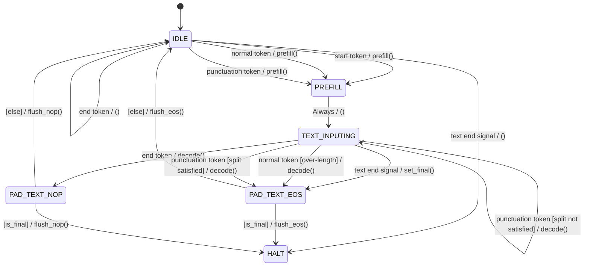

**English** | [中文](decode_fsm.zh-CN.md)

# Decode Session FSM Design

## Overview

The decode FSM manages per-session decode state. For **offline** (non-streaming) requests, the full text is available at the start: the request is conceptually `s-t1-t2-...-tN-e` (start → text tokens → EOS). For **streaming** requests, text arrives incrementally — when the available text is exhausted the FSM enters the **IDLE** state, and resumes as soon as new text (or `text_complete`) arrives.

### Offline vs Streaming Example

Assume the text tokens are `t1, t2, t3, t4`.

**Offline** — text pre-split into `[t1,t2]` and `[t3,t4]`:

```
Segment 1:  s → t1 → t2 → e → [Phase B] → done
Segment 2:  s → t3 → t4 → e → [Phase B] → done
```

**Streaming** — the same tokens arrive incrementally:

```
init(t1,t2):   s → t1 → t2 → IDLE (no e yet)
append(t3,t4):           resume → t3 → t4 → IDLE
text_complete:           resume → e → [Phase B] → done
```

Core rule: **before `e` (EOS) arrives, if there are no more text tokens, the session enters the IDLE state.** Phase B only runs after EOS has been consumed.

## State Diagram



## State Descriptions

| State | Description |
|-------|-------------|
| **IDLE** | Session paused — no text to process. Entry: initial startup, SB1/SB2 completion, no text after Prefill. Transitions: text arrives → Prefill; `text_complete` with no text → HALT. |
| **Prefill** | Runs prefill to load the prefix + first text token into the KV cache. On completion: if trailing text exists → SA; if only E (empty text) → IDLE (defensive). |
| **SA** | Phase A: each decode step consumes one trailing text token. Emits audio. Checks thresholds every step. Transitions: threshold satisfied + mid-cut → SB0; E consumed → SB1; no more text + streaming → SAIdle; otherwise → loop SA. |
| **SAIdle** | Streaming sub-state of SA — all text consumed but `text_complete` not set. The orchestrator retains the KV cache. On resume: new text → SA; E (`text_complete`) → SA → SB1. |
| **SB0** | Mid-cut only: injects `tts_eos_embed` so the model receives a segment-end signal. → SB1. |
| **SB1** | Pad phase: decodes using pad embeddings. Each step: checks for natural codec EOS or silence. Audio on EOS/silence steps is **not emitted** (meaningless). Transitions: EOS/silence → IDLE; KV overflow → SB2. |
| **SB2** | KV overflow handler. Updates the EMA ratio with an overflow penalty. → IDLE. |
| **HALT** | Session synthesis complete. |

### Key Design Decisions

1. **SA → SB1 direct** (`text_complete`, not a mid-cut): E has already been consumed as a trailing token in SA. The model has already seen EOS in its KV cache. SB0 does not need to inject a redundant EOS — go straight into the PAD phase (SB1).

2. **SA → SB0** (mid-cut only): there is still text after the cut point. The model has not yet seen EOS, so SB0 injects `tts_eos_embed` before starting the pad phase to signal segment end.

3. **SB1 EOS audio not emitted**: when SB1 detects a natural codec EOS or the silence threshold, that frame's audio is not meaningful speech. The terminating step sets `emit_wav=False`.

4. **SAIdle vs IDLE**: two distinct "wait" states with different resume semantics:
   - **SAIdle → SA**: KV continues, no re-prefill needed.
   - **IDLE → Prefill**: new segment, requires a full prefill.

## Transition Table

| Source State | Target State | Condition |
|--------------|--------------|-----------|
| IDLE | Prefill | Text (or S) arrives |
| IDLE | HALT | `text_complete` and no remaining text |
| Prefill | SA | Trailing text exists after prefill |
| Prefill | IDLE | No text (defensive: empty segment) |
| SA | SA | Threshold not satisfied → consume next token |
| SA | SAIdle | All trailing consumed, `!text_complete` |
| SA | SB0 | Threshold satisfied, `text_idx < trailing_len` (mid-cut) |
| SA | SB1 | All trailing consumed (E consumed), `text_complete` |
| SAIdle | SA | New text arrives (KV continues) |
| SAIdle | SA | `text_complete` arrives (inject E as trailing → SA → SB1) |
| SB0 | SB1 | EOS injected → start PAD phase |
| SB1 | IDLE | Natural codec EOS (`emit_wav=False`) |
| SB1 | IDLE | Consecutive silence ≥ dynamic N (`emit_wav=False`) |
| SB1 | SB2 | KV overflow |
| SB2 | IDLE | Overflow handled |

## IDLE vs SAIdle Resume

### SAIdle → SA (KV continues)

1. Build new trailing embeddings from the appended text.
2. Create a **new FSM** and call `enter_phase_a()`.
3. Set `next_embed = last_codec_sum + new_trailing[0]`.
4. Set `flow_state = ACTIVE` → the session re-enters the decode loop.

If `text_complete` with no new text: inject `tts_eos_embed` as a single trailing token → SA consumes it → SA → SB1 (direct, skipping SB0).

### IDLE → Prefill (new segment)

After SB1/SB2 → IDLE:
1. If there is remaining text in the current trailing (mid-cut) → Prefill and checkpoint restore → SA.
2. If no remaining text + more segments → next segment → Prefill → SA.
3. If no remaining text + `text_complete` → HALT.

**Priority**: remaining text > next segment > HALT.

## Key Variables

| Variable | Type | Description |
|----------|------|-------------|
| `steps_in_phase_a` | int | Accumulated steps in the current Phase A round. |
| `phase_b_start_frame` | int | The `frame_idx` when entering SB0 or SB1. |
| `thresholds.a/b/c/d` | int | Phase A step thresholds (three tiers + forced cut). |
| `pad_consecutive_silence` | int | Consecutive silence frames in SB1. |

## Threshold Computation

```python
remaining_kv = engine_max_decode_len - past_len
remaining_usable = remaining_kv - safety_margin
phase_a_cap = remaining_usable / (ema_ratio + 1)

a = int(phase_a_cap * 0.70)   # L1 punctuation only
b = int(phase_a_cap * 0.80)   # L1 + L2 punctuation
c = int(phase_a_cap * 0.90)   # L1 + L2 + L3 punctuation
d = phase_a_cap                # forced cut
```

## Dynamic Silence Threshold N (SB1)

```python
remaining_kv = engine_max_decode_len - past_len
if remaining_kv > 100:   N = 12
elif remaining_kv > 50:  N = 6
elif remaining_kv > 20:  N = 3
else:                    N = 1
```

## Streaming Flow Example

Full text: "你好，这是流式文本输入测试。我们正在验证。"

```
                        init("你好，这是流式文本输入测试。")
                        ┌──────────────────────────────────┐
Timeline    prefill     │  t1   t2   t3  ...  t8           │
            ━━━━━━━━━━━━┿━━━━━━━━━━━━━━━━━━━━━━━━━━━━━━━━━━┿━━━ SAIdle
                        │           Phase A                 │
                        └──────────────────────────────────┘

                        append("我们正在验证。")
                        ┌──────────────────────────────┐
                        │  t9   t10  ...  tN           │
            ━━━━━━━━━━━━┿━━━━━━━━━━━━━━━━━━━━━━━━━━━━┿━━━ SAIdle
                        │         Phase A               │
                        └──────────────────────────────┘

                        text_complete
                        ┌─────────────────────────────────┐
                        │  E  │  PAD  PAD ... silence      │
            ━━━━━━━━━━━━┿━━━━━┿━━━━━━━━━━━━━━━━━━━━━━━━━━━┿━━━ HALT
                        │ SA  │   SB1 (direct, no SB0)     │
                        └─────────────────────────────────┘
```
