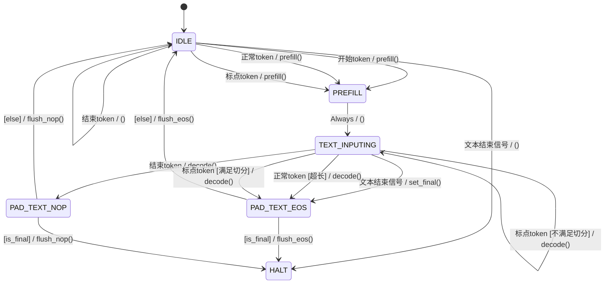

# 解码会话 FSM 设计

## 概述

解码 FSM 管理每个会话的解码状态。对于**离线**（非流式）请求，完整文本在开始时就可用：请求概念上为 `s-t1-t2-...-tN-e`（开始 → 文本 token → EOS）。对于**流式**请求，文本增量到达 —— 当可用文本耗尽时 FSM 进入 **IDLE** 状态，一旦新文本（或 `text_complete`）到达就恢复。

### 离线 vs 流式示例

假设文本 token 为 `t1, t2, t3, t4`。

**离线** — 文本预分割为 `[t1,t2]` 和 `[t3,t4]`：

```
Segment 1:  s → t1 → t2 → e → [Phase B] → done
Segment 2:  s → t3 → t4 → e → [Phase B] → done
```

**流式** — 相同 token 增量到达：

```
init(t1,t2):   s → t1 → t2 → IDLE (no e yet)
append(t3,t4):           resume → t3 → t4 → IDLE
text_complete:           resume → e → [Phase B] → done
```

核心规则：**在 `e`（EOS）到达之前，如果没有更多文本 token，会话进入 IDLE 状态。** Phase B 仅在 EOS 被消费后运行。

## 状态图



## 状态描述

| 状态 | 描述 |
|------|------|
| **IDLE** | 会话暂停 — 无文本可处理。入口：初始启动、SB1/SB2 完成、Prefill 后无文本。转换：文本到达 → Prefill；`text_complete` 且无文本 → HALT。 |
| **Prefill** | 运行 prefill 以将前缀 + 第一个文本 token 填充到 KV cache。完成时：若存在尾部文本 → SA；若仅 E（空文本）→ IDLE（防御性）。 |
| **SA** | Phase A：每个解码步消费一个尾部文本 token。输出音频。每步检查阈值。转换：阈值满足 + 中间切割 → SB0；E 被消费 → SB1；无更多文本 + 流式 → SAIdle；否则 → 循环 SA。 |
| **SAIdle** | SA 的流式子状态 — 所有文本已消费但 `text_complete` 未设置。编排器保留 KV cache。恢复时：新文本 → SA；E（`text_complete`）→ SA → SB1。 |
| **SB0** | 仅中间切割：注入 `tts_eos_embed` 使模型获得段结束信号。→ SB1。 |
| **SB1** | 填充阶段：使用 pad embeddings 解码。每步：检查自然 codec EOS 或静音。EOS/静音步的音频**不输出**（无意义）。转换：EOS/静音 → IDLE；KV 溢出 → SB2。 |
| **SB2** | KV 溢出处理器。使用溢出惩罚更新 EMA 比率。→ IDLE。 |
| **HALT** | 会话合成完成。 |

### 关键设计决策

1. **SA → SB1 直连**（`text_complete`，非中间切割）：E 已在 SA 中作为尾部 token 被消费。模型的 KV cache 中已看到 EOS。SB0 无需注入冗余 EOS —— 直接进入 PAD 阶段（SB1）。

2. **SA → SB0**（仅中间切割）：切割点后仍有文本。模型尚未看到 EOS，因此 SB0 在开始填充前注入 `tts_eos_embed` 以发出段结束信号。

3. **SB1 EOS 音频不输出**：当 SB1 检测到自然 codec EOS 或静音阈值时，该帧的音频不是有意义的语音。终止步设置 `emit_wav=False`。

4. **SAIdle vs IDLE**：两个独立的"等待"状态，具有不同的恢复语义：
   - **SAIdle → SA**：KV 连续恢复，无需重新 prefill。
   - **IDLE → Prefill**：新段，需要完整 prefill。

## 转换表

| 源状态 | 目标状态 | 条件 |
|--------|----------|------|
| IDLE | Prefill | 文本（或 S）到达 |
| IDLE | HALT | `text_complete` 且无剩余文本 |
| Prefill | SA | Prefill 后存在尾部文本 |
| Prefill | IDLE | 无文本（防御性：空段） |
| SA | SA | 阈值未满足 → 消费下一个 token |
| SA | SAIdle | 所有尾部已消费，`!text_complete` |
| SA | SB0 | 阈值满足，`text_idx < trailing_len`（中间切割） |
| SA | SB1 | 所有尾部已消费（E 已消费），`text_complete` |
| SAIdle | SA | 新文本到达（KV 连续恢复） |
| SAIdle | SA | `text_complete` 到达（注入 E 作为尾部 → SA → SB1） |
| SB0 | SB1 | EOS 已注入 → 开始 PAD 阶段 |
| SB1 | IDLE | 自然 codec EOS（`emit_wav=False`） |
| SB1 | IDLE | 连续静音 ≥ 动态 N（`emit_wav=False`） |
| SB1 | SB2 | KV 溢出 |
| SB2 | IDLE | 溢出已处理 |

## IDLE vs SAIdle 恢复

### SAIdle → SA（KV 连续）

1. 从追加文本构建新的尾部 embeddings。
2. 创建**新 FSM** 并调用 `enter_phase_a()`。
3. 设置 `next_embed = last_codec_sum + new_trailing[0]`。
4. 设置 `flow_state = ACTIVE` → 会话重新进入解码循环。

若 `text_complete` 且无新文本：注入 `tts_eos_embed` 作为单个尾部 → SA 消费它 → SA → SB1（直连，跳过 SB0）。

### IDLE → Prefill（新段）

SB1/SB2 → IDLE 后：
1. 若当前尾部中有剩余文本（中间切割）→ Prefill 并检查点恢复 → SA。
2. 若无剩余文本 + 更多段 → 下一段 → Prefill → SA。
3. 若无剩余文本 + `text_complete` → HALT。

**优先级**：剩余文本 > 下一段 > HALT。

## 关键变量

| 变量 | 类型 | 描述 |
|------|------|------|
| `steps_in_phase_a` | int | 当前 Phase A 轮次中累积的步数。 |
| `phase_b_start_frame` | int | 进入 SB0 或 SB1 时的 `frame_idx`。 |
| `thresholds.a/b/c/d` | int | Phase A 步数阈值（三级 + 强制切割）。 |
| `pad_consecutive_silence` | int | SB1 中连续静音帧数。 |

## 阈值计算

```python
remaining_kv = engine_max_decode_len - past_len
remaining_usable = remaining_kv - safety_margin
phase_a_cap = remaining_usable / (ema_ratio + 1)

a = int(phase_a_cap * 0.70)   # L1 仅标点
b = int(phase_a_cap * 0.80)   # L1 + L2 标点
c = int(phase_a_cap * 0.90)   # L1 + L2 + L3 标点
d = phase_a_cap                # 强制切割
```

## 动态静音阈值 N（SB1）

```python
remaining_kv = engine_max_decode_len - past_len
if remaining_kv > 100:   N = 12
elif remaining_kv > 50:  N = 6
elif remaining_kv > 20:  N = 3
else:                    N = 1
```

## 流式流程示例

完整文本："你好，这是流式文本输入测试。我们正在验证。"

```
                        init("你好，这是流式文本输入测试。")
                        ┌──────────────────────────────────┐
Timeline    prefill     │  t1   t2   t3  ...  t8           │
            ━━━━━━━━━━━━┿━━━━━━━━━━━━━━━━━━━━━━━━━━━━━━━━━━┿━━━ SAIdle
                        │           Phase A                 │
                        └──────────────────────────────────┘

                        append("我们正在验证。")
                        ┌──────────────────────────────┐
                        │  t9   t10  ...  tN           │
            ━━━━━━━━━━━━┿━━━━━━━━━━━━━━━━━━━━━━━━━━━━┿━━━ SAIdle
                        │         Phase A               │
                        └──────────────────────────────┘

                        text_complete
                        ┌─────────────────────────────────┐
                        │  E  │  PAD  PAD ... silence      │
            ━━━━━━━━━━━━┿━━━━━┿━━━━━━━━━━━━━━━━━━━━━━━━━━━┿━━━ HALT
                        │ SA  │   SB1 (direct, no SB0)     │
                        └─────────────────────────────────┘
```
