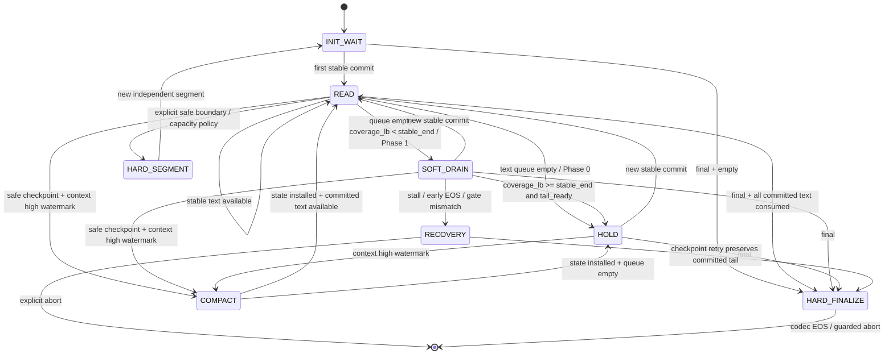

**English** | [中文](incremental_text_normalization_and_soft_drain.zh-CN.md)

# Streaming Text Disambiguation, Incremental Text Normalization, and Soft Drain Design

> Authored: 2026-07-28; implementation status updated: 2026-09-10<br>
> Status: **Design draft; Phase 0 is implemented**: the primary streaming TN, monotonic `TextCommit`, raw/spoken owner mapping, and current `WAIT_TEXT` path are wired into the runtime. `Soft Drain`, coverage, and low-seam rollover still require training and runtime work and are not released as default capabilities<br>
> Scope: Text ingestion and pre-segmentation processing in `engine/frontend/`, wait/resume control in `engine/backend/`, future Talker adaptation training, and Code2Wav state inheritance<br>
> Related: [Frontend Text Segmentation Pipeline](frontend_segmentation_pipeline.md) · [Decode FSM](../architecture/decode_fsm.md) · [Engine Overview](../architecture/engine_overview.md) · [Real-Time Audio Streaming](realtime_audio.md) · [Observability Goals](observability_goals.md)

---

## 0. Conclusion First

The fundamental constraint facing streaming TTS is not "when a character arrives," but "when the system can irreversibly commit to a pronunciation." Once audio has been played, later text has no authority to modify it. This design therefore changes text ingestion to use **monotonic commitment**: only a stable spoken form is handed to TTS, while any suffix that might still be rewritten by later characters or semantic context remains in a mutable buffer.

This design makes the following decisions:

| Decision | Conclusion |
|---|---|
| Where incremental TN belongs | Before the BPE tokenizer and `Spliter`, maintaining session-scoped raw/mutable/committed state |
| Role of WeTextProcessing | Rule-constrained candidate generation and verbalization; it does not perform semantic disambiguation by itself |
| Temporarily no committable text | Use the existing `WAIT_TEXT`/future `HOLD`; do not inject text EOS |
| Whether to feed temporary PAD to the current checkpoint | No; resuming text after PAD is an untrained path that may cause drawn-out speech, pauses, omissions, or premature EOS |
| How to implement `Soft Drain` | Add a dedicated `<tts_wait>`/control embedding and conservatively determine acoustic completion with a coverage lower bound plus an acoustic endpoint/tail gate |
| Responsibility of codec EOS/BOS | They indicate only the end/start of a complete acoustic sequence; they are not a temporary wait protocol |
| Continuation after context exhaustion | Only architecture-native bounded recurrent state or exact compaction can both preserve equivalence and free context; an ordinary snapshot migrates state but does not reduce `past_len`. Otherwise reconstruct approximately from actual codecs and original interleaved inputs without resampling overlap |
| Whether a low audio watermark can force a pronunciation commitment | No; the watermark can decide waiting, fallback, or a hard boundary, but cannot change semantic confidence |
| Whether Phase 0 changes the external protocol | No; continue accepting ordinary `TextChunk` messages, keeping all incremental state internal to the server initially |

The minimum closed loop for Phase 0 is:

```text
raw text delta
  → reconstruct Unicode / detect open spans
  → WeText candidates + domain rules/context ranking
  → commit only a stable spoken prefix
  → existing tokenizer / Spliter / WAIT_TEXT
```

Only Phase 1 and later add:

```text
READ → SOFT_DRAIN → HOLD → READ → ... → HARD_FINALIZE
```

---

## 1. Background and Problem Definition

### 1.1 Typical Ambiguity

An upstream LLM is generating this text as a stream:

```text
This is x 2 ...
```

After seeing only `x2`, possible pronunciations include:

- `x two`: a product model, variable name, or string;
- `x squared`: when context makes clear that it is an exponent expression;
- `x times two`: multiplication;
- `x sub two`: a subscript;
- other domain-specific pronunciations.

The problem is not limited to alphanumeric strings:

```text
1        → one
10       → ten
10.5     → ten point five
10.5%    → ten point five percent

3        → three
3rd      → third

2026-    → year, date prefix, range, or ordinary character sequence
```

If `1` or `3` has already been sent to TTS, it cannot be retracted when later input arrives. Running TN independently on every LLM delta and then appending the result cannot satisfy streaming correctness.

### 1.2 An Impossible Triangle

For two future texts that share the same observed prefix but require different pronunciations, the system cannot simultaneously guarantee:

1. zero waiting;
2. always-correct output;
3. no dependency on additional upstream semantics.

This design chooses **pronunciation correctness over uncontrolled zero waiting**, then uses audio already generated but not yet played to hide most of the waiting. If full context still cannot disambiguate the text, the system must use an explicit domain policy, an upstream spoken form, or an auditable literal fallback. It must not pretend that TN can recover intent that was never encoded in the source text.

Here, "stable" means **policy-stable under the declared closure/lookahead/deadline policy**, not mathematically immune to every possible future continuation. Only a validated typed hint or a closed-domain protocol can provide a stronger guarantee; a finite-context ranker provides only calibrated confidence. A deadline-forced commitment must be labeled as a fallback rather than presented as unique truth.

### 1.3 Difference from Ordinary Text Segmentation Buffering

The [Frontend Text Segmentation Pipeline](frontend_segmentation_pipeline.md) rejects "general window accumulation to find better sentence boundaries," because that would artificially add latency to all text. This design narrows the scope of holding:

- retain only the **mutable suffix whose pronunciation may be rewritten by future input**;
- commit ordinary stable prefixes immediately;
- use holding to prevent irreversible mispronunciation, not to pursue globally optimal segmentation;
- require every hold to have a class, reason, deadline, and fallback outcome.

---

## 2. Goals, Non-Goals, and Terminology

### 2.1 Goals

1. For any transport packetization, spoken text already committed to TTS is never modified.
2. Allow stable prefixes such as `This is` to continue through the existing streaming pipeline while retaining only open spans such as `x2`.
3. Use deterministic grammars such as WeTextProcessing to constrain the candidate space, then use domain information or context to select a candidate.
4. Reuse the current `WAIT_TEXT` for Phase 0 so model training does not block frontend correctness.
5. Define a clear, trainable, and observable contract for future `Soft Drain + coverage + state rollover`.
6. Provide conservative and auditable fallback paths for timeouts, capacity pressure, multilingual coverage gaps, and normalizer failures.

### 2.2 Non-Goals

1. Phase 0 does not promise full-context prosody; generated audio still depends only on text visible at generation time.
2. Phase 0 does not support resuming text after temporary PAD and does not change the current codec EOS stop semantics.
3. This design does not require WeTextProcessing to become a general semantic model.
4. This design does not allow already-played audio to be modified; if speculative audio exists, it must remain inside a server-side retractable window.
5. This design does not change the gRPC/WebSocket text message format in the first phase.

### 2.3 Terminology

| Term | Definition |
|---|---|
| `raw stream` | The raw Unicode text stream sent upstream at arbitrary boundaries |
| `mutable tail` | A raw suffix whose boundary, class, or pronunciation may still be changed by future input |
| `stable raw prefix` | A raw prefix that will not be revised under the declared closure/lookahead policy |
| `spoken candidate` | A candidate spoken form for a raw span, such as `x two` |
| `committed spoken prefix` | Spoken text already handed irreversibly to the tokenizer/TTS |
| `stable_end` | The right boundary after mapping committed normalized text into coverage-domain speakable units, with BPE-range/commit/raw mappings retained separately |
| `READ` | The state that consumes committed text and generates codecs normally |
| `WAIT_TEXT` / `HOLD` | Preserve state and wait for new text without advancing model position or generating PAD |
| `SOFT_DRAIN` | Continue generating predicted codec audio supported only by the committed but not yet acoustically completed prefix when no new text is available; requires training |
| `HARD_FINALIZE` | Input the real text EOS, then PAD-drain until codec EOS |
| `audio credit` | Remaining time represented by playable generated audio relative to the playback head |
| `rollover` | Switch to a new Talker context at a high context watermark while carrying or reconstructing local acoustic conditioning; continuity is accepted separately |

The remainder of this document defines coverage as a conservative lower bound and protects the acoustic tail with a separate `tail_ready`/endpoint gate. Coverage is a runtime control estimate, not a proof of semantic safety.

---

## 3. Safety Invariants

The following invariants take precedence over latency and throughput goals:

### I1. Text Commitment Is Monotonic

`commit.raw_end` strictly increases, and committed `tts_text` may only be appended to, never revised.

### I2. Packetization Does Not Change Final Semantics

With deadlines/fallbacks disabled and the final input complete, every legal packetization of the same raw text must produce the same final committed text.

### I3. Played Audio Must Not Cover Uncommitted Semantics

The raw coverage corresponding to the audio release frontier must not pass the text commit frontier. An experimental path that permits speculative codecs must keep the audio inside a discardable window.

### I4. Audio Watermarks Do Not Decide Semantics

Low `audio_credit` may trigger waiting, literal fallback, client-side silence, or hard finalization at a confirmed strong boundary, but it cannot promote a low-confidence candidate into a "correct pronunciation."

### I5. Temporary Waiting Does Not Use Final EOS

Text EOS and codec EOS are used only for complete input or an explicit hard segment. They must not be sent merely because input is temporarily exhausted while the `mutable tail` remains unresolved.

### I6. HOLD Does Not Advance Context

No Talker/Code2Wav decode step may run in `HOLD`; it must not increase `past_len` or generate padding silence.

### I7. Every Raw Character Has a Disposition

At session completion, every raw span must be either committed, dropped by an explicit rule (for example, emoji/decorative characters), or downgraded with a reason. Characters must never be silently lost.

### I8. Rollover Does Not Resample History

An already-played overlap must not be resampled and then used as continuation state. Complete state snapshot/restore can be exact; trained compaction and replay of the actual codec/input trace are approximate reconstruction paths and must not be described as equivalent to the untruncated Talker hidden state.

---

## 4. Current Implementation Baseline and Capability Boundary

### 4.1 Existing Capability: `WAIT_TEXT`

When trailing text is exhausted and `input_complete=False`, the current backend:

1. saves the latest `codec_sum` to `slot.last_codec_sum`;
2. sets `slot.next_embed=None`;
3. preserves the Talker KV and Code2Wav KV/conv/transconv state;
4. excludes that slot from subsequent decode batches;
5. resumes in place with `last_codec_sum + text_add` when new text arrives.

`WAIT_TEXT` is an implicit semantic state in the current code, not a standalone enum: the slot remains active, but `next_embed=None` and `last_codec_sum` is retained. This remains true only until cancellation, timeout, or idle eviction; idle eviction currently defaults to roughly 10 seconds, reports an error, and removes the session, so Phase 0 must explicitly evaluate and configure a held-slot lease.

Implementation entry points:

- `engine/backend/engine_loop.py:_process_step_output_inner`
- `engine/backend/engine_loop.py:_resume_streaming_segment_if_ready`
- `engine/backend/engine_loop.py:_get_active_slots_mlfq`

This path is the acoustic foundation of Phase 0, but it freezes as soon as the text queue is exhausted and may not finish generating the entire acoustic tail of `This is`. Phase 0 first solves irreversible misreading safety; fully exploiting the available audio slack belongs to Phase 1 `SOFT_DRAIN`.

### 4.2 Phase 0 Implemented: Primary Streaming TN and Monotonic Commitment

The runtime now wires
`engine/frontend/text_commitment/IncrementalTextCommitter` in front of tokenizer/Spliter
dispatch. It retains the complete raw Unicode source and an extendable mutable tail, then
produces monotonic `TextCommit` records through `SpanDetector`, the WeText backend, domain
rules, and explicit fallbacks. An already committed spoken prefix is not rewritten by transport
packetization or a later tail revision.

The current implementation includes:

- a general raw mutable tail, semantic span closure, and `SpanKind` classification;
- raw-to-spoken mappings, the `CanonicalTextJournal`, and owner-level coordinates;
- WeText/mixed-language routing, candidate verbalization, and literal/cardinal fallbacks;
- the `TextCommit`/commit fence and alignment metadata used by `qwen.text_progress`;
- adaptation from primary-TN commits to native-cursor label plans with owner-span reanchoring;
- reuse of the existing `WAIT_TEXT` path when no text is committable, without temporary text EOS
  or multi-PAD resume.

This is still not Soft Drain: the service does not generate an acoustic tail with `<tts_wait>`
when no new text is available, and cross-segment state rollover is not treated as a validated
capability. Coverage, trained control tokens, low-seam state inheritance, and their quality gates
remain Phase 1/2 work described below.

### 4.3 Current Hard Flush Is Termination, Not Suspension

Both `FLUSH_EOS` and `FLUSH_NOP` set the current segment's `input_complete=True` and produce the per-segment event `SEGMENT_TOKENS_DONE`; only `FLUSH_EOS` appends text EOS, while `FLUSH_NOP` does not. After existing trailing input is consumed, the model incrementally uses `tts_pad_embed`, then logically releases the slot on codec EOS or abort. A new segment performs an independent prefill, and Talker/Code2Wav state is reset on the next admission.

Therefore:

- `FLUSH_NOP` is not a soft wait;
- text cannot be appended to the same segment after codec EOS;
- current cross-segment behavior performs only audio reordering, not prosodic state inheritance.
- Although `kv_cache_pool.reset_for_new_segment()` is a helper that preserves KV, it currently has no call sites and is not an existing cross-segment inheritance capability.

### 4.4 Training Boundary of the Current Checkpoint

The existing sequence defines only one text BOS→text→EOS and one codec BOS→audio→EOS. The following operations must all be treated as out-of-distribution experiments, not production contracts:

- `text → PAD × N → text`;
- `codec EOS → codec BOS → codec` while reusing the same KV;
- resampling an overlap from repeated text, then assuming its hidden state matches the version already played.

---

## 5. Target Architecture

```mermaid
flowchart LR
    A[Transport TextChunk] --> B[Unicode / Grapheme Assembler]
    B --> C[Stateful Filter Chain]
    C --> D[Open-Span Lexer]
    D --> E[Normalizer Backend\nWeText n-best / custom rules]
    E --> F[Hint Validator + Context Ranker]
    F --> G[Monotonic Commit Controller]
    G -->|committed tts_text| H[Existing BPE Tokenizer]
    H --> I[Spliter / Dispatcher]
    I --> J[READ / WAIT_TEXT]
    G -->|mutable tail| K[Pending Buffer + Deadline]
    K --> D
    J -. Phase 1 .-> L[SOFT_DRAIN / HOLD]
    L -. high KV .-> M[State Rollover]
```



### 5.1 Three Frontiers

Each session explicitly maintains three boundaries:

1. **Text commit frontier**: the rightmost position in raw text whose pronunciation has been determined;
2. **Codec generation frontier**: the committed text covered by generated codecs;
3. **Audio release frontier**: audio that has been delivered and therefore cannot be retracted.

Phase 0 prohibits codec generation from passing the text commit frontier. Future speculative codec generation may temporarily pass it, but audio release still must not, and speculative results must remain discardable inside a server-side window.

### 5.2 Component Responsibilities

| Component | Responsible for | Not responsible for |
|---|---|---|
| Unicode assembler | Concatenating transport deltas and repairing cross-packet grapheme/emoji boundaries | Semantic disambiguation |
| Stateful filter chain | Preprocessing whitespace, emoji, markup, and similar content while preserving an offset map | Selecting numeric pronunciations |
| Open-span lexer | Finding numbers, units, identifiers, URLs, formulas, and similar spans that may continue to grow | Final verbalization |
| Normalizer backend | Generating one or more grammar-constrained spoken candidates | Recovering semantics that were not encoded |
| Hint validator/ranker | Validating upstream hints and ranking with left/right context, domain, and confidence | Modifying committed text |
| Commit controller | Deciding stable prefixes, deadlines, and fallbacks, then emitting monotonic commits | Controlling acoustic EOS |
| Audio scheduler | Selecting READ/HOLD/FINALIZE from committed input and audio credit | Forcing a semantic candidate to win |

---

## 6. Incremental TN and Disambiguation Pipeline

### 6.1 Processing Order

```text
1. append raw delta
2. complete Unicode/grapheme assembly
3. run stateful filters that change representation but not semantics
4. lexer partitions input into closed stable spans and an open mutable suffix
5. run normalizer on left context + mutable window + arrived right context
6. validate and rank candidates
7. commit controller commits only stable spans
8. merge retained prosodic punctuation to produce exact tts_text
9. hand off to the existing BPE tokenizer
```

The system cannot tokenize `x` first and attempt to retract it after `2` arrives. LLM/BPE token boundaries are also not linguistic span boundaries; the same raw span may cross any number of transport packets.

### 6.2 Open-Span Classes

The MVP lexer covers at least:

| Class | May continue as | Typical closure signal |
|---|---|---|
| integer/decimal | `10.5`, percentage, currency amount, unit | Explicit delimiter + suffix no longer matches |
| ordinal | `3rd`, `21st` | Ordinal suffix complete and a boundary encountered |
| date/time/range | `2026-07-28`, `10:30`, `1-3` | Grammar accepts and right boundary closes |
| identifier | `x2`, `X20`, version, model number | Whitespace/punctuation/markup boundary + domain decision |
| URL/email | scheme, host, path, query | Whitespace, closing parenthesis, or end of input |
| measure/currency | `25kg`, `$13.5` | Unit/currency span closes |
| math/markup | `x^2`, LaTeX, Markdown code | Paired delimiter closes |
| Unicode sequence | emoji ZWJ, keycap, combining characters | Grapheme cluster closes |

"Whitespace appeared" is not always a sufficient closure condition, for example with markup, spaced units, or upstream-formatted text. Closure must be defined per class.

### 6.3 WeTextProcessing Integration Boundary

WeTextProcessing implements `NormalizerBackend`; it is not hard-coded into `FrontendInterface`:

```python
class NormalizerBackend(Protocol):
    def candidates(
        self,
        text: str,
        *,
        language: str,
        domain: str | None,
        nbest: int,
    ) -> list[NormalizationCandidate]: ...
```

Integration constraints:

1. WeText currently operates on complete input/windows; the MVP uses an external lexer + sliding-window recomputation and does not assume streaming state inside WeText.
2. The shortest path with `nbest=1` is only the grammar default, not semantic truth.
3. The standard English grammar is not guaranteed to generate mathematical candidates such as `x squared`; these require custom rules or an upstream typed hint.
4. Mixed Chinese/English input should route language per span rather than relying only on session-level `language=auto`.
5. A normalizer may remove punctuation; original punctuation and boundaries must be retained or reconstructed as a prosody side channel.
6. FSTs must be prebuilt/prewarmed at service startup, not constructed on the first-request path.

### 6.4 Candidate Selection Priority

Candidates are selected in this priority order:

1. a **validated upstream typed spoken-form hint**;
2. a **session/domain lexicon**, such as policies for product models, mathematical expressions, or phone numbers;
3. a **context ranker** using limited left/right context and the candidate lattice;
4. a **unique grammar candidate**;
5. the **domain-configured literal fallback**.

An upstream hint must align with the raw span, satisfy language/character constraints, and belong to the set of candidates permitted by the grammar/lexicon. Arbitrary upstream strings must not be injected into TTS without validation.

### 6.5 Stable Prefix Algorithm

Phase 0 uses a conservative policy: the entire open semiotic span remains in the mutable tail. A future optimization may commit the longest common spoken prefix across candidates, but only when all of the following hold:

- all surviving candidates share that spoken token/phoneme prefix;
- raw ↔ spoken alignment proves that the corresponding raw interval cannot be rewritten by extension;
- the commit point falls on a complete TTS token/word boundary rather than inside a string character;
- punctuation/prosody side-channel information remains intact.

"The normalizer returned the same result twice in succession" is not sufficient proof of stability; future characters may still rewrite the entire result.

### 6.6 End-to-End `This is x2` Example

```text
t0  raw="This is "   → commit("This is ") → tokenizer/Spliter → READ
t1  raw+="x2"        → open identifier span; no new commit
                         active segment reaches current WAIT_TEXT; buffered audio keeps playing
t2  raw+=". And ..." → hint/domain/ranker selects "x two"
                         commit("x two.") → resume the same live segment when possible
t3  final             → resolve all pending text → HARD_FINALIZE
```

Phase 0 enters `WAIT_TEXT` as soon as the queue is exhausted, so it guarantees "do not misread early," not that the committed `This is` has been fully spoken. Phase 1 may continue with `SOFT_DRAIN` only while the coverage/tail gate permits. If the input begins with `x2`, no stable prefix is available to generate audio and the session remains in `INIT_WAIT`, increasing TTFT. If even the full right context does not encode an intent such as squared, multiplication, or model identifier, the system must use a typed hint or an explicit fallback.

### 6.7 Incremental Computation Boundary

Each delta re-lexes only the affected suffix and a bounded left/right window; it does not reprocess the entire history. Normalizer calls may be coalesced within one event-loop turn or a very small transport burst, but a general debounce must not retain an already-determined stable prefix. FSTs/grammars are warmed at service startup, and candidate count, window length, CPU time, and queue wait all require bounds and metrics.

---

## 7. Internal Data Contract

### 7.1 Offset Semantics

- `raw_start/raw_end` use Unicode code-point offsets in the session's original Python `str`;
- offsets refer to the raw stream before TN;
- each filter/normalizer transformation maintains a span map;
- UTF-8 byte offsets and code-point offsets must not be mixed;
- if hints are exposed through the protocol in the future, the protocol must explicitly declare the offset unit and text version.

### 7.2 Proposed Types

```python
@dataclass(frozen=True)
class NormalizationCandidate:
    spoken_text: str
    class_name: str
    score: float
    source: str                  # wetext | custom_rule | upstream_hint


@dataclass(frozen=True)
class TextCommit:
    commit_id: int
    raw_start: int
    raw_end: int
    spoken_text: str             # lexical verbalization
    tts_text: str                # exact tokenizer input, incl. prosody punctuation
    language: str
    class_name: str
    source: str
    confidence: float | None
    commit_kind: str             # stable | deadline_fallback | resource_fallback | final_fallback
    creates_fence: bool          # future raw spans may not merge backward across raw_end


@dataclass(frozen=True)
class CommitDecision:
    commits: tuple[TextCommit, ...]
    pending_raw: str
    pending_raw_start: int
    hold_reason: str | None
    candidate_count: int
    deadline_ms_remaining: float | None
    fallback_reason: str | None
    late_extension: bool


class IncrementalTextCommitter(Protocol):
    def feed(self, delta: str, *, final: bool = False) -> CommitDecision: ...
```

`TextCommit` is an append-only fact; `CommitDecision.pending_raw` is a diagnostic snapshot and may change arbitrarily as new input arrives.

### 7.3 Interface with the Existing Frontend

In Phase 0, the streaming branch of `FrontendInterface.push_text_input()` becomes:

```text
raw delta
  → session.text_committer.feed(...)
  → for commit in decision.commits:
        _ingest_streaming_text(session, commit.tts_text)
```

`mark_input_complete()` first flushes the committer with `final=True`, then calls the existing `spliter.input_done()`. An input-exhaustion-driven `END`/`SESSION_TOKENS_DONE` may be sent only after the committer has no pending raw text. A committed safe prefix may still produce an independent per-segment `SEGMENT_TOKENS_DONE` at an explicit punctuation or capacity boundary.

---

## 8. Deadlines, Fallbacks, and Completion Semantics

### 8.1 Two Types of Deadline

1. **Semantic deadline**: the maximum time/character window to wait for more text to determine a pronunciation;
2. **Resource deadline**: resource limits such as pending buffer size, session TTL, and held KV slots.

`audio_credit` is not a semantic deadline; it describes only whether the user will perceive the wait.

### 8.2 Deadline Expiration Policies

Select a policy from the session/domain configuration:

| Policy | Behavior | Applicable scenarios |
|---|---|---|
| `literal` | Commit a character/digit-literal pronunciation with minimal semantic inference | Model numbers, IDs, default general assistant behavior |
| `domain_default` | Use an explicitly configured candidate for the domain | Single-domain applications |
| `wait` | Keep pending and accept a perceptible pause | Correctness-first domains such as mathematics or medicine |
| `error` | Emit a recoverable error/request an upstream spoken form | Strong-contract interfaces |

A hard segment can only allow an existing safe prefix to complete; it cannot resolve the pronunciation of a pending span. "Cutting a segment" must not substitute for semantic fallback.

### 8.3 End of Input

After receiving `TextComplete`/`EndRequest`:

1. pass all remaining context to the normalizer/ranker;
2. if ambiguity remains, apply the session's final fallback;
3. commit or explicitly drop all pending raw text;
4. confirm that the committer is empty;
5. only then enter `HARD_FINALIZE`.

### 8.4 Commit Fence After Forced Commitment

If a deadline or resource-pressure policy forces `literal` or `domain_default` while the span could still be extended, the committer must install a non-crossable commit fence at that `raw_end`. Later characters begin a new span and must never merge backward to rewrite committed spoken text.

For example, if `1` times out and commits as `one`, then `0` arrives later, the system cannot revise the output to `ten`; it can only handle `0` under a late-continuation policy, usually yielding `one zero` or an explicit error. This is an observable degradation paid for monotonicity. It must emit `text.span.late_extension` and be reported separately from packetization-invariance measurements made with deadlines disabled.

---

## 9. Runtime State Machine

### 9.1 Target State Diagram



### 9.2 State Semantics and Support Status

| State | Model advances | Outputs audio | Currently supported | Notes |
|---|---:|---:|---:|---|
| `INIT_WAIT` | No | No | Implementable in frontend | Sentence-initial ambiguity directly increases TTFT |
| `READ` | Yes | Yes | Yes | Consumes only committed text |
| `HOLD` | No | No | Yes (existing `WAIT_TEXT`) | Preserves the same slot state until cancellation, timeout, or idle eviction |
| `SOFT_DRAIN` | Yes | Yes | No | Requires `<tts_wait>`, a coverage lower bound, and tail-gate training |
| `HARD_SEGMENT` | Yes, until completion | Yes | Yes | Produces an independent segment and a possible prosodic seam |
| `HARD_FINALIZE` | Yes, until EOS | Yes | Yes | Text EOS + PAD; actual termination |
| `RECOVERY` | Policy-dependent | Not released | No | Retries from a safe checkpoint or terminates explicitly; failure is not treated as successful HOLD |
| `COMPACT` | Pauses and migrates | No | No | Requires architecture-supported exact compaction or an accepted approximate rollover; an ordinary snapshot does not free context |

### 9.3 Mapping to the Existing Decode FSM

- `HOLD` in this document corresponds to the `SAIdle`/backend `WAIT_TEXT` semantics in the existing [Decode FSM](../architecture/decode_fsm.md);
- `HARD_FINALIZE` in this document corresponds to the existing `SB0/SB1` and codec EOS finalization;
- `SOFT_DRAIN` in this document is a new state and is **neither `SAIdle` nor the existing PAD phase**;
- while mutable text remains uncommitted, the frontend must not send `END` to the driver;
- `SEGMENT_TOKENS_DONE` is a per-segment event; a committed safe prefix may still end at an explicit safe boundary, but the frontend must never send `APPEND_TOKENS` to that same segment afterward.

---

## 10. Soft Drain and Coverage Training Contract

### 10.1 Why `tts_pad` Cannot Be Reused

The training semantics of the current `tts_pad` are "text has ended; continue generating the remaining audio and prepare to terminate." A temporary stream gap means "more text will arrive, but no new text token is currently available." Reusing the same embedding would conflate:

- completing the remaining phonemes of committed words;
- generating a sentence-final pause;
- triggering codec EOS;
- waiting for future text.

Therefore, add `<tts_wait>` (name TBD) or an equivalent phase embedding without changing the meaning of global text EOS/codec EOS.

### 10.2 Coverage

Coverage uses **speakable units**, preferably words or phonemes in Phase 1, rather than punctuation-bearing raw characters or an unexplained BPE index. Each unit maps to a BPE range, `commit_id`, and raw span. Define a conservative lower bound:

```text
a_t^LB = greatest speakable-unit index whose alignment end is known to be no later than codec frame t
tail_ready_t = whether the required acoustic tail of the final unit is complete
```

Non-speaking tokens such as punctuation do not directly consume coverage units; their pause/prosody effect is represented by endpoint/tail labels. A coverage false positive can truncate a final phoneme and is more dangerous than a false negative, so training and calibration must be conservative. Enforce monotonicity with cumulative non-negative increments, monotonic attention, or runtime monotonic projection rather than only a soft loss:

```text
a_t^LB >= a_(t-1)^LB
```

At runtime:

- if the text queue is empty and `a_t^LB < stable_end`, enter/remain in `SOFT_DRAIN`;
- enter `HOLD` only when `a_t^LB >= stable_end AND tail_ready_t=true`, with the confidence threshold and hysteresis satisfied;
- when a new commit arrives, update `stable_end` and return to `READ`;
- coverage must not pass the committed frontier.

A lower-change alternative is a `prefix_drained + tail_ready` classification head, but a monotonic lower-bound pointer makes omissions, repetitions, and overruns easier to locate. In either form, coverage is a control estimate and does not by itself prove acoustic completion.

### 10.3 Training Sample Construction

The Talker-side sequence contract must be:

```text
READ:       last_real_codec + next_committed_text_embedding
SOFT_DRAIN: last_real_codec + tts_wait_embedding
HOLD:       no forward; no training token; wall-clock duration does not consume context
RESUME:     last_real_codec + next_committed_text_embedding
```

`<tts_wait>` is a learned control/phase embedding injected directly on the Talker side. It does not enter the raw tokenizer and is not sent to Code2Wav as a codec. Its decode-step count covers only real codec frames that still belong to the committed prefix after the last visible committed token was consumed; it never encodes how many milliseconds the upstream remained idle. Once the acoustic tail is complete, real wall-clock waiting is represented by zero-forward `HOLD`.

1. Generate the final spoken form for complete text;
2. use CTC/forced alignment to obtain word/phoneme ↔ codec-frame alignments and include the required acoustic tail after the final phoneme in the endpoint label;
3. randomly simulate LLM bursts/stalls and TN commit trajectories over real continuous audio;
4. construct READ→SOFT_DRAIN→RESUME trajectories at ordinary word boundaries, around numbers/units/formulas, and near punctuation;
5. use the same continuous original audio before and after a wait, with only one true BOS/EOS for the full segment;
6. randomize the count of visible spoken tokens that are already committed but not yet acoustically realized; any uncommitted raw/candidate context requires a separate non-speakable channel and must not be mixed into the current speaking track;
7. oversample numbers, dates, URLs, alphanumeric mixtures, mathematical expressions, and mixed Chinese/English text;
8. include scheduled sampling/generated history to avoid recovery that works only under teacher forcing;
9. optionally distill codec logits near boundaries from a full-context teacher.

### 10.4 Probe Before Training Acceptance

First run a `tts_pad embedding/decode steps = 0/1/2/4/8/16 → resume text` probe on the current checkpoint, across multiple texts, languages, and seeds. Measure at least:

- premature/missing/late codec EOS;
- omissions, insertions, and repetitions;
- PAD duration and codec-logit drift;
- maximum reliable recovery length;
- comparisons against the current `WAIT_TEXT` and hard segment.

This experiment establishes the OOD boundary; it does not promote an accidentally usable PAD length into a production contract.

### 10.5 Soft Drain Failure Exits

Any of the following enters `RECOVERY` rather than being treated as a successful `HOLD`:

- coverage fails to advance within `max_soft_drain_steps`;
- `tail_ready` remains false or persistently conflicts with coverage;
- codec EOS appears before coverage completes;
- repetition, skipped words, silent frames, or coverage overrun is detected after WAIT/RESUME.

Recovery order is: guarded retry from a safe checkpoint that still contains every unspoken committed tail; hard finalize only when no committed text can be lost; otherwise explicit abort/error. A hard restart without the committed tail is forbidden because it would lose text that is committed but not yet spoken.

---

## 11. Audio Credit and Latency Control

### 11.1 Definition

```text
audio_credit_ms
  = generated_playable_audio_ms
  - estimated_played_audio_ms
  - jitter_reserve_ms
```

An approximate sufficient condition for a TN wait to be imperceptible is:

```text
resolution_wait_ms + synthesis_catchup_ms <= audio_credit_ms
```

For sentence-initial ambiguity, `audio_credit_ms=0`, so TTFT increases. Mid-stream ambiguity is usually covered by previously generated audio, but long spans, LLM jitter, network stalls, or consecutive ambiguities can still cause underflow.

### 11.2 Watermarks Control Actions, Not Pronunciations

| Watermark | Current Phase 0 | Future Phase 1 |
|---|---|---|
| High | Normal READ, limit excessive lookahead | Normal READ |
| Target range | READ/HOLD | READ/SOFT_DRAIN |
| Low with unresolved pending text | Remain in INIT_WAIT at sentence start; otherwise continue HOLD and wait for semantic deadline or literal fallback | Drain only committed but uncovered audio, then HOLD |
| Underflow | Client may insert silence/a perceptible pause may occur | Same; unbounded PAD generation is forbidden |

Server generation speed, the client jitter buffer, and the real playback head are not identical. Phase 0 may estimate `audio_credit` from server-side delivery/reorder timing. If the client can report its playhead, it must be added through versioned capability negotiation; the server cannot assume that every transport provides it.

`HOLD` has continuous-audio semantics only while the client playback buffer has not drained. If the client has already played inserted zeros or experienced a real gap, the frozen Talker/Code2Wav state has diverged from the waveform timeline heard by the user. Resume must be labeled `gapped_resume`, excluded from seamless/low-seam metrics, and handled with crossfade, explicit pause modeling, or a safe hard segment. A direct frozen-state continuation must not be advertised as seamless.

---

## 12. High Context Watermark and State Rollover

### 12.1 Do Not Resample the Overlap

Re-entering `x two .` and sampling it again cannot guarantee the same:

- codec sequence;
- duration, F0, energy, or pauses;
- Talker hidden state;
- Code2Wav convolution and attention state

as the version already played. Even if the overlap audio is discarded, continuation proceeds from a different state and therefore does not constitute strict prosody inheritance.

### 12.2 Recommended Paths

Classify the paths by equivalence rather than calling all of them "inheritance":

1. **Exact state handoff**: under a compatible layout and model version, directly snapshot/restore the complete Talker and Code2Wav runtime state; this supports slot/process migration but does not itself reduce `past_len`;
2. **Trained approximate**: trained sliding-window/KV compaction retaining system/speaker sinks and recent real history;
3. **Reconstruction approximate**: in a new Talker context, teacher-force a recent segment of the **actual interleaved trace**—the committed text/control embedding schedule used at the time plus the actually sampled multi-codebook codecs—then predict only the continuation. Actual codecs avoid switching to a different stochastic acoustic trajectory, but do not make the reconstructed hidden/KV state equivalent to the untruncated context.

A truly exact Talker path that also frees context requires architecture-native bounded recurrent state, a strictly equivalent ring/sliding cache, or provable compaction. An ordinary full-state snapshot is only a migration baseline. Once earlier history is discarded, accept the path as trained/reconstruction approximate unless such equivalence is proven.

For Code2Wav, prefer direct snapshot/handoff of KV, conv/transconv state, frame index, and buffer parity. If only silent replay from zero is available, the suffix must cover the real receptive field/state memory; otherwise it is also an approximate reconstruction. Sweep Talker and Code2Wav replay windows separately. "1–3 seconds" may be an initial experiment point, not a protocol constant.

The state checklist includes at least:

- Talker KV, `past_hidden`, `last_codec_sum`, and `cache_position`/RoPE delta;
- Code2Wav KV, conv/transconv state, frame index, and ping-pong buffer parity;
- the actual codec trace, sampling RNG, and repetition counts;
- remapping global coverage/commit/spoken cursors to the new context's local cursors;
- audio frame/sample index and the delivery checkpoint.

Inheriting only Talker KV or only Code2Wav state is insufficient for complete continuity. Every path must declare `exact`, `trained_approximate`, or `reconstruction_approximate` in events and metrics; low-seam quality must not be equated with identical internal state.

### 12.3 Scheduling Impact

Current lookahead segments in the same session may run concurrently in independent slots. Strict predecessor-state handoff introduces a dependency: a later segment must at least wait for the earlier segment to produce a usable checkpoint, and the Code2Wav path may even require serialization. This affects:

- the benefit of `max_concurrent_segments`;
- lookahead retry;
- slot lifetime;
- batch composition;
- the throughput/TTFT Pareto frontier.

Rollover must be evaluated as a separate experimental phase and cannot be an implicit prerequisite of Phase 0. Because continuous text may hit the context high watermark before entering `HOLD`, the scheduler must be able to trigger `COMPACT` from a safe checkpoint in `READ`/`SOFT_DRAIN`; after migration it returns to `READ` or `HOLD` depending on whether committed text is available.

---

## 13. External Protocol and Configuration

### 13.1 Phase 0 Protocol

The external protocol remains unchanged:

- `TextChunk.text` remains a raw delta;
- `TextComplete`/`EndRequest` still means that no more text will arrive;
- transport packet size has no authority over semantic boundaries;
- normalizer commits are server-internal events.

### 13.2 Optional Future Typed Hint

If the upstream LLM later provides an explicit spoken form, add a versioned capability instead of overloading ordinary text:

```text
SpokenSpanHint {
  raw_start
  raw_end
  raw_version
  spoken_text
  class_name
  language
  final
}
```

The hint participates only in candidate selection; the server remains responsible for offset validation, grammar/lexicon validation, and commitment.

### 13.3 Configuration Draft

```yaml
text_commitment:
  enabled: false
  normalizer_backend: wetext
  nbest: 4
  max_pending_chars: 64
  max_lookahead_chars: 32
  max_wait_ms: null          # supplied by deployment/domain policy; no fake universal default
  fallback_policy: literal  # literal | domain_default | wait | error
  late_extension_policy: literal  # literal | error; a commit fence is never revised
  preserve_punctuation: true
  domain: null
  allow_upstream_hint: false
```

`max_wait_ms`, the held-slot lease, the ranking margin, and per-class policies must be calibrated against real LLM arrival distributions and ambiguity sets. This design does not claim a single optimal value. Phase 1 `max_soft_drain_steps` and tail/coverage confidence thresholds are model-version metadata rather than universal text configuration.

---

## 14. Failure Handling and Fallback Matrix

| Failure | Detection | Behavior | Forbidden behavior |
|---|---|---|---|
| Normalizer has no path/throws | Backend exception / empty lattice | Literal fallback or policy-driven error; retain the raw span | Silently drop text |
| Candidates fail to converge | Deadline / lookahead cap | Domain fallback, continue waiting, or error | Arbitrarily choose a candidate because of low audio watermark |
| Pending buffer exceeds limit | `pending_chars > cap` | Force an auditable fallback and install a commit fence; record class and raw preview | Unbounded memory use or revision of committed text |
| Upstream hint offset mismatch | Raw version/range validation fails | Reject the hint and return to local candidates | Splice it into the wrong location |
| Multilingual backend missing | Language routing miss | Literal/original text + explicit metric | Pretend normalization succeeded |
| HOLD slot faces eviction | Idle lease / slot pressure | Current: idle eviction reports an error and deletes the session. Target: protect a lease, then recover from a checkpoint containing the full committed tail or fail explicitly | Describe the target as a current capability; silently clear state and continue |
| Pending remains at session final | Committer non-empty | Apply final fallback before END | Send text EOS early |
| Soft-drain overrun/early EOS/stall | `a_t^LB > stable_end`, EOS before tail, or step cap | Enter `RECOVERY`; guarded retry from a checkpoint containing the full committed tail, otherwise fail explicitly | Treat the anomaly as successful HOLD; continue generating uncommitted semantics |
| Real playback gap during HOLD | Playhead/underflow detection | Label `gapped_resume`; use crossfade, explicit pause, or a safe hard segment | Advertise a seamless continuation |
| Late append after segment done | `APPEND_TOKENS` after `SEGMENT_TOKENS_DONE` | Reject at the frontend contract and report an error; open a valid new segment | Place text after EOS/PAD and create an OOD sequence |
| Rollover state incomplete | Health check | Reject a partial handoff; retry from a safe checkpoint containing the full committed tail or fail explicitly | Inherit a mixture of partial states |

---

## 15. Observability

### 15.1 Lifecycle Events

Proposed additions:

| phase | Trigger | Key fields |
|---|---|---|
| `text.span.opened` | Lexer retains an open span | raw_start, class_candidates, hold_reason |
| `text.span.updated` | New delta changes pending state | pending_chars, candidate_count, top_margin |
| `text.commit` | Monotonic commitment | commit_id, raw_range, tts_len, class, source, confidence |
| `text.fallback` | Deadline/final fallback | policy, reason, waited_ms, class, candidate_count |
| `text.span.late_extension` | New characters hit a commit fence | fence_raw_end, delta_len, fallback_policy |
| `text.wait.started` | No committable text | pending_chars, audio_credit_ms |
| `text.wait.ended` | New commit arrives | waited_ms, resolution_source |
| `audio.soft_drain.started/ended` | Phase 1 state transition | stable_end, coverage, drain_steps |
| `audio.soft_drain.failed` | Phase 1 gate/model anomaly | reason, coverage_lb, tail_ready, drain_steps |
| `audio.gapped_resume` | Playback buffer drains during HOLD | gap_ms, recovery_method |
| `engine.context.rollover` | Phase 2 state handoff | method_class, source_len, replay_frames, state_health |

Raw/spoken previews must follow the existing observability tier's truncation and privacy policies; L1 must not log full sensitive text.

### 15.2 Metrics

- `tn_pending_chars`, `tn_open_spans`;
- `tn_commit_latency_ms` p50/p95/p99 grouped by class/language;
- `tn_fallback_total{policy,reason,class}`;
- `tn_candidate_count`, `tn_rank_margin`;
- `tn_late_extension_total{policy,class}`;
- `text_wait_ms`, `audio_credit_ms`, `audio_underflow_total`;
- `soft_drain_steps`, `hold_duration_ms`, `held_slot_ms`;
- `coverage_lag_words`, `coverage_lag_phones`, `coverage_lag_codec_frames`, `coverage_lag_ms`, `coverage_overrun_total`;
- `soft_drain_endpoint_false_positive_total`, `soft_drain_endpoint_false_negative_total`, `premature_soft_eos_total`, `gapped_resume_total`;
- `rollover_total{method_class,result}`, `rollover_replay_frames`, `rollover_continuation_degradation`;
- offline ambiguous-reading exact accuracy and early-commit violations.

---

## 16. Testing and Acceptance

### 16.1 Unit-Test Corpus

Cover at least these incremental expansions:

```text
1 → 10 → 10.5 → 10.5%
x → x2 → x20
3 → 3rd
2026 → 2026- → 2026-07-28
$ → $13 → $13.5
http → https://example.com/path?q=1
name@ → name@example.com
x → x^ → x^2
May → May 5
O → O2 → O2O
```

Also cover:

- mixed Chinese/English text;
- emoji/keycap/ZWJ across packets;
- URLs, email, code blocks, and LaTeX across packets;
- packetized whitespace, punctuation, parentheses, and quotes;
- multiple consecutive ambiguous spans;
- ambiguity at the very beginning of a sentence;
- `x2` that remains semantically ambiguous at end of input.

### 16.2 Property Tests

1. **Packetization invariance**: without deadlines, output under random packetization equals the full-text oracle;
2. **Monotonicity**: commit offsets/IDs strictly increase, and the committed string is always a prefix of every later result;
3. **No loss**: after final, every raw code point is traceable to a commit/drop/fallback;
4. **No premature END**: pending text never causes a driver `END` or `SESSION_TOKENS_DONE` merely because no new text is currently available; a committed prefix may still produce per-segment `SEGMENT_TOKENS_DONE` at a safe boundary;
5. **Bounded memory**: pending/window/candidate counts stay within configured limits;
6. **Offset round-trip**: raw ↔ filtered ↔ spoken span maps remain consistent.

### 16.3 Integration Tests

- Dispatch the stable prefix first; do not send the mutable tail into the tokenizer;
- with an active segment whose trailing input is exhausted, the backend enters existing `WAIT_TEXT` while text remains pending, without injecting PAD/EOS; sentence-initial ambiguity remains in `INIT_WAIT` and allocates no slot;
- when a new commit arrives, resume in the same slot with continuous codec/audio ordering;
- a safely hard-split segment continues finalization rather than incorrectly entering `WAIT_TEXT`;
- the contract rejects `APPEND_TOKENS` for the same segment after `SEGMENT_TOKENS_DONE`;
- hard finalize only after final fallback completes;
- idle timeout, cancellation, disconnect, and resume do not duplicate commits;
- normalizer exceptions do not lose text;
- under guarded delivery, all released audio covers only committed raw ranges.

### 16.4 Phase 0 Acceptance Gates

The implementation must satisfy:

1. early-commit violations = 0 on the ambiguous-prefix set;
2. packetization mismatches = 0 in no-deadline property tests;
3. final raw coverage = 100% (including explicit drop/fallback);
4. premature hard flushes triggered solely by temporary lack of text while pending = 0; per-segment flushes caused by safe punctuation/capacity are reported separately;
5. for ordinary non-semiotic text, the new commit layer introduces no unnecessary whole-packet waiting;
6. all existing tokenizer, Spliter, and engine tests pass;
7. output changes, wait distributions, and fallbacks are auditable on shadow data.

### 16.5 Phase 1 Acceptance Gates

Before opt-in, Phase 1 must meet predeclared thresholds:

1. coverage overruns, premature HOLD, and codec EOS before coverage completion are all zero on gold/regression sets;
2. resume success after 0/1/2/4/8/16 `<tts_wait>` decode steps is reported by language, class, and seed;
3. deletion, repetition, silent frames, and premature EOS remain within a predeclared non-inferiority margin against `WAIT_TEXT` and full-context baselines;
4. remaining-duration MAE/p95 against the alignment oracle, plus endpoint false-positive/false-negative rates, meet target;
5. boundary click, F0/energy/pause, CMOS/MOS, and speaker similarity meet target on samples without underflow;
6. report TTFA to the first actually spoken phoneme, not only the first PCM packet; underflows per minute and gap p95/p99 on real LLM traces meet target;
7. RTF/TPP, held-slot memory, and concurrent p95/p99 remain within capacity budgets.

### 16.6 Phase 2 Acceptance Gates

1. The exact snapshot/restore **migration baseline** matches uninterrupted next logits, next codec, and Code2Wav output within predeclared numeric tolerances; any claim of exact context compaction must also prove equivalence after reducing `past_len`;
2. trained/reconstruction approximate paths are accepted by continuity-quality non-inferiority, not exact hidden-state matching;
3. rollover pause is covered by audio credit or explicitly counted as a gap;
4. rollover failure, hard fallback, and `gapped_resume` rates meet target;
5. continuation F0/energy/pause/click, CMOS/MOS, speaker similarity, and WER/CER components meet target;
6. replay window, held-slot duration, memory, throughput, and p95/p99 TTFT/TPP remain within budget.

---

## 17. Phased Rollout

### Phase -1: Corpus and Shadow Mode

- Build a streaming-ambiguity gold set;
- collect span classes, closure lookahead requirements, and wait distributions from real LLM traces;
- run the committer in shadow-decision mode without changing current output;
- compare chunk-wise TN, the full-text oracle, and the candidate ranker.

### Phase 0: Stable Prefix + Existing `WAIT_TEXT`

- Add a session-scoped `IncrementalTextCommitter`;
- add a Unicode/open-span lexer + normalizer backend abstraction;
- generate WeText sliding-window candidates;
- add monotonic `TextCommit`, final fallback, and metrics;
- send only commits into the existing tokenizer;
- define `INIT_WAIT`, held-slot lease, idle eviction, and late-extension commit fences;
- leave the external protocol and model unchanged.

### Phase 0.5: Semantic Enhancements

- Custom math/identifier grammars;
- domain lexicon;
- small context ranker;
- optional typed spoken-form hint capability;
- adaptive lookahead/deadlines by class/language.

### Phase 1: `<tts_wait>` + Coverage

- Build forced-alignment training data;
- train `<tts_wait>`, a monotonic coverage lower-bound head, and an acoustic endpoint/tail gate;
- add the `SOFT_DRAIN` state;
- implement `RECOVERY` for step-cap, early-EOS, and gate-mismatch failures;
- run generated-history/scheduled-sampling and PAD-run comparisons;
- keep it opt-in until quality gates pass.

### Phase 2: Low-Seam State Rollover

- Compare exact snapshot, trained sliding KV, and replay of the actual text/control+codec trace;
- implement Code2Wav snapshot/handoff;
- restore or reconstruct the complete state checklist and label the path exact/trained-approximate/reconstruction-approximate;
- evaluate how same-session serialization dependencies affect concurrent throughput;
- add health checks and a hard-boundary fallback.

---

## 18. Decided and Open Items

### 18.1 Decided

1. Phase 0 first implements monotonic text commitment without waiting for model training.
2. WeText is a candidate generator, not a source of semantic truth.
3. Temporary stream gaps do not use text EOS/codec EOS.
4. The current checkpoint does not promote resume-after-multiple-PAD behavior into a production capability.
5. Audio watermarks and semantic readiness remain decoupled.
6. Rollover does not resample an already-played overlap; ordinary complete snapshot/restore is exact only for state migration and does not automatically solve context capacity, while all other paths are accepted on approximate quality.
7. The P0 external protocol remains unchanged; the internal offset/commit contract is established first.

### 18.2 Open

1. WeText Python/Pynini runtime versus a precompiled C++ runtime;
2. scope and maintenance ownership of custom English math/identifier grammars;
3. model, context window, and confidence margin for the context ranker;
4. final/deadline fallback for each domain;
5. whether typed spoken-form hints enter the public protocol;
6. whether coverage uses a word/phone lower-bound pointer or the lower-change `prefix_drained + tail_ready` head;
7. lease, checkpoint, and admission policy for HOLD slots;
8. which deployments use exact snapshot, trained compaction, or actual interleaved-trace replay;
9. multilingual support priorities and default behavior when a backend is missing;
10. whether the client reports its playhead via capability negotiation to improve `audio_credit` accuracy;
11. whether late continuation after a commit fence defaults to literal pronunciation or an immediate error.

---

## 19. Relationship to Existing Documents and Code

- [Frontend Text Segmentation Pipeline](frontend_segmentation_pipeline.md): this document extends its Stage 0, but buffers the mutable tail only for semantic safety; it does not restore general sentence-segmentation window accumulation.
- [Decode FSM](../architecture/decode_fsm.md): Phase 0 reuses `SAIdle/WAIT_TEXT`; the future `SOFT_DRAIN` is a new model state and must not be confused with `SB1/PAD`.
- [Engine Overview](../architecture/engine_overview.md): retains the existing three-stage `prefill → streaming input/WAIT → flush` backbone; this design adds a commit gate inside streaming input.
- [Real-Time Audio Streaming](realtime_audio.md): client pacing/jitter buffering provides isochronous playback; this design uses `audio_credit` only for decisions and measurement and does not make the engine `sleep()`.
- [Observability Goals](observability_goals.md) and [Metrics Catalog](observability_metrics_catalog.md): commit/wait/fallback/underflow observation points should be incorporated into the single source of truth for metrics before implementation.
- Primary implementation points: `engine/frontend/text_commitment/`,
  `engine/core/text_journal.py`, `engine/core/cursor_plan_adapter.py`,
  `engine/core/text_coordinates.py`, `engine/core/text_progress.py`,
  `engine/frontend/interface.py`, and `engine/backend/engine_loop.py`.

## 20. External References

- [WeTextProcessing](https://github.com/wenet-e2e/WeTextProcessing): WFST TN/ITN and extensible grammars.
- [Qwen3-TTS Technical Report](https://arxiv.org/abs/2601.15621): background on the dual text/acoustic tracks and the 12.5 Hz causal codec.
- [Neural WFST Text Normalization](https://www.isca-archive.org/interspeech_2022/bakhturina22_interspeech.pdf): nondeterministic WFST candidates and contextual reranking.
