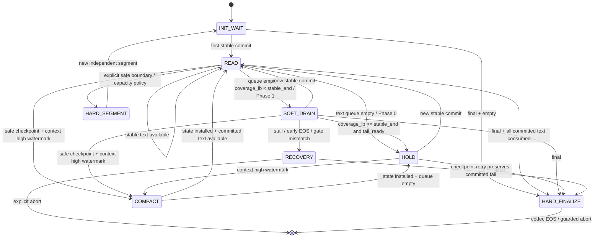

[English](incremental_text_normalization_and_soft_drain.md) | **中文**

# 流式文本消歧、增量文本规范化与 Soft Drain 设计

> 编写日期：2026-07-28<br>
> 状态：**设计稿**；Phase 0 可复用现有 `WAIT_TEXT`，`Soft Drain`、coverage 与低接缝 rollover 目标需要训练和运行时实现；除完整 state snapshot/restore 的迁移基线外不承诺状态等价<br>
> 范围：`engine/frontend/` 的文本入口与切分前处理、`engine/backend/` 的等待/恢复控制、后续 Talker 适配训练与 Code2Wav 状态继承<br>
> 关联：[前端文本切分流水线](frontend_segmentation_pipeline.zh-CN.md) · [解码 FSM](../architecture/decode_fsm.zh-CN.md) · [引擎总览](../architecture/engine_overview.zh-CN.md) · [实时音频流](realtime_audio.zh-CN.md) · [可观测性目标](observability_goals.zh-CN.md)

---

## 0. 结论先行

流式 TTS 面对的根本约束不是“何时收到字符”，而是“何时可以不可逆地承诺一种读法”。音频一旦播放，后续文本无权修改它。因此，本设计把文本入口改为**单调提交（monotonic commitment）**：只把已经稳定的 spoken form 交给 TTS，仍可能被后续字符或语义上下文改写的后缀保留在 mutable buffer 中。

本设计作出以下决策：

| 决策 | 结论 |
|---|---|
| 增量 TN 放在哪里 | 放在 BPE tokenizer 和 `Spliter` 之前，维护会话级 raw/mutable/committed 状态 |
| WeTextProcessing 的职责 | 规则化候选生成与 verbalization；不单独承担语义消歧 |
| 临时没有可提交文本 | 使用现有 `WAIT_TEXT`/未来 `HOLD`，不注入 text EOS |
| 当前 checkpoint 是否喂临时 PAD | 否；PAD 后恢复文本属于未训练路径，可能造成拖音、停顿、漏读或提前 EOS |
| `Soft Drain` 如何实现 | 新增独立 `<tts_wait>`/控制 embedding，并用 coverage lower bound + acoustic endpoint/tail gate 保守判断已提交文本是否声学完成 |
| codec EOS/BOS 的职责 | 只表示完整声学序列的终止/开始；不作为临时等待协议 |
| 上下文满后的延续 | 只有架构原生支持的有界 recurrent state/精确 compaction 能同时等价并释放 context；普通 snapshot 只能精确迁移、不能降低 `past_len`。否则用实际 codec 与原始交错输入近似重建，不重新采样 overlap |
| 音频低水位能否迫使读法提交 | 不能；水位只能决定等待、降级或硬边界，不能改变语义置信度 |
| Phase 0 是否改外部协议 | 不改；继续接收普通 `TextChunk`，所有增量状态先留在服务端内部 |

Phase 0 的最小闭环是：

```text
raw text delta
  → 重建 Unicode / 检测开放 span
  → WeText 候选 + 领域规则/上下文排序
  → 只提交稳定 spoken prefix
  → 现有 tokenizer / Spliter / WAIT_TEXT
```

Phase 1 以后才增加：

```text
READ → SOFT_DRAIN → HOLD → READ → ... → HARD_FINALIZE
```

---

## 1. 背景与问题定义

### 1.1 典型歧义

上游 LLM 正在流式生成：

```text
This is x 2 ...
```

仅看到 `x2` 时，读法可能是：

- `x two`：产品型号、变量名或字符串；
- `x squared`：若上下文明确它是幂表达式；
- `x times two`：乘法；
- `x sub two`：下标；
- 其他领域特定读法。

问题不只存在于字母数字串：

```text
1        → one
10       → ten
10.5     → ten point five
10.5%    → ten point five percent

3        → three
3rd      → third

2026-    → 年份、日期前缀、范围或普通字符序列
```

如果 `1` 或 `3` 已经下发到 TTS，后续输入到达时就无法撤回。对每个 LLM delta 独立运行 TN 再 append，不能满足流式正确性。

### 1.2 不可能三角

对于两个拥有相同已观察前缀、但正确读法不同的未来文本，系统无法同时保证：

1. 零等待；
2. 永远正确；
3. 不依赖上游额外语义。

本设计选择：**读法正确性优先于不可控的零等待**，再利用已经生成但尚未播放的音频余量隐藏大部分等待。若完整上下文仍不能消歧，则必须使用显式领域策略、上游 spoken-form 或可审计的 literal fallback，不能假装 TN 可以恢复原文没有编码的意图。

这里的“稳定”是**相对于已声明 closure/lookahead/deadline 策略的 policy-stable**，不是对任意未来文本的数学证明。只有经过验证的 typed hint 或封闭领域协议才能提供更强保证；基于有限上下文的 ranker 只能给出可校准置信度。因 deadline 强制提交的结果必须标为 fallback，而不是伪装成唯一真值。

### 1.3 与普通文本切分缓冲的区别

[前端文本切分流水线](frontend_segmentation_pipeline.zh-CN.md) 否决了“为了寻找更优分句而通用攒窗口”，因为那会人为增加所有文本的延迟。本设计的 hold 范围更窄：

- 只扣留**可能被后续输入改写读法的 mutable suffix**；
- 普通稳定前缀立即提交；
- hold 的目标是避免不可逆误读，不是追求全局最优切分；
- 每个 hold 都必须有类别、原因、期限和降级结果。

---

## 2. 目标、非目标与术语

### 2.1 目标

1. 对任意 transport 分包，已经提交给 TTS 的 spoken text 永不修改。
2. 让 `This is` 等稳定前缀继续进入现有流式管线，仅暂存 `x2` 等开放 span。
3. 用 WeTextProcessing 等确定性 grammar 限制候选空间，再用领域信息或上下文选择候选。
4. 复用当前 `WAIT_TEXT` 实现 Phase 0，不把模型训练阻塞在前端正确性之前。
5. 为后续 `Soft Drain + coverage + state rollover` 定义清晰、可训练、可观测的契约。
6. 在超时、容量压力、多语言缺口和 normalizer 失败时提供保守且可审计的降级路径。

### 2.2 非目标

1. Phase 0 不承诺完整上下文级 prosody；已生成音频仍只依赖生成当时可见文本。
2. Phase 0 不支持临时 PAD 后恢复文本，也不改变当前 codec EOS 停止语义。
3. 本设计不要求 WeTextProcessing 成为通用语义模型。
4. 本设计不允许修改已经播放的音频；推测性音频若存在，必须仍在服务端可撤回窗口内。
5. 本设计不在第一阶段改变 gRPC/WebSocket 文本消息格式。

### 2.3 术语

| 术语 | 定义 |
|---|---|
| `raw stream` | 上游按任意边界发送的原始 Unicode 文本流 |
| `mutable tail` | 尚可能被未来输入改变边界、类别或读法的原始后缀 |
| `stable raw prefix` | 在已声明 closure/lookahead 策略下不会再 revision 的 raw 前缀 |
| `spoken candidate` | 一个 raw span 的候选口语形式，例如 `x two` |
| `committed spoken prefix` | 已不可逆交给 tokenizer/TTS 的 spoken text |
| `stable_end` | 已提交 normalized text 映射到 coverage 可发声单元后的右边界；另保留 BPE range/commit/raw 映射 |
| `READ` | 消费已提交文本并正常生成 codec 的状态 |
| `WAIT_TEXT` / `HOLD` | 不推进模型位置、不生成 PAD，保留状态等待新文本 |
| `SOFT_DRAIN` | 在没有新文本时，继续生成仅由“已提交但尚未声学完成”的前缀支持的预测 codec 音频；需要训练 |
| `HARD_FINALIZE` | 输入真正的 text EOS，然后 PAD drain 直到 codec EOS |
| `audio credit` | 已生成可播放音频相对播放头的剩余时间余量 |
| `rollover` | 上下文高水位时切换到新 Talker context，并延续或重建局部声学条件；连续性需单独验收 |

本文后续把 coverage 定义为保守的 lower bound，并用独立的 `tail_ready`/acoustic endpoint gate 保护尾音。它是运行时控制估计，不是语义安全证明。

---

## 3. 安全不变量

下列不变量高于延迟和吞吐目标：

### I1. 文本提交单调

`commit.raw_end` 严格递增，已提交的 `tts_text` 只能 append，不能 revision。

### I2. 分包不改变最终语义

在关闭 deadline/fallback、输入最终完整的条件下，同一 raw text 的任意合法分包都必须得到相同的最终 committed text。

### I3. 已播放音频不得覆盖未提交语义

音频 release frontier 对应的 raw coverage 不得越过 text commit frontier。允许推测性 codec 的实验路径必须把音频留在可丢弃窗口内。

### I4. 音频水位不决定语义

低 `audio_credit` 可以触发等待、literal fallback、客户端静音或在已确认强边界处 hard finalize，但不能把低置信候选提升为“正确读法”。

### I5. 临时等待不使用最终 EOS

text EOS 与 codec EOS 只用于完整输入或明确 hard segment。`mutable tail` 未决时不得因输入暂时耗尽而发送 EOS。

### I6. HOLD 不推进上下文

`HOLD` 中不得执行 Talker/Code2Wav decode step，不增加 `past_len`，不生成填充静音。

### I7. 每个 raw 字符都有去向

会话结束时，每个 raw span 必须处于以下之一：已提交、按显式规则丢弃（如 emoji/装饰字符）、或带原因降级。不得静默丢字符。

### I8. Rollover 不重采样历史

已经播放的 overlap 不得重新采样后作为 continuation state。完整 state snapshot/restore 可以精确继承；trained compaction 和实际 codec/input trace replay 只能按近似重建验收，不得表述为与未截断 Talker hidden state 等价。

---

## 4. 当前实现基线与能力边界

### 4.1 已有能力：`WAIT_TEXT`

当前 backend 在 trailing text 耗尽且 `input_complete=False` 时：

1. 保存最新 `codec_sum` 到 `slot.last_codec_sum`；
2. 设置 `slot.next_embed=None`；
3. 保留 Talker KV、Code2Wav KV/conv/transconv state；
4. 不把该 slot 放入后续 decode batch；
5. 新文本到达后用 `last_codec_sum + text_add` 原位恢复。

`WAIT_TEXT` 是当前代码中的隐式语义态，而不是独立 enum：slot 仍为 active，但 `next_embed=None` 且保存了 `last_codec_sum`。它只在 slot 未被取消、超时或 idle eviction 前成立；当前 idle eviction 默认约 10 秒且会报错并删除 session，Phase 0 必须显式评估并配置 held-slot lease。

实现入口：

- `engine/backend/engine_loop.py:_process_step_output_inner`
- `engine/backend/engine_loop.py:_resume_streaming_segment_if_ready`
- `engine/backend/engine_loop.py:_get_active_slots_mlfq`

这条路径是 Phase 0 的声学基础，但它会在 text queue 耗尽时立即冻结，未必能把 `This is` 的全部尾音生成完。Phase 0 首先解决不可逆误读安全，不承诺充分利用所有潜在音频余量；后者属于 Phase 1 `SOFT_DRAIN`。

### 4.2 当前缺口：增量 TN 只有 emoji carry

流式模式目前只在 `engine/frontend/interface.py` 中保留 incomplete emoji suffix；其他文本经过简单空白/emoji 清理后立即 tokenize 和 dispatch。系统没有：

- 通用 raw mutable tail；
- semiotic span closure；
- raw ↔ normalized offset；
- 候选 verbalization；
- commit/fallback 事件。

### 4.3 当前 hard flush 是终止，不是暂停

`FLUSH_EOS`/`FLUSH_NOP` 都会把当前 segment 标为 `input_complete=True` 并产生段级 `SEGMENT_TOKENS_DONE`；只有 `FLUSH_EOS` 追加 text EOS，`FLUSH_NOP` 不追加。消费完已有 trailing 后，模型才逐步使用 `tts_pad_embed`，并在 codec EOS/abort 后逻辑释放 slot。新 segment 独立 prefill，Talker/Code2Wav 状态在下一次 admission 时重置。

因此：

- `FLUSH_NOP` 不等于 soft wait；
- codec EOS 后不能在原 segment 中追加文本；
- 当前跨 segment 只做音频 reorder，不做韵律状态继承。
- `kv_cache_pool.reset_for_new_segment()` 虽是保留 KV 的 helper，但当前没有调用点，不能视为已有段间继承能力。

### 4.4 当前 checkpoint 的训练边界

现有序列只定义一次 text BOS→text→EOS 和一次 codec BOS→audio→EOS。以下操作均应视为分布外实验，而不是生产契约：

- `text → PAD × N → text`；
- `codec EOS → codec BOS → codec` 且复用同一 KV；
- 用重复文本重新采样 overlap，再假设其隐藏状态与已播放版本相同。

---

## 5. 目标架构

```mermaid
flowchart LR
    A[Transport TextChunk] --> B[Unicode / Grapheme Assembler]
    B --> C[Stateful Filter Chain]
    C --> D[Open-Span Lexer]
    D --> E[Normalizer Backend\nWeText n-best / custom rules]
    E --> F[Hint Validator + Context Ranker]
    F --> G[Monotonic Commit Controller]
    G -->|committed tts_text| H[Existing BPE Tokenizer]
    H --> I[Spliter / Dispatcher]
    I --> J[READ / WAIT_TEXT]
    G -->|mutable tail| K[Pending Buffer + Deadline]
    K --> D
    J -. Phase 1 .-> L[SOFT_DRAIN / HOLD]
    L -. high KV .-> M[State Rollover]
```



### 5.1 三条 frontier

每个 session 显式维护三条边界：

1. **Text commit frontier**：raw text 中读法已经确定的最右位置；
2. **Codec generation frontier**：已经生成 codec 所覆盖的 committed text；
3. **Audio release frontier**：已经交付、因而无法撤回的音频位置。

Phase 0 禁止 codec generation 越过 text commit。未来若增加 speculative codec，可暂时越过，但 audio release 仍不得越过，并必须支持在服务端窗口内丢弃推测结果。

### 5.2 组件职责

| 组件 | 职责 | 不负责 |
|---|---|---|
| Unicode assembler | 拼接 transport delta，修复跨包 grapheme/emoji 边界 | 语义消歧 |
| Stateful filter chain | 空白、emoji、markup 等预处理并保留 offset map | 选择数字读法 |
| Open-span lexer | 找出可能继续扩展的数字、单位、标识符、URL、公式等 | 最终 verbalization |
| Normalizer backend | 生成受 grammar 约束的一个或多个 spoken candidates | 恢复未编码语义 |
| Hint validator/ranker | 验证上游 hint，结合左右上下文、领域和置信差排序 | 修改已提交文本 |
| Commit controller | 决定 stable prefix、deadline 和 fallback，发单调 commit | 控制声学 EOS |
| Audio scheduler | 根据 committed input 和 audio credit 选择 READ/HOLD/FINALIZE | 迫使语义候选胜出 |

---

## 6. 增量 TN 与消歧流水线

### 6.1 处理顺序

```text
1. append raw delta
2. 完成 Unicode/grapheme assembly
3. 运行只改变表示、不改变语义的 stateful filters
4. lexer 将输入分为 closed stable spans 与 open mutable suffix
5. 对 left context + mutable window + 已到达 right context 运行 normalizer
6. 对候选验证和排序
7. commit controller 只提交稳定 span
8. 合并保留的 prosody punctuation，生成准确的 tts_text
9. 交给现有 BPE tokenizer
```

不能先 tokenize `x`，再等 `2` 到达后尝试撤销。LLM/BPE token 边界也不是语言 span 边界；同一个 raw span 可能跨任意多个 transport 包。

### 6.2 Open-span 类别

MVP lexer 至少覆盖：

| 类别 | 可能继续扩展为 | 典型闭合信号 |
|---|---|---|
| integer/decimal | `10.5`、百分比、金额、单位 | 明确分隔符 + 不再匹配后缀 |
| ordinal | `3rd`、`21st` | ordinal suffix 完整并遇到边界 |
| date/time/range | `2026-07-28`、`10:30`、`1-3` | grammar 接受且右边界闭合 |
| identifier | `x2`、`X20`、版本号、型号 | 空白/标点/markup 边界 + 领域判定 |
| URL/email | scheme、host、path、query | 空白、闭合括号或输入结束 |
| measure/currency | `25kg`、`$13.5` | 单位/金额 span 闭合 |
| math/markup | `x^2`、LaTeX、Markdown code | 配对 delimiter 闭合 |
| Unicode sequence | emoji ZWJ、keycap、组合字符 | grapheme cluster 闭合 |

“空白出现”不总是充分闭合条件，例如 markup、带空格的单位或上游格式化文本。closure 必须按类别定义。

### 6.3 WeTextProcessing 集成边界

WeTextProcessing 作为 `NormalizerBackend` 实现，而不是写死在 `FrontendInterface`：

```python
class NormalizerBackend(Protocol):
    def candidates(
        self,
        text: str,
        *,
        language: str,
        domain: str | None,
        nbest: int,
    ) -> list[NormalizationCandidate]: ...
```

集成约束：

1. WeText 当前按完整输入/窗口运行；MVP 使用外部 lexer + 滑窗重算，不假设它有 streaming state。
2. `nbest=1` 的 shortest path 只是 grammar 默认，不等于语义真值。
3. 英文标准 grammar 不保证生成 `x squared` 等数学候选；需要 custom rule 或上游 typed hint。
4. 中英文混合应按 span 路由语言，而不是只依赖 session 级 `language=auto`。
5. normalizer 可能删除标点；原始标点和边界必须作为 prosody side-channel 保留或重建。
6. FST 在服务启动时预构建/预热，不能在首请求路径临时建图。

### 6.4 候选选择优先级

候选选择按以下优先级执行：

1. **验证通过的上游 typed spoken-form hint**；
2. **session/domain lexicon**，例如产品型号、数学表达、电话号码策略；
3. **上下文 ranker**，使用有限左右上下文和 candidate lattice；
4. **grammar 唯一候选**；
5. **领域配置的 literal fallback**。

上游 hint 必须满足 raw span 对齐、语言/字符约束，并落在 grammar/lexicon 允许的候选集合内；不能把任意上游字符串无验证地注入 TTS。

### 6.5 Stable prefix 算法

Phase 0 采用保守策略：整个开放 semiotic span 都留在 mutable tail。后续可优化为候选最长公共 spoken prefix，但只有同时满足以下条件才允许提交：

- 所有仍存活候选共享该 spoken token/phoneme 前缀；
- raw ↔ spoken 对齐能证明该前缀对应的 raw 区间不会被扩展重写；
- 提交点位于完整 TTS token/word 边界，而不是字符串字符中间；
- 不会破坏标点/prosody side-channel。

不能用“连续两次 normalizer 输出相同”作为稳定证明；未来字符仍可能整体改写结果。

### 6.6 `This is x2` 端到端示例

```text
t0  raw="This is "   → commit("This is ") → tokenizer/Spliter → READ
t1  raw+="x2"        → open identifier span; no new commit
                         active segment reaches current WAIT_TEXT; buffered audio keeps playing
t2  raw+=". And ..." → hint/domain/ranker selects "x two"
                         commit("x two.") → resume the same live segment when possible
t3  final             → resolve all pending text → HARD_FINALIZE
```

Phase 0 在队列耗尽处立即 `WAIT_TEXT`，所以它保证的是“不提前读错”，不保证已提交的 `This is` 已经完整发声；Phase 1 才能在 coverage/tail gate 允许时继续 `SOFT_DRAIN`。若输入一开始就是 `x2`，没有任何 stable prefix 可生成音频，session 留在 `INIT_WAIT`，因此 TTFT 增加。若完整右上下文仍没有编码“平方/乘法/型号”等意图，则只能按 typed hint 或显式 fallback 决策。

### 6.7 增量计算边界

每个 delta 只重新词法分析受影响的 suffix 与有界左/右窗口，不重复处理全部历史。normalizer 调用应按同一 event-loop turn 或很小的 transport burst 合并，但不得以通用 debounce 扣留已经确定的稳定前缀。FST/grammar 在服务启动时预热，候选数、窗口长度、CPU 时间和队列等待都必须有上限与指标。

---

## 7. 内部数据契约

### 7.1 Offset 语义

- `raw_start/raw_end` 使用 session 内原始 Python `str` 的 Unicode code-point offset；
- offset 指向未做 TN 的 raw stream；
- filter/normalizer 每次变换都维护 span map；
- 禁止用 UTF-8 byte offset 与 code-point offset 混用；
- 若未来协议暴露 hint，协议必须显式声明 offset 单位和文本版本。

### 7.2 建议类型

```python
@dataclass(frozen=True)
class NormalizationCandidate:
    spoken_text: str
    class_name: str
    score: float
    source: str                  # wetext | custom_rule | upstream_hint


@dataclass(frozen=True)
class TextCommit:
    commit_id: int
    raw_start: int
    raw_end: int
    spoken_text: str             # lexical verbalization
    tts_text: str                # exact tokenizer input, incl. prosody punctuation
    language: str
    class_name: str
    source: str
    confidence: float | None
    commit_kind: str             # stable | deadline_fallback | resource_fallback | final_fallback
    creates_fence: bool          # future raw spans may not merge backward across raw_end


@dataclass(frozen=True)
class CommitDecision:
    commits: tuple[TextCommit, ...]
    pending_raw: str
    pending_raw_start: int
    hold_reason: str | None
    candidate_count: int
    deadline_ms_remaining: float | None
    fallback_reason: str | None
    late_extension: bool


class IncrementalTextCommitter(Protocol):
    def feed(self, delta: str, *, final: bool = False) -> CommitDecision: ...
```

`TextCommit` 是 append-only 事实；`CommitDecision.pending_raw` 是诊断快照，可随新输入任意变化。

### 7.3 与现有前端的接口

Phase 0 将 `FrontendInterface.push_text_input()` 的 streaming 分支改为：

```text
raw delta
  → session.text_committer.feed(...)
  → for commit in decision.commits:
        _ingest_streaming_text(session, commit.tts_text)
```

`mark_input_complete()` 先以 `final=True` flush committer，再调用现有 `spliter.input_done()`。只有 committer 已无 pending raw，才允许因“上游输入结束”发送 `END`/`SESSION_TOKENS_DONE`。已经提交的安全前缀仍可因明确标点或容量策略产生独立的 per-segment `SEGMENT_TOKENS_DONE`。

---

## 8. Deadline、fallback 与结束语义

### 8.1 两类 deadline

1. **Semantic deadline**：等待更多文本以确定读法的最大时间/字符窗口；
2. **Resource deadline**：pending buffer、session TTL、held KV slot 等资源上限。

`audio_credit` 不是 semantic deadline；它只描述用户是否会感知等待。

### 8.2 Deadline 到期策略

按 session/domain 配置选择：

| 策略 | 行为 | 适用场景 |
|---|---|---|
| `literal` | 按字符/数字字面读法提交，尽量不推断语义 | 型号、ID、一般助手默认 |
| `domain_default` | 使用领域显式配置的候选 | 单一业务域 |
| `wait` | 保持 pending，接受可感知停顿 | 数学、医疗等正确性优先域 |
| `error` | 发出可恢复错误/要求上游补充 spoken form | 强契约接口 |

硬分段只能让已有安全前缀完成，不能解决 pending span 的读法。不得用“切一段”替代 semantic fallback。

### 8.3 输入结束

收到 `TextComplete`/`EndRequest` 后：

1. 将完整剩余上下文交给 normalizer/ranker；
2. 若仍有多义，应用 session 的 final fallback；
3. 提交或显式丢弃全部 pending raw；
4. 确认 committer empty；
5. 才进入 `HARD_FINALIZE`。

### 8.4 强制提交后的 Commit Fence

若 deadline/resource pressure 在 span 尚可继续扩展时强制执行 `literal` 或 `domain_default`，committer 必须在该 `raw_end` 建立不可跨越的 commit fence。后续字符从新 span 开始，绝不能回并并改写已经提交的 spoken text。

例如 `1` 超时后已提交 `one`，随后才到达 `0`，系统不能回改成 `ten`；它只能按 late-continuation 策略处理为新 span（通常形成 `one zero` 或显式 error）。这是为单调性付出的可见降级，必须发出 `text.span.late_extension`，并从关闭 deadline 的 packetization-invariance 指标中单独分层统计。

---

## 9. 运行时状态机

### 9.1 目标状态图



### 9.2 状态语义与支持度

| 状态 | 模型是否推进 | 是否输出音频 | 当前支持 | 备注 |
|---|---:|---:|---:|---|
| `INIT_WAIT` | 否 | 否 | 前端可实现 | 句首歧义会直接增加 TTFT |
| `READ` | 是 | 是 | 是 | 只消费 committed text |
| `HOLD` | 否 | 否 | 是（现有 `WAIT_TEXT`） | 在取消、超时或 idle eviction 前保留同一 slot 状态 |
| `SOFT_DRAIN` | 是 | 是 | 否 | 需要 `<tts_wait>`、coverage lower bound 与 tail gate 训练 |
| `HARD_SEGMENT` | 是，直到结束 | 是 | 是 | 会产生独立段和可能的韵律接缝 |
| `HARD_FINALIZE` | 是，直到 EOS | 是 | 是 | text EOS + PAD；真正终止 |
| `RECOVERY` | 视策略 | 不释放 | 否 | 从安全 checkpoint 重试或显式终止，不把失败当 HOLD 成功 |
| `COMPACT` | 暂停并迁移 | 否 | 否 | 需要架构支持的 exact compaction 或经验收的近似 rollover；普通 snapshot 不释放 context |

### 9.3 与现有 Decode FSM 的映射

- 本文 `HOLD` 对应现有 [Decode FSM](../architecture/decode_fsm.zh-CN.md) 的 `SAIdle`/backend `WAIT_TEXT` 语义；
- 本文 `HARD_FINALIZE` 对应现有 `SB0/SB1` 与 codec EOS 收尾；
- 本文 `SOFT_DRAIN` 是新增状态，**既不是 `SAIdle`，也不是现有 PAD phase**；
- mutable text 未提交时，前端不得把 `END` 送入 driver；
- `SEGMENT_TOKENS_DONE` 是段级事件；已提交安全前缀仍可在明确安全边界结束，但该事件后禁止再向同一个 segment 发送 `APPEND_TOKENS`。

---

## 10. Soft Drain 与 coverage 训练契约

### 10.1 为什么不能复用 `tts_pad`

当前 `tts_pad` 的训练语义是“文本已经结束，继续生成剩余音频并准备终止”。临时断流实际表达的是“未来还有文本，但当前没有新 text token”。复用同一个 embedding 会混淆：

- 完成已提交词的剩余音素；
- 生成句末停顿；
- 触发 codec EOS；
- 等待未来文本。

因此新增 `<tts_wait>`（名称待定）或等价 phase embedding，且不改变 global text EOS/codec EOS 的含义。

### 10.2 Coverage

coverage 坐标采用**可发声单元**，Phase 1 首选词或音素，而不是含标点的 raw 字符或未解释的 BPE index。每个单元维护到 BPE range、`commit_id` 和 raw span 的映射。定义保守下界：

```text
a_t^LB = 截至 codec frame t，其对齐结束时间已确定不晚于 t 的最大可发声单元索引
tail_ready_t = 最后单元的必要声学尾部是否已经完成
```

标点等非发声 token 不直接占 coverage 单元，其 pause/prosody 效果由 endpoint/tail label 表达。coverage false-positive 会截断尾音，风险高于 false-negative，因此训练和校准必须偏保守。单调性由累积非负增量、单调 attention 或运行时 monotonic projection 强制保证，而不只是一项 soft loss：

```text
a_t^LB >= a_(t-1)^LB
```

运行时：

- 若 text queue 空且 `a_t^LB < stable_end`，进入/保持 `SOFT_DRAIN`；
- 只有 `a_t^LB >= stable_end AND tail_ready_t=true`，并满足置信门槛与 hysteresis，才进入 `HOLD`；
- 新 commit 到达后更新 `stable_end` 并回到 `READ`；
- coverage 不得越过 committed frontier。

低改动备选是 `prefix_drained + tail_ready` 分类 head，但单调 lower-bound pointer 更容易定位漏读、重复和越界。无论哪种形式，coverage 都是控制估计，不单独构成“文本已声学完成”的证明。

### 10.3 训练样本构造

Talker 侧的序列契约必须是：

```text
READ:       last_real_codec + next_committed_text_embedding
SOFT_DRAIN: last_real_codec + tts_wait_embedding
HOLD:       no forward; no training token; wall-clock duration does not consume context
RESUME:     last_real_codec + next_committed_text_embedding
```

`<tts_wait>` 是 Talker 侧直接注入的 learned control/phase embedding，不进入 raw tokenizer，也不作为 codec 送入 Code2Wav。其 decode step 数只覆盖“最后一个可见 committed token 被消费后，仍属于该 committed prefix 的真实 codec 帧”，绝不编码上游空等了多少毫秒；声学完成后的真实等待由零 forward 的 `HOLD` 表示。

1. 对完整文本生成最终 spoken form；
2. 用 CTC/强制对齐得到词/音素 ↔ codec frame 映射，并把最后音素后的必要声学 tail 纳入 endpoint label；
3. 从真实连续音频中随机模拟 LLM burst/stall 与 TN commit 轨迹；
4. 在普通词边界、数字/单位/公式前后和标点附近构造 READ→SOFT_DRAIN→RESUME 轨迹；
5. wait 前后使用同一条连续原始音频，整段只有一个真正 BOS/EOS；
6. 随机化已 committed、但尚未声学实现的可见 spoken token 数；未提交 raw/candidate 若要作为上下文，必须走独立 non-speakable channel，不能混入当前发声轨；
7. 过采样数字、日期、URL、字母数字混排、数学式和中英混合；
8. 加入 scheduled sampling/生成历史，避免仅在 teacher forcing 下恢复正常；
9. 对 full-context teacher 做边界附近 codec-logit distillation（可选）。

### 10.4 训练验收前的 probe

对当前 checkpoint 先做 `tts_pad embedding/decode steps = 0/1/2/4/8/16 → resume text` 探针，至少多文本、多语言、多 seed，测：

- premature/missing/late codec EOS；
- 漏读、插入、重复；
- PAD 时长和 codec-logit 漂移；
- 最大可靠恢复长度；
- 与当前 `WAIT_TEXT`、hard segment 的对照。

该实验用于证明 OOD 边界，不用于把偶然可用的 PAD 长度升级为生产契约。

### 10.5 Soft Drain 失败出口

以下任一情况都进入 `RECOVERY`，不能当作成功 `HOLD`：

- coverage 在 `max_soft_drain_steps` 内不增长；
- `tail_ready` 长期不成立，或与 coverage 持续冲突；
- coverage 完成前出现 codec EOS；
- WAIT/RESUME 后检测到重复、跳词、无声帧或 coverage overrun。

恢复顺序是：从仍包含全部未发声 committed tail 的安全 checkpoint 做 guarded retry；若能证明不漏字，再 hard finalize；否则显式 abort/error。不得在未保存 committed tail 的情况下 hard restart，因为那会丢失“已提交但尚未发声”的文本。

---

## 11. Audio credit 与延迟控制

### 11.1 定义

```text
audio_credit_ms
  = generated_playable_audio_ms
  - estimated_played_audio_ms
  - jitter_reserve_ms
```

一次 TN 等待对用户无感的充分条件近似为：

```text
resolution_wait_ms + synthesis_catchup_ms <= audio_credit_ms
```

句首歧义时 `audio_credit_ms=0`，因此增加 TTFT。中途歧义通常能被之前生成的音频覆盖，但长 span、LLM 抖动、网络 stall 或连续歧义仍可能造成 underflow。

### 11.2 水位只控制动作，不控制读法

| 水位 | 当前 Phase 0 | 未来 Phase 1 |
|---|---|---|
| 高 | 正常 READ，限制过度 ahead | 正常 READ |
| 目标区间 | READ/HOLD | READ/SOFT_DRAIN |
| 低且 pending 未决 | 句首保持 INIT_WAIT，否则继续 HOLD；等待 semantic deadline 或 literal fallback | 仅 drain 已提交且未覆盖的音频，随后 HOLD |
| underflow | 客户端可能填静音/产生可感知停顿 | 同左；不得生成无界 PAD |

服务端生成速度、客户端 jitter buffer 与真实播放头并不完全等价。Phase 0 的 `audio_credit` 可先以 server-side delivery/reorder 时间估算；若客户端支持回传 playhead，必须通过版本化能力协商加入，不能假定所有 transport 都有。

`HOLD` 只有在客户端播放缓冲尚未耗尽时才具有连续音频语义。若客户端已经播放补零或发生真实 gap，冻结的 Talker/Code2Wav 状态与用户听到的波形时间线已经分叉；恢复必须标记为 `gapped_resume`，不计入 seamless/low-seam 指标，并使用 crossfade、显式 pause 建模或安全 hard segment。不得把冻结状态直接续接后宣称“无缝”。

---

## 12. 上下文高水位与 State Rollover

### 12.1 不采用重新采样 overlap

重新输入 `x two .` 并再次采样不能保证得到已经播放版本相同的：

- codec 序列；
- 时长、F0、能量和停顿；
- Talker hidden state；
- Code2Wav 卷积与注意力状态。

即使丢弃重叠音频，后续生成也已从不同状态继续，因此不构成严格韵律继承。

### 12.2 推荐路径

按等价性分为三类路径，而不是把它们都称为“继承”：

1. **Exact state handoff**：兼容布局和模型版本下，直接 snapshot/restore 完整 Talker 与 Code2Wav runtime state；它可用于 slot/process 迁移，但本身不减少 `past_len`；
2. **Trained approximate**：训练过的 sliding-window/KV compaction，保留 system/speaker sink 与最近真实历史；
3. **Reconstruction approximate**：在新 Talker context 中 teacher-force 最近一段**实际交错轨迹**，即当时的 committed text/control embedding 调度与实际采样的多 codebook codec，然后只预测 continuation。使用真实 codec 避免走上另一条随机声学轨迹，但不保证重建 hidden/KV 与未截断 context 等价。

真正为 Talker 释放 context 的 exact 路径，要求模型架构原生提供有界 recurrent state、严格等价的 ring/sliding cache 或可证明的 compaction；普通 full-state snapshot 只是迁移基线。除此之外，只要丢弃了更早历史，就按 trained/reconstruction approximate 验收。

Code2Wav 优先 direct snapshot/handoff 原 KV、conv/transconv state、frame index 和 buffer parity。若只能从零静默 replay，suffix 长度必须覆盖实际 receptive field/状态记忆；否则同样是近似重建。Talker 与 Code2Wav 的 replay window 分别做 sweep 决定，“1–3 秒”只能作为初始实验点，不能写成协议常量。

状态清单至少包括：

- Talker KV、`past_hidden`、`last_codec_sum`、`cache_position`/RoPE delta；
- Code2Wav KV、conv/transconv state、frame index、ping-pong buffer parity；
- 实际 codec trace、采样 RNG、repetition counts；
- global coverage/commit/spoken cursor 到新 context local cursor 的重映射；
- 音频 frame/sample index 与 delivery checkpoint。

只继承 Talker KV 或只继承 Code2Wav state 都不足以保证完整连续性。每条路径必须在事件和指标中声明 `exact`、`trained_approximate` 或 `reconstruction_approximate`，不能把低接缝质量等同于内部状态相等。

### 12.3 调度影响

当前同 session 的 lookahead segments 可独立 slot 并行。严格 predecessor state handoff 会引入依赖：后段至少要等前段生成可用 checkpoint，Code2Wav 路径甚至可能要求串行。这会影响：

- `max_concurrent_segments` 的收益；
- lookahead retry；
- slot 生命周期；
- batch compose；
- 吞吐与 TTFT 的 Pareto。

rollover 必须作为独立实验阶段评估，不能作为 Phase 0 的隐式前提。由于连续文本可能在进入 `HOLD` 前就撞到 context high watermark，调度器需要在 `READ`/`SOFT_DRAIN` 的安全 checkpoint 触发 `COMPACT`；迁移后根据是否有 committed text 返回 `READ` 或 `HOLD`。

---

## 13. 外部协议与配置

### 13.1 Phase 0 协议

外部协议不变：

- `TextChunk.text` 仍是 raw delta；
- `TextComplete`/`EndRequest` 仍表示不再有文本；
- transport 包大小不拥有语义边界权；
- normalizer commit 是服务端内部事件。

### 13.2 可选的未来 typed hint

若后续让上游 LLM 显式提供 spoken form，应新增版本化 capability，而不是重载普通文本：

```text
SpokenSpanHint {
  raw_start
  raw_end
  raw_version
  spoken_text
  class_name
  language
  final
}
```

hint 仅参与候选选择；服务端仍负责 offset 校验、grammar/lexicon 校验和 commit。

### 13.3 配置草案

```yaml
text_commitment:
  enabled: false
  normalizer_backend: wetext
  nbest: 4
  max_pending_chars: 64
  max_lookahead_chars: 32
  max_wait_ms: null          # 由部署/领域策略给出，不设伪通用默认
  fallback_policy: literal  # literal | domain_default | wait | error
  late_extension_policy: literal  # literal | error; commit fence 永不回改
  preserve_punctuation: true
  domain: null
  allow_upstream_hint: false
```

`max_wait_ms`、held-slot lease、rank margin 和具体类别策略必须通过真实 LLM 到达分布与歧义集校准，不在设计稿中声称单一最优值。Phase 1 的 `max_soft_drain_steps` 与 tail/coverage 置信门槛属于模型版本元数据，不能混作通用文本配置。

---

## 14. 失败处理与降级矩阵

| 故障 | 检测 | 行为 | 禁止行为 |
|---|---|---|---|
| normalizer 无路径/异常 | backend exception / empty lattice | literal fallback 或按策略 error；保留 raw span | 静默丢文本 |
| 候选长期不收敛 | deadline / lookahead cap | 领域 fallback、继续 wait 或 error | 因 audio 低水位随便选候选 |
| pending buffer 超限 | `pending_chars > cap` | 强制可审计 fallback、建立 commit fence；记录类别和 raw preview | 无界占内存或回改已提交文本 |
| 上游 hint offset 失配 | raw version/range 校验失败 | 拒绝 hint，回到本地候选 | 拼接到错误位置 |
| 多语言 backend 缺失 | language routing miss | literal/原文 + 显式指标 | 假装已规范化 |
| HOLD slot 面临 eviction | idle lease / slot pressure | 当前：idle eviction 报错并删除 session；目标：保护 lease，超限后从有完整 committed tail 的 checkpoint 恢复或显式失败 | 把目标行为描述成当前已有能力；静默清状态后继续 |
| session final 仍有 pending | committer non-empty | 执行 final fallback 后再 END | 提前发送 text EOS |
| soft-drain 越界/提前 EOS/stall | `a_t^LB > stable_end`、EOS before tail、step cap | 进入 `RECOVERY`，从保存完整 committed tail 的 checkpoint guarded retry；否则显式失败 | 把异常当作成功 HOLD；继续生成未提交语义 |
| HOLD 后实际播放 gap | playhead/underflow 检测 | 标记 `gapped_resume`，crossfade、显式 pause 或安全 hard segment | 宣称无缝续接 |
| segment done 后 late append | `APPEND_TOKENS` after `SEGMENT_TOKENS_DONE` | 前端契约拒绝并报错；新建合法 segment | 把 text 放到 EOS/PAD 后形成 OOD 序列 |
| rollover state 不完整 | health check | 拒绝部分 handoff；从含完整 committed tail 的安全 checkpoint 重试或显式失败 | 部分状态混合继承 |

---

## 15. 可观测性

### 15.1 生命周期事件

建议新增：

| phase | 触发 | 关键字段 |
|---|---|---|
| `text.span.opened` | lexer 扣留开放 span | raw_start, class_candidates, hold_reason |
| `text.span.updated` | 新 delta 改变 pending | pending_chars, candidate_count, top_margin |
| `text.commit` | 单调提交 | commit_id, raw_range, tts_len, class, source, confidence |
| `text.fallback` | deadline/final 降级 | policy, reason, waited_ms, class, candidate_count |
| `text.span.late_extension` | 新字符撞到 commit fence | fence_raw_end, delta_len, fallback_policy |
| `text.wait.started` | 没有可提交文本 | pending_chars, audio_credit_ms |
| `text.wait.ended` | 新 commit 到达 | waited_ms, resolution_source |
| `audio.soft_drain.started/ended` | Phase 1 状态变化 | stable_end, coverage, drain_steps |
| `audio.soft_drain.failed` | Phase 1 gate/模型异常 | reason, coverage_lb, tail_ready, drain_steps |
| `audio.gapped_resume` | HOLD 期间播放缓冲耗尽 | gap_ms, recovery_method |
| `engine.context.rollover` | Phase 2 state handoff | method_class, source_len, replay_frames, state_health |

raw/spoken preview 必须沿用现有 observability tier 的截断与隐私策略；L1 不记录完整敏感文本。

### 15.2 指标

- `tn_pending_chars`、`tn_open_spans`；
- `tn_commit_latency_ms` p50/p95/p99，按 class/language 分组；
- `tn_fallback_total{policy,reason,class}`；
- `tn_candidate_count`、`tn_rank_margin`；
- `tn_late_extension_total{policy,class}`；
- `text_wait_ms`、`audio_credit_ms`、`audio_underflow_total`；
- `soft_drain_steps`、`hold_duration_ms`、`held_slot_ms`；
- `coverage_lag_words`、`coverage_lag_phones`、`coverage_lag_codec_frames`、`coverage_lag_ms`、`coverage_overrun_total`；
- `soft_drain_endpoint_false_positive_total`、`soft_drain_endpoint_false_negative_total`、`premature_soft_eos_total`、`gapped_resume_total`；
- `rollover_total{method_class,result}`、`rollover_replay_frames`、`rollover_continuation_degradation`；
- 离线评测的 ambiguous reading exact accuracy、early-commit violation。

---

## 16. 测试与验收

### 16.1 单元测试语料

至少覆盖逐步扩展：

```text
1 → 10 → 10.5 → 10.5%
x → x2 → x20
3 → 3rd
2026 → 2026- → 2026-07-28
$ → $13 → $13.5
http → https://example.com/path?q=1
name@ → name@example.com
x → x^ → x^2
May → May 5
O → O2 → O2O
```

以及：

- 中英混合；
- emoji/keycap/ZWJ 跨包；
- URL、email、代码块和 LaTeX 跨包；
- 空白、标点、括号和 quote 分包；
- 连续多个 ambiguous spans；
- 句首即歧义；
- 输入结束时仍无法语义唯一的 `x2`。

### 16.2 属性测试

1. **Packetization invariance**：无 deadline 时，随机分包的最终输出等于 full-text oracle；
2. **Monotonicity**：commit offset/ID 严格递增，已提交字符串始终是后续结果前缀；
3. **No loss**：final 后所有 raw code points 均可追踪到 commit/drop/fallback；
4. **No premature END**：pending 非空时不会因“暂时无文本”发送 driver `END` 或 `SESSION_TOKENS_DONE`；已提交前缀仍可按安全边界产生段级 `SEGMENT_TOKENS_DONE`；
5. **Bounded memory**：pending/window/候选数受配置上限约束；
6. **Offset round-trip**：raw ↔ filtered ↔ spoken span map 一致。

### 16.3 集成测试

- stable prefix 先 dispatch，mutable tail 不进入 tokenizer；
- 已有 active segment、其 trailing 已耗尽且 pending 期间，backend 进入现有 `WAIT_TEXT`，不注入 PAD/EOS；句首歧义保持 `INIT_WAIT` 且不分配 slot；
- 新 commit 到达后同 slot 恢复，codec/audio 顺序连续；
- 已安全 hard-split 的 segment 继续 finalize，不错误地进入 `WAIT_TEXT`；
- `SEGMENT_TOKENS_DONE` 后同 segment 的 `APPEND_TOKENS` 被契约层拒绝；
- final fallback 完成后才能 hard finalize；
- idle timeout、取消、断连、resume 不重复 commit；
- normalizer exception 不丢文本；
- guarded delivery 下所有已释放音频只覆盖 committed raw range。

### 16.4 Phase 0 验收门槛

必须满足：

1. 歧义前缀集上 early-commit violation = 0；
2. 无 deadline 属性测试的 packetization mismatch = 0；
3. final raw coverage = 100%（含显式 drop/fallback）；
4. 仅由 pending 暂时无新文本触发的 premature hard flush = 0；安全标点/容量触发的 per-segment flush 单独统计；
5. 对非 semiotic 普通文本，新增 commit 层不引入不必要的整包等待；
6. 现有 tokenizer、Spliter、engine 单测全部通过；
7. shadow 数据上输出变化、等待分布和 fallback 可审计。

### 16.5 Phase 1 验收门槛

在 opt-in 之前必须满足预声明阈值：

1. gold/regression 集上 coverage overrun、premature HOLD、coverage 完成前 codec EOS 均为 0；
2. `<tts_wait>` decode steps 0/1/2/4/8/16 后的 resume success 按语言/类别/seed 报告；
3. deletion、repetition、silent frame、premature EOS 相对 `WAIT_TEXT` 与 full-context baseline 不超过预声明 non-inferiority margin；
4. soft-drain 剩余时长相对 alignment oracle 的 MAE/p95，以及 endpoint false-positive/false-negative 达标；
5. 无 underflow 样本的 boundary click、F0/energy/pause、CMOS/MOS 与 speaker similarity 达标；
6. 报告实际发声音素 TTFA，而不只统计首个 PCM 包；真实 LLM trace 的 underflow 次数/分钟与 gap p95/p99 达标；
7. RTF/TPP、held-slot 显存、并发 p95/p99 在容量预算内。

### 16.6 Phase 2 验收门槛

1. exact snapshot/restore **迁移基线**与不中断执行的 next logits、next codec、Code2Wav 输出在预声明数值容差内一致；若宣称 exact context compaction，还必须证明降低 `past_len` 后同样等价；
2. trained/reconstruction approximate 路径按连续性质量 non-inferiority 验收，不要求 hidden state exact match；
3. rollover pause 可由 audio credit 覆盖，或被明确计为 gap；
4. rollover failure、hard fallback、`gapped_resume` 比例达标；
5. continuation 的 F0/energy/pause/click、CMOS/MOS、speaker similarity 与 WER/CER 分项达标；
6. replay window、held-slot 时长、显存、吞吐和 p95/p99 TTFT/TPP 在预算内。

---

## 17. 分阶段落地

### Phase -1：语料与 Shadow

- 建立 streaming ambiguity gold set；
- 从真实 LLM trace 统计 span 类别、闭合所需 lookahead 和等待分布；
- committer 只做 shadow decision，不改变现有输出；
- 比较 chunk-wise TN、full-text oracle 与候选 ranker。

### Phase 0：Stable Prefix + 现有 `WAIT_TEXT`

- 新增 session-scoped `IncrementalTextCommitter`；
- Unicode/open-span lexer + normalizer backend abstraction；
- WeText sliding-window candidates；
- monotonic `TextCommit`、final fallback、指标；
- 只把 commit 送入现有 tokenizer；
- 明确 `INIT_WAIT`、held-slot lease、idle eviction 与 late-extension commit fence；
- 外部协议和模型不变。

### Phase 0.5：语义增强

- custom math/identifier grammar；
- domain lexicon；
- 小型 context ranker；
- 可选 typed spoken-form hint capability；
- 按 class/language 自适应 lookahead/deadline。

### Phase 1：`<tts_wait>` + Coverage

- 构建强制对齐训练数据；
- 训练 `<tts_wait>`、单调 coverage lower-bound head 与 acoustic endpoint/tail gate；
- 增加 `SOFT_DRAIN` 状态；
- 实现 step cap、early EOS/gate mismatch 的 `RECOVERY`；
- 做生成历史/scheduled sampling 与 PAD-run 对照；
- 通过质量门槛前保持 opt-in。

### Phase 2：低接缝 State Rollover

- 比较 exact snapshot、trained sliding KV 与实际 text/control+codec trace replay；
- 实现 Code2Wav snapshot/handoff；
- 恢复或重建完整状态清单，并标注 exact/trained-approximate/reconstruction-approximate；
- 评估同 session 串行依赖对并发吞吐的影响；
- 加 health check 与 hard-boundary fallback。

---

## 18. 已决策与待确认项

### 18.1 已决策

1. Phase 0 先做文本单调提交，不等待模型训练。
2. WeText 作为候选生成器，不作为语义真值源。
3. 临时断流不使用 text EOS/codec EOS。
4. 当前 checkpoint 不把多 PAD 后恢复升级为生产能力。
5. 音频水位与 semantic readiness 解耦。
6. rollover 不重新采样已经播放的 overlap；普通完整 snapshot/restore 只对状态迁移声称 exact，不自动解决 context 容量；其余路径按近似质量验收。
7. P0 外部协议不变，内部先建立 offset/commit 契约。

### 18.2 待确认

1. WeText Python/Pynini 运行时还是预编译 C++ runtime；
2. custom English math/identifier grammar 的范围与维护责任；
3. context ranker 的模型、窗口和置信 margin；
4. 各 domain 的 final/deadline fallback；
5. typed spoken-form hint 是否进入公共协议；
6. coverage 使用 word/phone lower-bound pointer 还是低改动 `prefix_drained + tail_ready` head；
7. HOLD slot 的 lease、checkpoint 与 admission policy；
8. rollover 的 exact snapshot、trained compaction 与实际交错 trace replay 分别适用哪些部署；
9. 多语言支持优先级与缺失 backend 的默认行为；
10. client playhead 是否通过 capability 回传以提高 `audio_credit` 精度；
11. commit fence 后 late continuation 默认读法还是直接 error。

---

## 19. 与现有文档和代码的关系

- [前端文本切分流水线](frontend_segmentation_pipeline.zh-CN.md)：本文扩展其 Stage 0，但只为 semantic safety 缓冲 mutable tail，不恢复通用分句攒窗口。
- [解码 FSM](../architecture/decode_fsm.zh-CN.md)：Phase 0 复用 `SAIdle/WAIT_TEXT`；未来 `SOFT_DRAIN` 是新增模型态，不能与 `SB1/PAD` 混淆。
- [引擎总览](../architecture/engine_overview.zh-CN.md)：保持 `prefill → streaming input/WAIT → flush` 的现有三阶段主干；本文在 streaming input 内增加 commit gate。
- [实时音频流](realtime_audio.zh-CN.md)：客户端 pacing/jitter buffer 负责等时播放；本文的 `audio_credit` 只用于决策和测量，不让引擎 `sleep()`。
- [可观测性目标](observability_goals.zh-CN.md) 与 [指标目录](observability_metrics_catalog.zh-CN.md)：实现前应把 commit/wait/fallback/underflow 观测点并入指标单一真相源。
- 当前主要落点：`engine/frontend/interface.py`、`engine/core/session.py`、新 `engine/frontend/text_commitment/`（建议）、`engine/backend/engine_loop.py`（Phase 1+）。

## 20. 外部参考

- [WeTextProcessing](https://github.com/wenet-e2e/WeTextProcessing)：WFST TN/ITN 与可扩展 grammar。
- [Qwen3-TTS Technical Report](https://arxiv.org/abs/2601.15621)：文本/声学双轨与 12.5Hz causal codec 背景。
- [Neural WFST Text Normalization](https://www.isca-archive.org/interspeech_2022/bakhturina22_interspeech.pdf)：非确定性 WFST 候选与上下文重排。
